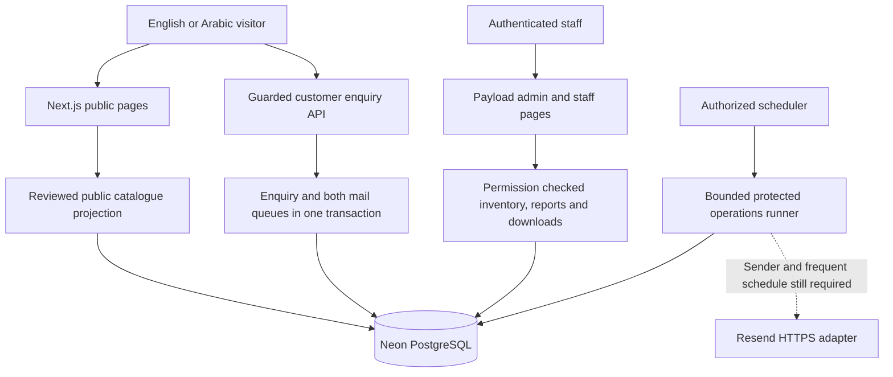

# EL AMAL website delivery and administration handbook

Prepared for Nour Abulnasr and the EL AMAL team. Updated 6 October 2026.

This is the consolidated delivery record and operating manual for both nontechnical owners and technical maintainers. It explains what each part does, how it was implemented, why the approach was chosen, where administrators go, what is still inactive, and who must act before full launch. This revision updates the original 29 September handbook rather than leaving the latest state in a separate addendum only.

**The real website and catalogue are live. The complete customer quotation service is not yet operational.** The selected Precision Revealed hero is delivered, while real public submission/email and the existing-quotation upload journey still await activation prerequisites. The next chapter gives the current status by subcategory and the full-launch checklist. An old approximate 90% scope estimate is not a readiness certificate.

## How to use this handbook

- Nour or business owner: read Current delivery and the path to full launch first, especially the input register and acceptance checklist.
- Catalogue editor: use the catalogue publication and administration chapters for exact fields, images, specifications, review evidence and publication steps.
- Sales or warehouse: use the role matrix, enquiry procedures, stock examples, reports and troubleshooting guide. Follow only the procedures available to your role.
- Developer: use the release identities, backend/API/security chapters, environment names, verification scripts and recovery/deployment instructions. Distinguish the production branch from prepared quotation code.

Each status is supported by source or dated verification. A built feature is not necessarily enabled. Examples of stock or customer records are explanations, not real production data. Passwords, tokens, database connection strings and encryption keys are excluded from this document.

## Where to go

| Task | Address or location |
| --- | --- |
| English website | https://el-amal-sigma.vercel.app/en |
| Arabic website | https://el-amal-sigma.vercel.app/ar |
| Product catalogue | https://el-amal-sigma.vercel.app/en/products |
| Quote basket | https://el-amal-sigma.vercel.app/en/quote |
| Direct RFQ | https://el-amal-sigma.vercel.app/en/rfq |
| Existing quotation, after activation | /en/rfq#existing-quotation, or the Arabic equivalent; currently not production-active |
| Staff sign in and CMS | https://el-amal-sigma.vercel.app/admin |
| Stock operations | https://el-amal-sigma.vercel.app/staff/inventory |
| Demand reports | https://el-amal-sigma.vercel.app/staff/reports |
| Source repository | https://github.com/nourabulnasr/EL-AMAL |
| Production branch and application | codex/el-amal-foundation; 63acd5b |
| Continuation branch and combined application | codex/hero-review-and-quotation; c2e6262, followed by documentation updates |
| Local project | C:\Users\noura\OneDrive\Documents\ChatGPT\EL-AMAL 4 |

Replace /en with /ar for the corresponding Arabic public journey. Staff use the hosted HTTPS addresses, not a developer's localhost or sample-content preview. The same staff account and role checks apply across CMS, inventory and reporting. A visible link does not grant access.

## Scope and phase position

EL AMAL is a bilingual industrial instrument catalogue and enquiry platform. A published model may represent several possible configurations. An exact SKU identifies a supplied configuration, while a stock receipt records counted physical units. Publishing a model does not create stock or reserve anything.

The original plan used six implementation increments: foundation, catalogue slice, RFQ slice, stock slice, completion and release candidate. Later reports grouped work into six workstreams. We are in completion and release acceptance, with core construction substantially delivered and specific activation/content/operating gates open. These are two ways to organize one project, not twelve phases.

No public prices, checkout, payment processing, customer accounts, ERP integration, automated purchasing or AI engineering advice are included. A basket is a request-preparation tool. Oil and gas and general industry are the two implemented industry routes required by the later client brief; other industry pages from the original wider proposal require scope reconciliation. The original broader 10 MB upload allowance is not delivered: the tested quotation implementation supports three files of 2 MiB each.

## Delivery milestones

| Milestone | Delivered outcome |
| --- | --- |
| Foundation and first review link | Next.js/Payload, Neon databases and Vercel hosting; one stable client review address. |
| Client workflow requirements | Search by model/type/application, direct RFQ with model/range/quantity, industry pages and conditional business contact/WIKA evidence components. |
| Brand and entrance | Requested navy/white/orange, bilingual typography, approved loading entrance and mobile/motion safeguards. |
| 28 September catalogue publication | All 29 supplied main pages published as 151 actual model groups, with genuine images, bilingual specifications and manufacturer documents. |
| 29 September operations | Private inventory and reports, bounded encrypted photos, daily maintenance, crawl evidence and an isolated encrypted restore rehearsal. |
| Permission corrections | Owner-only unlock and private notification worker fields; later last-owner continuity and authentication/role concurrency safeguards. |
| 1 October prepared quotation extension | PDF/XLSX/photo existing-quotation workflow implemented separately; migration and public activation remain pending. |
| 6 October selected hero release | Precision Revealed, lighter-blue/motion refinements, smaller image, layout-shift correction and narrow security patches deployed. |
| 6 October final verification | Production 142-unit workflow and combined 152-unit workflow succeeded; homepage lab performance mobile 95 / desktop 99, measured CLS 0. |

Git preserves code, migrations and this handbook. Neon contains the live records. Ignored original photographs, private settings and backup keys are separate assets. Neither this PDF nor a repository clone is a current database backup.


## Current delivery and the path to full launch

Status date: 6 October 2026. This is the current decision guide for the entire handbook. The detailed chapters that follow have also been corrected for the new hero, quotation implementation and resolved permission findings. Dated test results remain dated; updating a document does not rerun a production test or activate a service.

### The direct answer

The real catalogue, bilingual public website, selected Precision Revealed hero, hosted administration, inventory tools and private demand reports are delivered. Customer enquiry submission, confirmation messages, sales notifications, emailed password recovery and the normal customer attachment journey are not operational yet. The existing-quotation extension is implemented and cloud-tested on the review branch, but its production database migration and activation are outstanding.

**The website is live for review and catalogue browsing. It is not yet 100% ready for the intended customer quotation service.** The launch checklist below defines what must change before that claim is justified. A high design or Lighthouse score cannot compensate for a customer being unable to submit their request.

The old approximate 90% figure was a weighted scope estimate, not a measured readiness score. It is preserved as historical context in project records; this revision does not invent a new percentage. Use the actual capabilities, dependencies and acceptance evidence below to judge completion.

### How to read each status

| Status | What it means |
| --- | --- |
| Live | Released on the stable production website, with the scoped evidence recorded here. It does not mean every real-world scenario has been tested. |
| Built, inactive | Implementation and automated tests exist, but a configuration, migration or operational dependency prevents normal customer use. |
| Waiting for input | A business fact, account authorization, policy or acceptance must come from Nour or the client before the developer can finish it accurately. |
| Engineering remains | Work can be completed by the developer, immediately or after the stated dependency. It is not reassigned to the client merely because it is unfinished. |
| Deferred or additional scope | Explicitly postponed or beyond the present delivered limits. It is not silently counted as complete or made a surprise launch requirement. |

### Release identity and evidence

Production application: `63acd5b3630296e92a7ae8c0955e2a31686bffab`, on `codex/el-amal-foundation`. Stable public URL: https://el-amal-sigma.vercel.app/en, with Arabic at `/ar`. The corresponding deployment is `el-amal-3m6pheeed-nour-abulnasrs-projects.vercel.app`.

Combined hero, security and quotation application: `c2e62620e890274b29868f7fd9424be14a92f7e3`, on `codex/hero-review-and-quotation`. This is the continuation branch, not a claim that all its features are in production. Documentation commits follow that application commit.

The final production workflow [37486441262](https://github.com/nourabulnasr/EL-AMAL/actions/runs/37486441262) succeeded with 142 unit tests, TypeScript, the advisory gate, disposable database regressions, production build and built-server checks. The combined quotation workflow [37486837237](https://github.com/nourabulnasr/EL-AMAL/actions/runs/37486837237) succeeded with 152 unit tests and the additional quotation lifecycle checks. Local TypeScript exhausted native memory on the merged branch; the complete cloud TypeScript/build check subsequently succeeded. Production verification covered 11 scoped route/header checks, not every possible customer action.

### Interface visual identity and motion

| Subcategory | Delivered, how and why | Remaining and owner |
| --- | --- | --- |
| Selected hero | Live English/Arabic Precision Revealed replaces the search-and-gauge hero. An asymmetric headline and instrument sculpture lead to catalogue and RFQ actions. Catalogue search remains on Products. | Concept choice is complete. Nour/client still reviews the implemented presentation as part of final acceptance. |
| Artwork | The approved concept image is a 70,360-byte WebP instead of a 1,680,432-byte PNG. It is explicitly described as a concept illustration, not an actual product diagram. | Real company identity assets are separate client inputs. Do not substitute this illustration for manufacturer product evidence. |
| Color and typography | Requested navy backgrounds, lighter steel/pale blue, white text and existing orange accents; Newsreader, Manrope and Noto Sans Arabic create display/body/language hierarchy. | Final logo and approved business imagery from client; developer integrates them. |
| Hero movement | Small event-driven pointer depth, desktop scroll compression where supported, working pause control and static mobile fallback. No new WebGL or video engine. | Broader actual-device and OS reduced-motion testing remains engineering work. |
| Smaller interactions | Button lift/sheen/arrow response, link underlines, section settling, progress and product-image crop reveals. Keyboard focus disables the crop to preserve its full outline. | Address specific usability findings; adding more libraries is not a launch requirement. |
| Loading | Branded dismissible entrance plus a separate genuine route-loading status. The fallback now reserves 100svh to prevent a streamed footer jump. | Keep checking route changes; the decorative entrance is not a network-progress estimate. |
| Mobile and access | Bilingual/RTL layout, landmarks, real controls, focus states and motion safeguards. Latest 390px EN/AR hero checks found no horizontal overflow. | Developer completes representative keyboard, screen-reader, zoom and device checks; client reviews target devices. |

Source: `src/components/precision-hero.tsx`, `precision-depth.tsx`, `precision-hero.css`, `src/app/(site)/[locale]/refinement.css`, `styles.css` and `loading.tsx`.

### Catalogue technical content and contact paths

| Subcategory | Delivered, how and why | Remaining and owner |
| --- | --- | --- |
| Actual supplied catalogue | All 29 photographed main pages became 151 published model groups, with 151 actual manufacturer images, 560 bilingual specification rows and 159 verified download links at publication. | No new catalogue batch is needed. Client technical, Arabic and rights acceptance remains; developer corrects findings. |
| Availability labels | 90 in-stock / 61 out-of-stock model labels follow the supplied folders and the instruction that every model on a main page shares its folder status. They carry a source date. | Client supplies changes. These labels never establish counted warehouse stock. |
| Discovery | Model search, category, type/application filters, native pagination, category routes, related content and zero-result guidance. | Maintain accurate classification as products change; no fictional filters or models needed. |
| Product details | Genuine photographs, bilingual descriptions, specifications, manufacturer datasheets and model enquiry actions. Publication requires source/review/rights evidence. | Staff can edit reviewed content; new image files still need developer deployment because no general Media library is implemented. |
| Industries and information | Oil and gas and general industry pages, About, Contact and Resources. | Client provides genuine company facts, address/hours and approved claims. Extra industries from the original broader proposal need explicit scope reconciliation. |
| Phone and WhatsApp | Conditional contact components and links are implemented. Missing business numbers are not invented. | Client supplies verified numbers including country code; developer configures and tests tap/call/message destinations. |
| WIKA relationship | Evidence-gated bilingual relationship component exists. Manufacturer product identity is separate from distributor authorization. | Client supplies the genuine certificate/listing and approved wording; developer publishes only supported claims. |

### SEO and search visibility

The technical SEO work is live. These are specific implementation choices, not promises of Google positions:

1. **Readable server output:** real product names, descriptions and tables are delivered as HTML. Visitors and crawlers do not depend on a decorative animation to access the content.
2. **Linked site structure:** categories, native pagination, product links and breadcrumbs expose the complete catalogue instead of hiding later products behind a search box.
3. **Page-specific metadata:** localized titles, descriptions and canonicals identify each real page and valid pagination page. This limits generic or conflicting page identities.
4. **English/Arabic alternatives:** reciprocal hreflang, English x-default, language and direction settings connect equivalent pages while preserving each language's URL.
5. **Structured data:** factual organization/website, page, breadcrumb, collection/list and real-product graphs describe visible content. There are no invented ratings, zero prices or distributor claims.
6. **Controlled indexing:** published production content is eligible; previews, admin, APIs and utility quotation pages are excluded. Filter-query duplicates are noindex/follow, while useful category and pagination URLs remain discoverable.
7. **Dynamic sitemap and robots:** eligible bilingual records and image URLs are included; drafts, private records and arbitrary filter combinations are excluded. A robots rule is not a privacy or access-control mechanism.
8. **Sharing and brand assets:** Open Graph, Twitter images and favicon routes resolve consistently across nested URLs.
9. **Full discovery audit:** the latest saved 6 October crawl covered 342 public pages, 342 sitemap entries and 155 image/assets, with zero issues detected by its implemented checks. After the final hero release, scoped live metadata checks also succeeded.

**Still needed from Nour/client:** confirm the final public domain and give authorized Search Console ownership/access. Supply real contact/company facts and approve the technical content. A custom domain is valuable for identity but is not a prerequisite for Google indexing the existing Vercel URL.

**Still needed from engineering:** connect the chosen domain if applicable; coordinate canonical/sitemap/redirect changes; verify ownership and submit the sitemap when access is available; inspect representative URLs and resolve actual indexing diagnostics. Search Console inclusion and search impressions are not currently verified. Real traffic and indexing take observation time; neither an automated SEO score nor a sitemap submission guarantees ranking for “elamal” or “el amal industry”.

### Customer enquiries existing quotations and email

| Subcategory | Delivered implementation | Present operating state |
| --- | --- | --- |
| Quote basket | Models/quantities persist locally; review step, contact validation and bilingual feedback. | Preparation works. Real public submission remains disabled. |
| Direct RFQ | Model, quantity and requested range without finding a catalogue item first. | Form preparation exists; same inactive mail/intake dependencies. |
| Enquiry recording | Immutable customer snapshot, random reference, repeat-request protection and transactional queues. | Tested with isolated data; no claim of a completed real customer submission. |
| Email confirmation | Expiring proof link, bounded resend and neutral responses, recipient limits and durable jobs. | Needs a verified sender and genuinely running frequent worker. |
| Staff notifications | Wait for real customer confirmation; retries, leases and idempotency reduce duplicate handling. | Confirmed recipient is mohamed.sorour8@icloud.com. Receiving address is not sender-domain verification. |
| Existing quotation | PDF, modern Excel XLSX, JPEG and PNG; contact details and optional notes instead of re-entering model lines. | Built and tested on the review branch; hosted migration not applied and public feature not active. |
| Staff recovery email | Neutral recovery, bounded request, expiry and concurrent-token controls. | Built but disabled until real sender/recovery settings and delivery checks succeed. |
| Scheduling | Native daily 02:00 UTC maintenance; protected frequent-worker integration prepared. Intake checks a recent successful mail heartbeat. | Daily housekeeping does not maintain the 15-minute intake heartbeat. Frequent scheduler terms/access/provisioning remains pending. |

#### Exact existing-quotation limits and customer steps after activation

The customer opens `/en/rfq#existing-quotation` or its Arabic equivalent, enters contact details, requests confirmation and follows the email link. The confirmation screen accepts at most three files, each at most 2 MiB. Uploads occur individually. The customer explicitly chooses **Send files for review** after uploading; uploading alone does not announce a successful staff notification. A completed document request has zero product lines and does not reserve stock or inflate product-demand reports.

JPEG/PNG images are decoded and reconstructed. PDF/XLSX documents receive bounded format checks and AES-256-GCM encrypted private storage. Unsupported legacy XLS, macro-enabled XLSM, password-protected formats and files outside the accepted limits are rejected. The shared logical attachment quota is 64 MiB; files expire after 30 days. Database overhead is additional to that logical quota.

**PDF/XLSX files are not antivirus scanned.** Encryption protects stored bytes; it does not make a file safe to open. Staff must acknowledge this before a forced authenticated download and use their organization's scanning tools. Files are not placed in public assets or attached to notification emails. Larger uploads, automatic malware scanning and external object storage are additional infrastructure work, not delivered capabilities.

#### Administrator steps after quotation activation

1. Sign in as owner or sales at `/admin` and open **Enquiries** at `/admin/collections/enquiries`.
2. Open the request by reference. Check the request kind, email verification and quotation submission time. Do not treat a saved, unfinished upload session as a completed customer submission.
3. Open **Enquiry attachments** at `/admin/collections/enquiry-attachments` and match the enquiry/reference. Check file type and expiry. The current production label is still **Enquiry photos** until the quotation release changes it.
4. Use the download action. For PDF/XLSX, read and acknowledge the unscanned-document notice. Scan locally before opening; keep active/embedded content disabled. Access is restricted to owner/sales.
5. Record permitted workflow status/internal notes. Do not rewrite the immutable customer snapshot to invent models or quantities. Review the document and agree the exact requirement with the customer through the approved sales process.
6. Check **Notification queue** for delivery status. “Queued” is not proof of inbox receipt. Investigate failed/expired deliveries with the owner rather than editing queue internals.

### Security and data protection

| Subcategory | Implemented approach and reason | Remaining boundary |
| --- | --- | --- |
| Permissions | Four job-based roles, private collection checks, field-level protection and action-specific inventory access. Private API probes returned 403 anonymously. | Final individual accounts/roles and periodic access review need the owner. |
| Owner continuity | Owner-only unlock; role changes preserve at least one owner with transaction/lock protection. Login/reset snapshot writes cannot overwrite the current role. | Privileged direct SQL remains outside application protections. Database credentials must be restricted. |
| Credentials and account lifecycle | New/changed passwords require 15-128 characters, reject a small set of obvious choices; five failed attempts lock for ten minutes; production cookie controls. | Previously chosen short password needs replacement. Application MFA and a normal staff-disable/offboarding switch are not implemented; departing staff need an authorized technical revocation procedure. |
| Recovery | Neutral responses, bounded bodies/rates, expiring tokens and serialized reset use. | Real emailed recovery has not been activated or tested in an inbox. |
| Input and abuse | Server validation, same-origin mutation checks, bounded request bodies, pseudonymous rate keys, email limits, queue capacity and worker-health gating. | These reduce abuse; they do not prove immunity to spam or distributed attacks. |
| Private files | Encrypted records, expiring grants, no public read, no-store/nosniff and forced staff downloads. | PDF/XLSX need cautious staff handling; automatic malware scanning is absent. |
| Browser headers | HTTPS/HSTS, framing/object/base/form restrictions, MIME sniffing protection and private referrer policies. | Current CSP is baseline hardening, not a full nonce-based script policy or proof against all XSS. |
| Dependencies | Pinned lockfile and all-severity CI advisory gate; Next 16.3.8, Sharp 0.35.5, source-map-js 1.2.2 and scoped Sass 1.79.6 correction in current release. | Zero known findings at the checked release is time-specific. Maintenance and new advisory checks continue. |
| Verification | Unit tests, disposable PostgreSQL concurrency/access regressions, runtime probes and fresh code review. | No independent penetration-test certification or claim of perfect security. |

**Safe ownership transfer:** at `/admin/collections/staff`, the current owner first promotes the successor to owner and confirms the successor can sign in. Only then change the former owner's role. Bulk staff updates are rejected. A reset does not promote an account. Keep provider-account MFA distinct from the unimplemented application MFA feature.

### Inventory reporting and staff administration

The private stock console at `/staff/inventory` includes receipts, justified adjustments, verified exact-SKU holds, partial/full release and dispatch, expiry, blocked units, count reviews, optional freshness rules and reconciliation. Unique operation keys prevent an identical retry from moving stock twice; a new operation key remains a new instruction. Posted movements are corrected by additional recorded events, not erased history.

The latest recorded production check found zero exact SKU definitions. This means configuration and opening stock were not supplied; it does not claim the warehouse is empty. The client must define actual ranges/connections/materials and opening quantities before stock promises can be made. The developer imports and validates the data, then rehearses receipt, hold, release, dispatch and reconciliation with staff. This is required for activating stock commitments, not for reading the public catalogue.

Owner/sales reports at `/staff/reports` include demand summaries, date/cohort filtering and CSV export with private access. Dates follow the application's Cairo reporting boundaries. These are saved-enquiry reports, not visitor analytics, revenue or paid-order reports. Document-only quotations are excluded from product demand and automatic stock allocation. Real useful reporting depends on activated intake and actual customer activity.

Catalogue editors manage drafts; owners review and publish. Sales handles enquiries and holds; warehouse handles receipts/adjustments/dispatch/counts; the owner oversees configuration and accounts. The detailed role matrix and screen-by-screen instructions later in this handbook remain the operator reference. No general customer account system or public checkout is included.

### Hosting recovery and operational resilience

Next.js/Payload are deployed together on Vercel; Neon PostgreSQL stores durable data. GitHub stores code and migrations. Separate development databases keep mutation tests away from production. A Git push does not back up live enquiries, account records, stock history, ignored originals or private environment settings.

A previous encrypted backup was restored into an isolated database: 24 tables and 572 rows with matching fingerprints and constraints. That proves the recorded snapshot could be restored. It does not prove a current pre-quotation backup exists, nor establish an automatic offsite schedule. The pending full encrypted production backup destination is `artifacts/backups/el-amal-2026-10-06-pre-quotation.enc`, relative to this project. It includes private staff/enquiry data; the key stays separately outside the synced project. Automatic approval review rejected the export without specific destination authorization. No export workaround or production quotation migration was performed.

Nour/client must authorize the destination and agree backup ownership, retention and recovery targets. Engineering then takes/verifies the fresh backup, applies the additive quotation migration, verifies the migrated application and sets up an authorized recurring backup location with separate key custody. A rollback must respect database compatibility; switching a deployment alone does not undo a schema change.

External Checkly monitoring remains explicitly deferred by Nour. This handbook does not reactivate it. Internal delivery health and daily maintenance exist, but neither equals independent external outage alerting. Until alerting is authorized, agree who checks operational health manually.

### Performance evidence and its limits

The [final 6 October PageSpeed report](https://pagespeed.web.dev/analysis/https-el-amal-sigma-vercel-app-en/nm5hsmeqea?form_factor=mobile) measured the actual English production homepage after the hero/layout correction:

| Lab measure | Mobile | Desktop |
| --- | --- | --- |
| Performance | 95/100 | 99/100 |
| Accessibility | 100/100 | 100/100 |
| Best practices | 100/100 | 100/100 |
| Basic SEO checks | 100/100 | 100/100 |
| Largest Contentful Paint | 2.4 seconds | 0.7 seconds |
| Total Blocking Time | 60 ms | 70 ms |
| Cumulative Layout Shift | 0 | 0 |

The earlier hero sample had mobile CLS 0.261; reserving the route-loading space removed that shift in the final sample. No legitimate resources were blocked to obtain the result. The hero adds no new runtime library; responsive image priority, reduced hydrated data and optimized font use limit cost elsewhere.

These are individual homepage lab samples, not a whole-site guarantee. Product measurements from September are historical, not remeasured October product scores. There is no recorded real-user field dataset or field INP. Engineering still owes representative EN/AR catalogue/detail/form checks and broader device/accessibility acceptance. Observe real traffic after launch without calling TBT an INP measurement.

### What Nour or the client must provide

These inputs are collected together; passwords, API keys and database credentials belong in secure settings, never in this document or chat.

| Required action | Why it is needed | What engineering does next |
| --- | --- | --- |
| Explicitly authorize the named encrypted database-backup destination | The export includes private records and was previously blocked for missing destination consent. | Capture/verify the current backup, apply the quotation migration and verify release compatibility. |
| Confirm an owned sending domain/address and authorize the sending service | The known iCloud recipient cannot verify a sending domain. | Configure sender/DNS privately; test actual confirmation, sales and recovery delivery. |
| Authorize the frequent scheduler/account terms | Customer intake requires genuine recent worker health. | Provision/authenticate the worker, verify repeated healthy runs and outage behavior. |
| Provide business phone, WhatsApp, address/hours and final company facts | Contact links and business assertions must be real. | Populate EN/AR content, test links and update factual structured data. |
| Provide genuine WIKA evidence and approved wording | Distributor/partner claims need evidence. | Publish the evidence-backed component or keep unsupported claims absent. |
| Confirm final logo/imagery and review technical/Arabic content | Provisional identity and extracted content need business acceptance. | Integrate approved assets and fix specific content findings. |
| Confirm final public domain and Search Console ownership/access | Needed to control official search identity and inspect indexing. | Connect chosen domain, update redirects/canonicals, submit sitemap and inspect URLs. |
| Replace the short admin password and assign named staff roles | Existing account strength and access are owner decisions. | Assist secure setup, check permissions and test recovery after activation. |
| Approve privacy/retention wording and backup arrangements | Customer files, contact data and recovery copies need an agreed operating policy. | Publish approved wording and implement the agreed retention/backup schedule. |
| Supply exact SKUs, opening counts and reservation policy if stock commitments are launched | Catalogue labels do not define warehouse quantities or valid commercial variants. | Import with validation and run staff stock acceptance. |
| Give final business/visual/operational acceptance | Technical tests cannot approve the client's brand or sales process. | Close the release checklist with evidence and remove review notices only when truthful. |

Already supplied and not requested again: all 29 catalogue main pages, the instruction applying stock status to every main-page model, the receiving inbox, approval of PDF/Excel/photo formats, requested color direction and the Precision Revealed hero choice. Checkly remains deferred; accepting unrelated paid plans or integrations is not implied.

### Engineering work that remains ours

**Independent of new client facts:** maintain the corrected documentation; complete wider representative EN/AR device, keyboard, zoom and assistive-technology checks; measure representative catalogue/detail/form performance; fix reproducible failures; maintain dependency and access-control verification. These checks are not all completed by this documentation update.

**After account or content inputs:** finish sender/scheduler provisioning, backup/migration, production quotation configuration, real delivery/upload/recovery acceptance, approved business-content integration, Search Console/domain setup and recurring recovery operations. The developer owns this execution; the client supplies facts/access and accepts the result.

**Unclosed original proposal scope:** the original 10 MB multi-format upload allowance and behavioral/product-event analytics are not fulfilled by the current 2 MiB quotation extension and private demand report. Broader industry content also needs reconciliation with the later two-industry brief. Nour/client must explicitly accept the revised limits or retain these items for implementation; they are not automatically waived or silently counted complete.

**Additional or explicitly deferred:** automatic malware scanning, external object storage, application MFA, a stricter script CSP if pursued, independent penetration testing and external monitoring. Decide which are required by the client's threat model or contracted scope before calling an expanded scope complete. They must not be advertised as delivered today. No payment, checkout or ERP work is part of this launch.

### The full-launch acceptance checklist

The following are proposed closure criteria for the intended enquiry website. They distinguish release blockers from ongoing optimization and optional inventory scope.

| Closure criterion | Current position | Evidence required to close |
| --- | --- | --- |
| Approved public experience and real catalogue | Delivered; final business/content acceptance open | Client accepts current EN/AR pages, technical content and permitted brand claims; corrections verified. |
| Working business contact paths | Inputs outstanding | Verified phone/WhatsApp and contact details resolve on desktop/mobile. |
| Production quotation schema and release | Not migrated or activated | Authorized fresh backup, successful additive migration, compatible deployed version and private-boundary checks. |
| Customer email and sales delivery | Inactive | Real authorized EN/AR customer submission, confirmation, one staff notification, retry/outage recovery and inbox receipt recorded. |
| Existing quotation file journey | Built and cloud-tested only | Accepted PDF/XLSX/photo uploaded, explicitly finalized, visible only to permitted staff, downloaded with the right warning; rejected/expired/oversized cases checked. |
| Staff account and recovery readiness | Login/security controls delivered; credential/recovery setup open | Strong named owner/staff accounts, correct role access and genuine recovery email/reset verified. |
| Privacy and dependable recovery | Draft operating limits and one restore proof exist | Approved policy, authorized current/offsite backups, separate key custody and rehearsed recovery responsibility. |
| Technical/browser acceptance | Automated/cloud/scoped checks complete; broader coverage open | Representative desktop/mobile EN/AR, keyboard, reduced-motion, zoom and screen-reader tasks, forms and failure states checked; material failures corrected. |
| Search handover | Technical eligibility delivered; ownership/submission open | Chosen canonical domain, Search Console ownership, sitemap submission and representative URL inspection recorded. Ranking is not a launch pass/fail guarantee. |
| Original proposal reconciliation | Wider uploads, behavioral analytics and broader industry scope not fully delivered | Client accepts documented scope changes, or engineering implements and verifies the retained requirements. A feature cannot be removed from the completion definition without agreement. |
| Stock commitments, if enabled at launch | Tools delivered; exact data absent | Valid exact SKUs, counted opening stock, approved policy and staff receipt/hold/dispatch/reconciliation walkthrough. Otherwise explicitly defer commitments. |
| Business release decision | Pending | Client accepts the operational workflow; review notices accurately reflect enabled features; operator ownership and support route recorded. |

Completing this list means the agreed launch scope works and has evidence. It does not mean permanent immunity from vulnerabilities, universal accessibility certification, guaranteed inbox delivery, instant indexing or a top-ten award. Those outcomes require ongoing operation and, in some cases, independent parties.

### Release order once inputs arrive

1. Configure verified sender, permissions, policies and protected frequent scheduling without opening public intake prematurely.
2. Take the explicitly authorized current encrypted backup and verify it; apply the additive quotation migration with the tested source revision.
3. Deploy the compatible production build and validate access boundaries, attachment limits and current worker health.
4. Perform authorized real EN/AR enquiry, quotation, staff notification and recovery journeys. Distinguish database acceptance, queued transport and actual inbox receipt.
5. Resolve findings, finish content/domain/search work and rehearse the staff tasks appropriate to the enabled scope.
6. Record client acceptance and enable the appropriate public gates. Verify the stable URL again after activation; keep a recovery procedure available.

The document revision itself performs none of these production changes. It gives the next operator an exact scope and a truthful starting point.


## EL AMAL handbook public website catalogue design and search

Updated 6 October 2026 against production application `63acd5b` and prepared quotation application `c2e6262`. September measurements are explicitly historical. Stable public addresses: [English](https://el-amal-sigma.vercel.app/en) and [Arabic](https://el-amal-sigma.vercel.app/ar). Current readiness, ownership and launch criteria appear at the start of this handbook.

This is documentation of the existing implementation. No application code, deployment, database or external account was changed to produce this chapter. Statements about live checks refer to the saved release evidence, not a fresh live audit. Repository-relative source paths below resolve from `C:\Users\noura\OneDrive\Documents\ChatGPT\EL-AMAL 4`.

### 1 What the public website does

EL AMAL helps an engineer identify an industrial instrument and helps a purchasing team assemble the details needed for a quotation. Visitors can browse a real bilingual catalogue, search a model reference, narrow the results, open manufacturer documents, collect models and quantities, and prepare an enquiry. They can also start a direct request for a model that is not listed.

The site is a quotation catalogue. There are no public prices, checkout, payment processor, customer accounts, automatic purchasing, ERP integration or AI engineering recommendations. These were outside the initial proposal. Adding an item to the basket does not reserve stock or place an order. A catalogue model can represent a family with many possible configurations; it is not automatically an exact orderable SKU.

The real catalogue and eligible search pages are publicly available. Visitor enquiry submission, real customer email delivery and password-recovery delivery remain disabled until the sender and frequent delivery scheduler are ready. A visitor can prepare and review a request but must not be told that a review screen has sent it. Private staff operations are implemented separately from these public readiness switches.

The current public header consequently displays: “Client review — enquiries and stock reservations are not yet available,” with an Arabic equivalent. This notice describes visitor-facing availability; it does not mean the private stock ledger or staff inventory console is absent. Search indexing and email activation are independent controls.

**Source:** `README.md`; `PROGRESS.md` current milestone; `src/components/header.tsx`; `src/components/enquiry-preview.tsx`; `src/components/direct-rfq.tsx`; `src/lib/customer-readiness.ts`; `docs/kickoff-2026-09-17.md`.

### 2 Public pages and navigation

#### Complete route families

Every content route below exists in English and Arabic. Substitute `en` or `ar` for `{locale}`. Product details are generated from published CMS records, not 151 separately authored page files.

| Route | What the visitor sees | Search treatment |
| --- | --- | --- |
| `/` | Redirect to `/en` | Entry redirect, not a separate sitemap page |
| `/{locale}` | Homepage, model search, category entry points, selected instruments, quotation process and industry links | Eligible when production indexing is enabled |
| `/{locale}/products` | All 151 published model groups, filters and first 24 results | Eligible |
| `/{locale}/products?page=2` through `?page=7` | Remaining catalogue pages; page 7 has seven entries | Each valid page has its own canonical and sitemap entry |
| `/{locale}/categories/pressure` and `?page=2` | 47 pressure entries | Both pages eligible |
| `/{locale}/categories/temperature` and `?page=2`, `?page=3`, `?page=4` | 87 temperature entries | All four pages eligible |
| `/{locale}/categories/accessories` | 17 valves/accessories entries | Eligible |
| `/{locale}/products/cms-N` | One published model-group detail, real image, availability date, technical rows and document links | All 151 existing IDs have eligible EN/AR pages; exact list in Appendix A |
| `/{locale}/industries/oil-gas` | Oil and gas application briefing/checklist, direct RFQ and related application filter | Eligible |
| `/{locale}/industries/general-industry` | Factory/utility/replacement briefing/checklist, direct RFQ and related filter | Eligible |
| `/{locale}/about` | Current approach and quotation process; conditional WIKA relationship evidence | Eligible |
| `/{locale}/contact` | How to begin a request; current submission status; conditional phone/WhatsApp actions | Eligible |
| `/{locale}/resources` | Technical enquiry preparation checklist | Eligible |
| `/{locale}/quote` | Browser-saved basket, quantities, removal and enquiry preparation | `noindex, nofollow`; omitted from sitemap |
| `/{locale}/rfq` | Direct model/quantity/range request and review | `noindex, nofollow`; omitted from sitemap |
| `/{locale}/verify` | Token-based enquiry confirmation; optional photos after real confirmation | `noindex, nofollow`, `no-referrer`; omitted from sitemap |
| `/{locale}/products?q=…&category=…&type=…&application=…` | Any supported combination of model search and filters | `noindex`; production allows following links |
| `/sitemap.xml` | Generated bilingual discovery list | 342 URLs in the final audit |
| `/robots.txt` | Crawler rules and, when eligible, sitemap location | Public machine-readable endpoint |
| `/social-image` | Stable 1200 × 630 PNG sharing artwork | Public asset |
| `/favicon.ico`, `/icon.svg` | Existing navy/orange/white A monogram | Public assets |
| `/images/products/*.png` | 151 original manufacturer product images | Public assets |

The locale `opengraph-image.tsx` file also participates in Next's generated image convention. Nested-page metadata deliberately points to `/social-image`, whose path is stable rather than relying on Next's generated suffix. These are image routes, not separate editorial pages.

The 342 sitemap pages reconcile exactly: for each language there are six home/information/industry pages, seven catalogue pages, seven category pages and 151 product pages: `2 × (6 + 7 + 7 + 151) = 342`. The count does not include quote/RFQ/verification pages, filter combinations, assets or administrative routes.

Unknown product/category/industry/information identifiers call `notFound()`. Unknown locales are rejected. There is a localized not-found view inside the site and a standalone bilingual global 404 fallback. Because Next may begin streaming before a missing record is discovered, two missing nested routes in the saved SEO audit returned HTTP 200 with explicit noindex; `/xx` returned HTTP 404. Do not describe every missing nested route as returning 404.

There are no implemented public `/privacy`, `/terms`, `/delivery`, `/services`, `/industries/pharmaceutical`, `/industries/food-beverage` or `/industries/construction-epc` pages. The information route allows only `about`, `contact` and `resources`.

**Source:** `src/app/(redirect)/page.tsx`; `src/app/(site)/[locale]/`; `src/content/information.ts`; `src/content/industries.ts`; `src/lib/seo-discovery.ts`; `src/app/social-image/route.tsx`; `src/app/global-not-found.tsx`; `artifacts/2026-09-29/completion/seo-final.json`.

#### Header footer and contact bar

The header links the EL AMAL wordmark to the current language homepage. Main navigation contains Catalogue, Industries, Request a quote and About. Industries opens the homepage industry section; its two entries then open the dedicated industry pages. A language switch and quote-basket link sit alongside the navigation. The basket badge counts distinct model lines, not total requested units.

The header is sticky. An `IntersectionObserver` changes its scrolled appearance without a continuous custom scroll listener. Below 1024px the navigation becomes a Menu disclosure; at the smallest widths the language and basket actions form their own row. The toggle exposes `aria-expanded` and `aria-controls`; choosing a menu link closes it, and Escape closes it and returns focus to the toggle. A no-JavaScript style keeps navigation links visible and hides the unusable toggle.

The footer repeats catalogue, basket, About, Resources and Contact links, includes a localized introduction replay button, and shows the current year. A separate contact bar always offers the RFQ route. Telephone and WhatsApp links appear only when valid approved numbers are configured; they are not placeholders.

`BUSINESS_PHONE` and `BUSINESS_WHATSAPP` accept international numbers beginning with `+` and a nonzero country code, followed by 7–14 more digits. The phone becomes a `tel:` link. WhatsApp removes the plus sign for its `wa.me` URL. The direct RFQ can open a prepared WhatsApp message only when that number is present. Opening the draft is not sending a message.

**Source:** `src/components/header.tsx`; `src/app/(site)/[locale]/layout.tsx`; `src/components/business-contact.tsx`; `src/lib/business-contact.ts`; `src/components/direct-rfq.tsx`.

#### What changed from the original proposal

The 17 September kickoff proposed four industry pages: oil and gas, pharmaceutical, food and beverage, and construction/EPC. The 24 September client-requirements record explicitly says the client screenshot takes priority over the previous phase sequence, and specifies the two implemented industries: oil and gas and general industry. The content file, product application choices and sitemap all use those two. This handbook records the later implementation scope; it does not count four completed industry pages or silently assume the three other original sectors exist.

The original “up to 250 models / 500 supplied SKUs” was a content allowance, not evidence that 250 real models or 500 stock items were supplied. The later authorized publication covers all 151 model groups on the 29 actual photographed main pages. There is no missing batch implied by subtracting 151 from the original allowance. Exact stocked configurations and opening balances remain separate client inputs.

**Source:** `docs/kickoff-2026-09-17.md`; `docs/client-requirements-2026-09-24.md`; `docs/catalogue-publication-2026-09-28.md`; `src/content/product-options.ts`.

### 3 How the real catalogue was built

#### Sources counts and what they mean

| Evidence | Verified recorded quantity | Meaning |
| --- | ---: | --- |
| Original photographed main pages | 29 | 17 in-stock and 12 out-of-stock source photos; partial neighbouring pages excluded |
| Published entries | 151 | Printed cards/model groups, including grouped families; not 151 exact SKUs |
| In-stock / out-of-stock labels | 90 / 61 | User-reported main-page classification, dated 27 September 2026 |
| Measurement categories | 47 pressure / 87 temperature / 17 accessories | Totals reconcile to 151 |
| Original manufacturer images | 151 | One image path for every published group; 151 actual PNG files |
| Bilingual specification rows | 560 | Each row has English/Arabic labels and values; not 560 separate rows per language |
| Translated terms checked | 486 | Publication report's terminology/numeric-fidelity check |
| Datasheet identities/downloads | 159 | 158 verified codes plus one explicitly recorded official-link/code mismatch |
| Entries with official datasheet links | 150 | The remaining M12 cable entry links the manufacturer catalogue at page 29 |
| Document references in publication JSON | 164 | Families can have several documents and documents can recur; 160 distinct URLs including the catalogue fallback |
| Application tags | 33 oil/gas / 90 general industry | Manufacturer-evidenced classification; tags can overlap and are not suitability guarantees |

The counts were read from the publication report and checked against `publication.json`: 151 products, 151 unique image paths, 560 technical rows, and the 90/61 split. `datasheet-links.json` records 159 codes, 158 normally verified codes, one official-link/code mismatch, zero unresolved codes, 149 cards with complete conventional datasheets and 150 with official datasheet links. The distinction explains why “150 entries have links” is not identical to “150 entries have perfectly matching printed datasheet codes.”

Nour's explicit rule is that every model on a main photographed page inherits that folder's stock label. Pen marks do not select stock. This rule supersedes earlier intake uncertainty. It must not be re-asked or silently reinterpreted. The label is a dated family-level report, not a live count, factory commitment, configuration guarantee or reservation.

The images came from the matching official WIKA portfolio, not AI replacement product photography. They show the model family; a supplied variant can differ. The homepage's decorative instrument remains an illustration and is explicitly captioned as such. It must not be confused with the actual product photographs.

**Source:** `docs/catalogue-publication-2026-09-28.md`; `catalogue/2026-09-27/publication.json`; `catalogue/2026-09-27/datasheet-links.json`; `catalogue/2026-09-27/source-manifest.json`; `public/images/products/`; `src/components/precision-hero.tsx`.

#### Extraction translation and publication path

The source workflow retains photographed originals privately, records filenames/dimensions/hashes, indexes each main page, extracts matching official catalogue material, translates the selected technical information, verifies manufacturer document identities, and builds importable publication records. The reproducible files include `extract-official.py`, `official-extraction.json`, `prepare-content.mjs`, `content-source.json`, `translation-input.json`, `translations.json`, `verify-datasheets.mjs`, `datasheet-links.json`, `build-publication.mjs` and `publication.json` under `catalogue/2026-09-27/`.

The importer validates before writing, uses stable external IDs, and records a backup of affected records. Dry run is its default; writes require the explicit chosen target. The recorded development import resumed with 64 unchanged and 87 new records, without duplicates. Hosted publication created and verified all 151 records. The 28 September live check compared SHA-256 hashes for all 151 served PNG files against local originals.

A product can appear in the public projection only when it is published and has both-language names and descriptions, a source reference, reviewer identity, parseable review date and reuse-rights confirmation. The public object is rebuilt from an allowlist. Internal source/reviewer records, draft versions and exact SKUs do not pass through to the public page. Categories without projected products are omitted. CMS mode never silently falls back to plausible demo products when reads fail or return no products.

This is a publication-control mechanism, not a manufacturer's certification of every specification or a substitute for the client's final technical/Arabic review. Original photos/PDFs and operational artifacts are ignored by Git; a clone is not a backup of those private source files. Approved extracted product PNGs are public assets.

Known source corrections were documented rather than hidden: TFT35's printed TE76.18 resolves to TE67.18; BA's PV32.22 resolves to PV32.21; the official PGT21 document has inconsistent printed PV21.02 headers, so its public title identifies WIKA PGT21; the missing A-1200 negative sign was restored from PE81.90; an ambiguous generic HPNV low-pressure option was omitted in favour of supported nominal information. None of these corrections creates an offered configuration or certification claim.

**Source:** `scripts/import-catalogue.ts`; `src/lib/import.ts`; `src/lib/access.ts`; `src/lib/public-catalogue.ts`; `src/lib/catalogue-details.ts`; `docs/catalogue-publication-2026-09-28.md`; `catalogue/2026-09-27/README.md`.

#### Search filters and pagination

Search works across the model reference, both-language name and both-language description. It is not a separate search service. Normalization applies Unicode NFKC, lowercase, removes punctuation/spaces and Arabic vowel marks/tatweel, and normalizes the common alef variants. An exact normalized model match sorts first. Input is capped at 120 characters. This lets model references survive punctuation and mixed-script differences without pretending to offer semantic engineering advice.

Four inputs combine: text query, measurement category, instrument type, and application. Types are pressure gauges, pressure transmitters, pressure switches, temperature instruments, and valves/accessories. Applications are oil/gas and general industry. Filters submit through ordinary URL forms, so results can be bookmarked and remain readable without JavaScript. Active filter labels and reset links make the current state visible. A search/category chip can remove that specific condition; type/application labels are shown and can be changed through their selects or the full reset.

Pagination renders 24 cards per page with ordinary Previous/Next anchors. Filters are preserved in navigation. Invalid, noninteger, unsafe or out-of-range page values resolve to page 1. Category-only navigation can use a dedicated `/categories/<key>` path; combinations with query/type/application use `/products` query parameters. Canonical generation normalizes valid page state and excludes page 1's redundant `page=1` parameter.

The zero-result view suggests shortening the model or resetting filters. An empty real catalogue instead says it is being prepared; it does not substitute synthetic content. A direct-RFQ link covers a model outside the catalogue. Card descriptions are visually limited to two lines; full descriptions and the technical table remain available on the product detail.

**Source:** `src/lib/catalogue.ts`; `src/components/catalogue-view.tsx`; `src/components/product-card.tsx`; `src/content/product-options.ts`; `src/lib/seo-discovery.ts`; `src/app/(site)/[locale]/products/page.tsx`; `src/app/(site)/[locale]/categories/[slug]/page.tsx`.

#### Product detail behavior

Each detail opens with a breadcrumb, manufacturer image, category link, isolated model code, localized title/description, dated availability and Add to quote. The page explicitly says that configuration and current availability need confirmation during quotation. The technical section explains that ranges/options describe the family, then renders manufacturer-document buttons and a definition list containing the model, category, source status and bilingual specification rows.

Images use `next/image`, known dimensions, responsive `sizes`, and `object-fit: contain` so the whole instrument remains visible. Card images are lazy; the main detail image is eager with high fetch priority because it is prominent initial content. Fixed photo stages and declared dimensions reduce image-driven layout shifts. Document links are HTTPS and open with `noopener noreferrer`; missing documents have an explicit message. Product availability is a textual status plus a localized date rather than color alone.

No price, stock quantity, product rating, certification badge or authorization claim is inferred. Final suitability, revision, variant, availability and commercial terms need human confirmation. There is no gallery of invented alternative views or 3D product viewer.

**Source:** `src/app/(site)/[locale]/products/[slug]/page.tsx`; `src/components/product-image.tsx`; `src/components/product-availability.tsx`; `src/lib/catalogue-details.ts`; `src/lib/public-catalogue.ts`.

### 4 Basket direct RFQ and confirmation experience

#### Basket sequence

1. Open a product and select **Add to quote**. Each click adds one unit to that model's existing line or creates a new line. A status message confirms the interface action.
2. Open the header's quote basket. Change quantities from 1 to 9,999 whole units, remove a line, or return to the catalogue.
3. Add name, work email and company, with optional application/configuration notes. Review the details before any submission action.
4. In the current gated production state, the interface truthfully remains a form preview. The separate authorized staff test-save function is available only in demo catalogue mode, not in the current real CMS catalogue mode. Visitor review does not save a real enquiry or send email.
5. When prerequisites are configured and the independent intake switch is deliberately enabled, the customer submission control can save the immutable request and queue confirmation. Confirmation must happen before the downstream customer workflow; adding a basket item never reserves stock.

Only product IDs and quantities are saved in browser `localStorage`. Demo and CMS baskets use different keys: `el-amal-preview-basket-v1` and `el-amal-cms-basket-v1`. The provider removes records that no longer exist in the current projected catalogue, rejects malformed saved structures, limits baskets to 100 distinct lines, and synchronizes other tabs through the storage event. An unavailable storage mechanism produces a warning and leaves the current session usable. The browser catalogue payload contains only each product's ID, model and bilingual name; all technical detail remains server-rendered.

The basket is device/browser storage, not a logged-in cross-device cart. Contact details are component state, not persisted basket data; reloading can lose an unfinished form. Editing/saving the basket requires JavaScript and the no-script message says so. Catalogue reading and product document access do not require the basket to work. A 100-line add limit exists in the library; the product button does not provide a separate visible full-basket message, so that extreme case is not claimed to have complete UX acceptance.

The basket enquiry uses inline localized validation, required labels, email direction isolation, explicit invalid-field descriptions and focus on the first invalid field. It moves focus to the review heading after successful validation, and back to the form when editing. Name, email, company and notes are bounded at 120, 254, 160 and 2,000 characters respectively.

**Source:** `src/components/add-to-quote.tsx`; `src/components/basket-provider.tsx`; `src/lib/basket.ts`; `src/components/quote-basket.tsx`; `src/components/enquiry-preview.tsx`; `src/lib/enquiry-preview.ts`; `src/app/(site)/[locale]/layout.tsx`.

#### Direct request sequence

The direct RFQ requires model, integer quantity, measurement range/unit, name, email and company, with optional notes. Model/range can describe an unlisted instrument. The form uses native required/email/number/pattern validation and limits model to 120 characters and range to 160. Review disables the input fieldset, shows that technical suitability/availability need confirmation, and offers Edit details. The optional WhatsApp action assembles the details into a URL-encoded draft for the visitor to send.

The activated customer control uses a request fingerprint plus an idempotency key, a busy lock, bounded request timeout and localized rate-limit/unavailable feedback. Retrying the same details is intended to avoid duplicate requests. A saved response displays a reference and says the confirmation email is queued, not delivered. Resend uses a returned receipt, a visible 60-second cooldown and eligibility wording. The server revalidates these limits and identities; client validation alone is not a trust boundary.

**Source:** `src/components/direct-rfq.tsx`; `src/components/customer-enquiry-submit.tsx`; `src/components/test-enquiry-submit.tsx`; `src/lib/customer-service.ts`; `docs/customer-intake.md`.

#### Confirmation and attachments

The verification page reads the token from a URL fragment, shows an explicit Confirm action, and removes the fragment from browser history before the confirmation request. Statuses distinguish missing/expired/used links, rate limiting, uncertain failures, real customer verification and staff test confirmation. A test confirmation explicitly does not prove customer email ownership. Confirmation itself does not place an order or reserve stock.

The deployed product-line confirmation path supports up to three private JPEG/PNG photos, 2 MiB each, after genuine customer email confirmation. Normal access remains blocked by inactive intake/mail. The separately built existing-quotation path adds PDF and modern Excel XLSX at the same per-file limit; it requires an additive production migration and explicit activation. Its full customer/admin steps, unscanned-file warning, shared 64 MiB capacity and 30-day expiry are described in the current readiness chapter. Neither version delivers a 10 MB-per-file allowance or automatic malware scanning.

**Source:** `src/app/(site)/[locale]/verify/page.tsx`; `src/components/verify-enquiry.tsx`; `src/components/enquiry-photo-upload.tsx`; `docs/private-enquiry-photos.md`; `docs/phase-status.md`.

### 5 English Arabic and mobile behavior

The locale layout sets real `html lang="en"`/`lang="ar"` and `dir="ltr"`/`dir="rtl"`; translation is stored in code/content fields rather than supplied by a runtime translation service. The same record identity links both languages. English uses Manrope body text and Newsreader display headings. Arabic uses Noto Sans Arabic for body/headings with its own line-height and size rules. Arabic titles are not forced into the English spacing metrics.

Model references, signed ranges, units and email addresses retain left-to-right isolation where needed. `BidiText` separates Latin/numeric runs inside Arabic prose with `<bdi dir="ltr">`; explicit model fields also use isolation. This matters for references such as grouped models, a minus sign in a temperature range, or connection dimensions. Technical review still needs to validate terminology; layout isolation is not translation certification.

With JavaScript, the language switch replaces the first locale segment, then preserves the current query string and fragment through a full document navigation. Thus an Arabic filtered catalogue can retain its filters when switching to English, and the same local basket survives the switch. The anchor itself preserves the path without JavaScript, but query/hash preservation is implemented in its click handler; do not claim the complete query-preserving switch in no-script mode. Unsaved form component state is not transferred between languages.

The layout starts as a vertical phone layout. Catalogue controls precede results; the filter becomes a sticky sidebar on a large screen. Product details stack and later become two columns. The final desktop catalogue uses two product columns beside the filter, while the homepage's selected-instrument composition deliberately gives the first product a larger stage. Category tabs can scroll horizontally, product/model/table text can wrap, and on widths below 420px technical definition rows become one column. Wider layouts constrain the overall readable width instead of stretching indefinitely.

The important thresholds are 640px for several two-column arrangements, 900px for Precision Revealed pointer-depth eligibility, 900px for editorial information-page composition, 1024px for full navigation/hero/filter layout, and 1500px for additional outer margins. Different components need different thresholds; there is no claim that all responsive behavior is controlled by one breakpoint.

Recorded browser checks include 320px grouped product details, 375/390px mobile views and 1440px desktop samples, both locales, language switching, filters, basket persistence and no horizontal page overflow in the sampled routes. These are useful samples, not coverage of every phone, browser, zoom factor or all 342 pages in a rendered browser.

**Source:** `src/app/(site)/[locale]/layout.tsx`; `src/app/(site)/[locale]/styles.css`; `src/components/header.tsx`; `src/components/bidi-text.tsx`; `src/content/copy.ts`; `artifacts/2026-09-29/launch/browser-audit.json`; `artifacts/2026-09-29/completion/final-browser.log`; `docs/catalogue-publication-2026-09-28.md`.

### 6 Design and motion what is actually implemented

#### Visual direction

The selected direction began as **Precision in steel**, then adopted Nour's exact navy request on 27 September. Its four design layers are: the instrument and quotation task as the subject; bright white type and orange details against deep navy as the light/contrast; oversized editorial headings and an off-centre instrument as the framing; precision and confidence as the intended feeling.

The active background values are `#010736` and `#091540`, white written content, and the existing orange accent `oklch(72% .14 55)`. Source CSS retains older steel/neutral rules before the later navy overrides; reading only the first `:root` block gives the wrong current palette. It is a mixed implementation: the final navy overrides use exact hex values, with OKLCH retained for the accent and some effects. It is not a uniformly converted OKLCH-only design system.

The final override deliberately makes body/muted text white, distinguishes adjacent navy surfaces with borders/spacing, and keeps dark glyphs on orange controls. Actual manufacturer images sit on white contained stages to preserve the complete photographed instrument. The selected concept sculpture has metal highlights and lighter-blue emphasis; it is not a technical product photograph. The current A monogram/wordmark and supplied-content presentation are provisional identity work pending the final logo and approved company assets.

Manrope handles functional text; regular-weight Newsreader provides English display hierarchy; Arabic has Noto Sans Arabic. Hero headings use responsive sizing up to approximately 142px in the large English composition, while technical copy and labels are materially smaller. Most pages use generous section spacing, clear rules and editorial asymmetry rather than repeated equal-weight rounded cards. This describes implementation and intention; only Nour grants visual acceptance.

**Source:** `docs/quality-roadmap-2026-09-27.md`; `src/app/(site)/[locale]/styles.css`, especially the “Client palette — 27 September 2026” block; `src/app/(site)/[locale]/layout.tsx`; `src/components/instrument.tsx`; `PROGRESS.md` 20 and 27 September entries.

#### Hero depth and motion

Precision Revealed is the client-selected second concept, live on the English and Arabic homepages. It replaces the earlier HTML/CSS gauge and hero search. The composition combines a server-rendered heading and actions with a decorative optimized sculpture image. Its caption explicitly identifies concept artwork rather than an engineering diagram. Search remains on the catalogue page.

The original 1,680,432-byte PNG was converted to a 70,360-byte WebP. Next Image provides responsive optimized versions with eager high-priority loading. Arabic mirrors the artwork and reading order. No new animation library, video or WebGL runtime was added.

On a fine hover-capable pointer at least 900px wide with normal motion preference, a small client component adjusts image position from pointer movement. At most one animation frame is pending; there is no continuous render loop. Pointer exit, document visibility changes, pause and unmount reset/clean up the interaction. CSS provides spring-shaped easing, not a true three-dimensional simulation. Supported desktop browsers use a native view timeline for gentle scroll compression. Mobile, reduced-motion and unsupported browsers keep static content.

A visible Pause motion / Enable motion control governs the hero's decorative motion. Product crop reveals elsewhere disable clipping on keyboard focus so the focus outline remains visible. Existing Motion dependencies and older instrument source files are not evidence that the new hero uses that old component.

**Source:** `src/components/precision-hero.tsx`, `precision-depth.tsx`, `precision-hero.css`; `src/app/(site)/[locale]/refinement.css`; `docs/precision-release-2026-10-06.md`.

#### Introduction loading hover and focus

| Feature | Implemented behavior | Limit or distinction |
| --- | --- | --- |
| Branded introduction | Navy split panels, white editorial EL AMAL wordmark, orange gauge sweep, localized caption/Skip, footer Replay | Decorative entrance; no fake network percentage |
| Entrance duration | Desktop CSS sequence 1.8s; mobile below 768px 1.15s; JS fallback dismissal 2.2s | Runs on document mount/replay, not every client navigation; no once-per-session storage flag |
| Dismissal | Pointer press, any keyboard input, focus entry, wheel/touch movement and explicit Skip can dismiss | Does not lock body scroll or take focus for decoration |
| No-JavaScript / reduced motion | Introduction/replay hidden; global animation/transition reductions; route needle static | No mandatory animated gateway to content |
| Actual route loading | Reserves 100svh to prevent the streamed footer jumping; localized `role="status"`, polite live region and `aria-busy`, with gauge needle | Fallback reflects Next route work; not a simulated duration or progress estimate |
| Header | Sticky, darker/translucent scrolled state with CSS backdrop blur | CSS glass appearance, not a liquid-glass library |
| Buttons | Fine-pointer lift, one-pass sheen, arrow displacement; immediate press response | CSS spring-shaped `linear()` easing, not physics simulation for every element |
| Links/categories/cards | Navigation underline, category text/arrow movement, image-stage lift, active-filter feedback | Hover movement is opt-in for fine pointers; touch retains press feedback |
| Form focus | Visible orange outline/boundaries and error treatment | Keyboard focus is explicit; full assistive-technology acceptance remains open |

The same-segment `loading.tsx` does not unblock data already awaited in the locale layout. The current layout awaits the fresh catalogue before returning its full shell. That is an identified performance tradeoff. A whole-site Suspense experiment was not applied because its tested hidden late segment required JavaScript to reveal real content; keeping the no-script catalogue readable took precedence in the existing implementation.

`package.json` includes Motion 12.43.0. It does not include Vanta, Three.js, React Three Fiber, GSAP, Lenis, Anime.js, a liquid-glass package or a logo-morph package. There is no video hero, procedural particle scene, original 3D modelling, scroll hijacking, true liquid logo or 3D product viewer. Requested visual outcomes must be described in terms of the actual CSS/Motion implementation, not attributed to unused libraries. The split-panel introduction is an EL AMAL composition informed by a reference entrance; it is not evidence that the reference site's implementation was copied.

**Source:** `src/components/site-intro.tsx`; `src/app/(site)/[locale]/loading.tsx`; `src/app/(site)/[locale]/styles.css`; `src/components/header.tsx`; `package.json`; `docs/performance-completion.md`; `PROGRESS.md` 25/27 September interaction entries.

### 7 Technical SEO and discoverability

#### Twelve implemented approaches and why

These twelve groups describe concrete implementation choices, not a claim that there are twelve ranking factors or that the site has earned a particular ranking.

1. **Server-render the real catalogue.** Product names, descriptions and technical content reach readers/crawlers as HTML, with no-script readability preserved. This reduces dependence on browser JavaScript for discovering the business's actual content.
2. **Build a crawlable hierarchy.** Home links to categories and selected products; catalogue/category pages link to detail pages; breadcrumbs support return navigation. Discovery does not depend only on search boxes.
3. **Give pagination real URLs.** Native Previous/Next anchors and a separate canonical for each valid page expose all 151 records, including later catalogue/category pages. Pagination is not collapsed to the first page.
4. **Exclude faceted search duplicates.** Search/category/type/application query results use noindex while their product links remain followable in eligible production. Dedicated category routes retain useful indexable landing pages.
5. **Generate page-specific metadata.** Localized titles and descriptions describe the actual page/model and page number. Canonicals identify its normalized URL rather than relying on a generic site title.
6. **Connect language equivalents.** English/Arabic reciprocal alternates, English x-default, correct document language/direction and distinct canonicals clarify the bilingual relationship without treating Arabic as duplicate English content.
7. **Describe facts with structured data.** Website/organization, page/breadcrumb, collection/list and real CMS Product entities describe what is actually present. Fictional prices, reviews and authorization claims are excluded.
8. **Gate search exposure by environment.** Demo/development/previews remain noindex; private/admin/API and quotation utility routes have permanent exclusions. Production indexing is a separate explicit decision from activating customer mail.
9. **Generate the sitemap from eligible records.** Both languages, valid pagination, nonempty categories and published products are included, with real image URLs and no invented last-modified dates. Drafts/internal data are excluded.
10. **Provide stable sharing and brand assets.** Explicit Open Graph/Twitter images and repaired favicon/icon routes prevent missing nested-page previews and broken brand assets. These are presentation/discovery basics, not ranking guarantees.
11. **Preserve content provenance and truthful claims.** Reviewed bilingual publication fields, actual manufacturer photos/documents and conditional WIKA relationship evidence limit unsupported commercial/technical assertions. Technical accuracy still needs final client acceptance.
12. **Audit the entire intended discovery set.** The bounded read-only crawler verifies route coverage, metadata, alternates, schema and assets, and reports partial-crawl failure rather than treating a sample as a full audit. Google indexing/traffic and field performance remain separate observations.

The subsections below give exact behavior and source references for these approaches.

#### Metadata contract

All indexable public page families use `generateMetadata` with the shared `pageMetadata` helper. Home titles are absolute, for example `EL AMAL | Industrial instrumentation`; other pages use the layout's `%s | EL AMAL` template. A product title combines its model and localized name. Descriptions come from the relevant bilingual page or product content. Valid page numbers are reflected in paginated titles.

Each helper-generated page has its own absolute canonical, English and Arabic language alternatives, and English `x-default`. Alternatives preserve the normalized page path/query. A canonical identifies the preferred URL for that page; it is not a promise of indexing. Product IDs are shared across languages. Valid pagination uses a self-canonical; it is not all collapsed to page 1.

Open Graph sets type `website`, EL AMAL site name, localized title/description, absolute page URL, `en_GB` or `ar_EG`, the reciprocal alternate locale, and the 1200 × 630 `/social-image`. Twitter uses `summary_large_image` with title/description/image. The shared artwork contains English EL AMAL campaign wording; Arabic metadata does not imply a separately translated Arabic image. `GOOGLE_SITE_VERIFICATION`, if supplied, emits Google's verification meta token. No Search Console ownership or submission is implied by merely supporting that variable.

The helper's coverage should not be overstated: `/verify` deliberately supplies its own noindex/referrer metadata rather than the full public-page metadata contract, and standalone error pages are separate. Noindex utility pages are not intended to be SEO landing pages.

**Source:** `src/lib/page-metadata.ts`; `src/app/(site)/[locale]/layout.tsx`; the individual `page.tsx` files; `src/app/(site)/[locale]/verify/page.tsx`; `src/app/(site)/[locale]/opengraph-image.tsx`; `src/app/social-image/route.tsx`.

#### Production gate and exclusions

Indexing is allowed only when all four conditions are true: `SITE_INDEXING_ENABLED=true`, `CATALOGUE_SOURCE=cms`, `CMS_ENABLED=true`, and `VERCEL_ENV=production`. The canonical origin comes from a valid credential-free HTTPS `SITE_URL`; the current fallback/stable origin is `https://el-amal-sigma.vercel.app`. A preview does not become indexable merely because the switch was copied into its environment.

When the production gate is false, all routes receive `X-Robots-Tag: noindex, nofollow`, the layout metadata is noindex/nofollow, and the sitemap is empty. In eligible production, private administration/staff/API routes and EN/AR quote/RFQ/verification routes retain permanent `noindex, nofollow` headers. A `/products` request with any `q`, `category`, `type` or `application` key receives `noindex, follow`; even an explicitly present empty filter parameter is excluded. Plain pagination alone is indexable. The public metadata mirrors these distinctions.

`robots.txt` allows `/`, disallows `/admin`, `/staff` and `/api/`, and lists the sitemap only when the production gate is enabled. It does not disallow quote/RFQ/filter pages, because their noindex instructions need to be crawlable. Robots exclusions are discovery policy; access control and private-response protections are separate server mechanisms. Environment changes affecting configured headers/layout metadata require redeployment.

**Source:** `src/lib/site-policy.mjs`; `next.config.mjs`; `src/app/robots.ts`; `src/app/sitemap.ts`; `src/app/(site)/[locale]/products/page.tsx`; `docs/seo-launch-2026-09-29.md`.

#### Sitemap and structured data

The dynamic sitemap reads the actual public CMS projection. It includes both languages for home, About, Contact, Resources, the two industries, all catalogue pages, nonempty category pages and each published product. Entries include reciprocal locale alternatives; product entries include the real public product-image URL. It does not invent modification dates. Drafts, empty categories, internal SKUs, basket/RFQ/verification, private routes and query-filter combinations are excluded.

The shared layout emits linked `WebSite` and `Organization` entities for EL AMAL, with stable `#website`/`#organization` IDs, URL and languages. It does not invent address, phone, hours, local-office claims, social identities or certifications.

| Page family | Additional JSON-LD |
| --- | --- |
| Homepage | Shared WebSite and Organization graph |
| Catalogue/category | CollectionPage linked to the website; ItemList containing only displayed records; BreadcrumbList |
| Product in CMS mode | WebPage linked to website and Product; BreadcrumbList; Product with name, description, model, URL, actual image and recorded manufacturer |
| Demo product | WebPage and BreadcrumbList only; no real Product assertion |
| About | AboutPage plus BreadcrumbList |
| Contact | ContactPage plus BreadcrumbList |
| Resources | WebPage plus BreadcrumbList |
| Industry | Localized WebPage in addition to the shared site graph |

An ItemList's `numberOfItems` is the current displayed-page count, while positions continue from that page's real offset. Product schema links page and product identities. The current code does not serialize the technical specification table as `additionalProperty`; the details are readable HTML. No `Offer`, made-up zero price, `AggregateRating`, fake review, certification or authorized-distributor relationship is added. Manufacturer identity means who makes the instrument, not proof of EL AMAL's commercial authorization.

The WIKA relationship block appears on home/About only after approved English wording, Arabic wording and a safe HTTPS evidence URL are all supplied. It is otherwise absent. Ordinary search discoverability is the current goal; the presence of Product JSON-LD alone does not establish eligibility for a Google product rich result.

**Source:** `src/lib/seo-discovery.ts`; `src/lib/product-schema.ts`; `src/components/site-schema.tsx`; `src/components/wika-evidence.tsx`; `src/app/(site)/[locale]/[information]/page.tsx`; `src/app/(site)/[locale]/industries/[slug]/page.tsx`.

#### What the final SEO audit actually proves

The original full crawl began on 29 September at 14:46 UTC. A fresh 6 October crawl repeated the complete discovery coverage with zero detected issues in the covered checks. It records 342 public HTML pages, 342 sitemap URLs, 155 checked asset URLs and zero detected issues under its implemented rules. All 151 product pages were reached in each language. The 155 assets are 151 product PNGs, `/social-image`, the icon URL, the versioned favicon URL and the plain favicon URL; they are not 155 different product photographs.

`scripts/audit-live-seo.mjs` starts from the sitemap/homepages, follows allowed public route families, and checks HTTP behavior, canonicals, reciprocal alternatives, language/direction, titles/descriptions/H1, robots, sharing metadata and parseable JSON-LD. It checks referenced social/product/icon assets, private-route discovery exclusions and missing-route handling. A configured page cap reached prematurely is a failure; it does not silently label a partial crawl complete. The final record has no detected issues, not a guaranteed absence of every conceivable SEO problem.

It does not prove Google indexed the pages, ranking, traffic, rich results, full content accuracy, external technical-PDF availability at the later crawl date, accessibility, field Core Web Vitals, every structured-data recommendation or whole-site security. The original PDF identity verification is a separate catalogue evidence set. Search Console property verification/submission and representative URL inspections remain owner follow-through. If the final public domain changes, matching old-to-new redirects, `SITE_URL`, redeployment, full recrawl and replacement sitemap submission are needed.

**Source:** `artifacts/2026-09-29/completion/seo-final.json`; `scripts/audit-live-seo.mjs`; `docs/seo-launch-2026-09-29.md`; `catalogue/2026-09-27/datasheet-links.json`.

### 8 Performance changes and measured limits

#### Changes that reduced real work

The interface uses Next.js 16.3.8, React 19.2.8, Tailwind 4.3.3, TypeScript 5.9.3 and Motion 12.43.0, with Payload 3.90.2 for CMS. Most catalogue content is rendered on the server; interactive code is concentrated in navigation, basket/forms, introduction and the small desktop hero interaction.

Four material improvements were made against the actual CMS catalogue:

1. **Main image discovery.** The product detail photo changed from lazy loading to eager/high priority. A prominent initial image should not wait as if it were below the fold. Cards remain lazy.
2. **Smaller hydrated data.** Basket consumers receive only ID/model/name instead of every technical row. Recorded uncompressed product HTML fell from 140,383 to 60,600 bytes after related payload changes. This is one sampled response, not a universal page-size constant.
3. **No public theme-negotiation restart.** Payload's `Critical-CH` header was scoped to admin routes so supporting browsers do not restart public navigation for CMS theme negotiation.
4. **Font and catalogue-read work.** Newsreader requests only the regular 400 weight actually used. Noto Sans Arabic is one variable face rather than repeated weight declarations, with unconditional shared preload disabled. Independent product/category pagination starts concurrently, while each collection reads one page at a time.

All public fonts still use `next/font/google`, `display: swap` and bundled self-hosted output. A clean build needs font retrieval; the visitor does not make a runtime Google Fonts CSS request. The earlier raw font-file calculation was 248,880 bytes; the expected optimized English raw-file total was 47,080, a saving of 201,800 bytes. A fresh deployed English browser observation measured 47,680 transferred bytes, including transfer overhead. These values describe slightly different measurements and should not be presented as a discrepancy or an exact timing improvement.

Arabic still loads its required font faces when CSS matches Arabic content. Removing shared preload is not evidence of zero Arabic font cost or final Arabic performance acceptance. Current final Lighthouse samples are English; Arabic received rendering/no-overflow/no-script checks, not a documented matching final Arabic Lighthouse run.

Catalogue reads use request-scoped React `cache`, not a persistent cross-request catalogue cache. A new request sees publication changes. Product and category streams run together with total concurrency at most two; pagination within each stream remains sequential, preserves order and reads every page. Failure of either stream rejects the load; no partial plausible catalogue or demo fallback is returned. Five targeted regressions cover concurrent start, bounded pagination, both failure paths and later-request freshness.

**Source:** `package.json`; `src/app/(site)/[locale]/layout.tsx`; `src/components/product-image.tsx`; `next.config.mjs`; `src/lib/load-catalogue.ts`; `src/lib/read-catalogue-records.ts`; `tests/read-catalogue-records.test.mjs`; `docs/performance-completion.md`; `PROGRESS.md`.

#### Historical September measurements and current result

| Saved mobile lab sample | Performance | LCP | Total Blocking Time | CLS | Accessibility / Best Practices / SEO |
| --- | ---: | ---: | ---: | ---: | --- |
| English homepage, preceding font release, 14:36 UTC | 91 | 2.890s | 205.5ms | 0 | 100 / 100 / 100 |
| English actual product `/en/products/cms-120`, 14:38 UTC | 90 | 2.919s | 232ms | 0 | 100 / 100 / 100 |
| English homepage, final concurrent-read release, 14:50 UTC | 89 | 2.758s | 237.5ms | 0 | 100 / 100 / 100 |

For normal communication these round to homepage 89–91, final LCP 2.8s/TBT 240ms; product 90, LCP 2.9s/TBT 230ms. The final homepage result is 89, not 91. The product's most recent saved 90 is the preceding font-release sample; there is no separate final-product Lighthouse file after the loader change. A lower LCP in one run does not mean every metric or overall score improved.

Earlier actual-product performance was 57/LCP 5.8s/TBT 590ms before the image/payload work, then 84/LCP 3.4s/TBT 160ms. An earlier actual-home sample was 78/LCP 4.0s. The demo-era homepage 100/LCP 1.2s came from different content and conditions and must not be reused as the real catalogue's current result.

The 6 October production English-homepage PageSpeed sample supersedes these older homepage scores: mobile 95, LCP 2.4s, TBT 60ms, CLS 0; desktop 99, LCP 0.7s, TBT 70ms, CLS 0. Accessibility, best-practices and basic SEO checks scored 100 on both. The current readiness chapter links the report. This meets the homepage lab target in that sample, not consistently across every route or real visit. No fresh October product score or field INP is claimed. TBT must not be relabelled INP; the report had no real-user field dataset.

Remaining performance work includes representative repeated EN/AR home/catalogue/detail measurements, Arabic font-discovery/shift checks, investigation of server/catalogue readiness and render-blocking work, and a streaming strategy that preserves no-script content if pursued. None should be claimed complete simply because a cloud build succeeded or one score reached 90.

**Source:** `artifacts/2026-09-29/completion/lighthouse-home.json`; `lighthouse-product.json`; `lighthouse-final-home.json`; `artifacts/2026-09-29/completion/final-browser.log`; `docs/performance-completion.md`; `PROGRESS.md`.

### 9 Accessibility and verification boundaries

Implemented accessibility measures include a skip link to the main content, landmark structure, real links/forms/buttons, visible focus, menu expanded-state relationships, localized labels/status/error messages, controlled focus in the basket form, text-based availability labels, image alternative text, RTL-aware layout, no-script catalogue reading and reduced-motion alternatives. Decorative gauge layers and arrows are hidden from assistive technology where appropriate. Phone/contact/footer links and main controls have deliberate touch target heights; controls generally use 44–54px minimum interactive heights.

Reduced-motion CSS turns off transitions/animation and smooth scrolling, hides the introduction/replay, resets hero transforms and removes the moving route needle. Precision Revealed's live media-query check disables pointer interaction for reduced motion; it does not use the earlier hero's Motion import. No-JavaScript styles hide the introduction and expose mobile nav links, while server-rendered product content and native search/pagination remain readable. This is progressive enhancement for content, not an assertion that RFQ/basket submission works without JavaScript.

The recorded launch browser audit covered ten representative public/login views: English home (1440px), Arabic home (390px), English catalogue (1440px), Arabic catalogue page 2 (390px), English actual product (390px), Arabic actual product (320px), English RFQ (390px), Arabic basket (390px), English Contact (390px), and admin login (1440px). It also sampled the authenticated stock page. Automated axe results found zero violations in the selected rules after the public-notice/login landmark fixes. Manual-review items remained. Its configured public rule tags were WCAG 2 A/AA, WCAG 2.1 A/AA and best-practice checks, so it is not evidence of comprehensive WCAG 2.2 conformance.

The same release evidence records the reduced-motion entrance as hidden, Skip to content as first keyboard focus, and an actual Arabic product readable with JavaScript disabled. Post-payload browser checks exercised basket add/quantity/reload/Arabic switch/remove, model search and menu Escape/focus restoration, then cleaned the test selection. The final completion browser log again records EN/AR home/detail samples without overflow or detected axe violations and an Arabic no-script product heading. Final private reports were also checked at 390px and 1440px, separately from the public route coverage.

A Lighthouse accessibility score of 100 is a result for the audited rules/sample, not an accessibility certification. Screen-reader task completion, high zoom/reflow, browser/device combinations, user testing, enabled real-submission error/recovery flows and final Arabic editorial review remain broader acceptance work. The originally requested Impeccable skill/suite was unavailable in the recorded project setup, so equivalent manual/source/browser work must not be labelled as actual execution of `/impeccable /audit`, `/colorize`, `/typeset`, `/animate` or `/polish`.

**Source:** `src/components/header.tsx`; `src/components/enquiry-preview.tsx`; `src/components/site-intro.tsx`; `src/app/(site)/[locale]/styles.css`; `artifacts/2026-09-29/launch/browser-audit.json`; `artifacts/2026-09-29/launch/check-browser.mjs`; `artifacts/2026-09-29/completion/final-browser.log`; `docs/kickoff-2026-09-17.md`; `docs/verification-2026-09-17.md`.

### 10 Analytics reporting and remaining acceptance

#### Analytics is not the same as the demand report

The kickoff's ANA01 required product events, server-confirmed leads and a protected demand CSV, with controlled event reconciliation and no contact data in analytics. The existing source/package/scripts/tests contain no identified Google Analytics/gtag/dataLayer integration, browser event collector or product-view/search/datasheet-click/basket-add analytics instrumentation. There is no recorded analytics-provider configuration or event-reconciliation acceptance evidence. Those behavioral events must remain explicitly unimplemented/unverified rather than being inferred from Vercel hosting, server logs or an SEO crawl.

The private demand report is implemented. Owner/sales users can see aggregated saved enquiries, requested units and genuinely verified customer enquiries, with protected CSV export. Verified counts require stored customer verification status and timestamp, and exclude staff/demo verification from the default customer cohort. These are database-derived demand counts, not an external server-confirmed lead event feed, conversion attribution, page-view analytics, sales revenue or an inventory-shortage report. The distinction preserves an honest status for the original ANA01 requirement: its reporting/export portion exists; behavioral/event collection and reconciliation are not evidenced as complete.

**Source:** `docs/kickoff-2026-09-17.md` ANA01/T11; `docs/demand-reporting.md`; `src/lib/demand-service.ts`; `src/lib/demand-report.ts`; `src/app/(staff)/staff/reports/page.tsx`; `package.json`; source search performed for this handbook.

#### Work and inputs still outstanding

| Area | Remaining item | Why it matters |
| --- | --- | --- |
| Client identity/content | Final logo, approved company/factory photography, accurate business facts and final About/Contact copy | Present content emphasizes the process and does not establish missing company history/address/hours/services |
| Direct contact | Approved international phone and WhatsApp numbers | Conditional links remain absent until valid values exist |
| WIKA relationship | Exact bilingual wording plus official evidence/certificate/listing | No distributor/authorization claim should be invented |
| Catalogue acceptance | Client technical and Arabic review; exact offered variants where relevant | Family data and source-link checks do not certify each offered configuration |
| Real inventory | Exact SKU definitions, opening quantities and accepted reservation/expiry/freshness policy | Dated public 90/61 model labels cannot become counted stock |
| Customer delivery | Owned sender/domain, sending service, frequent scheduler authorization and actual delivery/recovery tests | Receiving inbox is already known; it alone cannot send confirmation mail |
| Attachments | Activate the built 2 MiB PDF/XLSX/photo quotation release after backup, migration and mail setup; reconcile larger-file/scanning scope | Current production photo journey is gated. The prepared extension still does not fulfill the original 10 MB allowance or automatic scanning |
| Policies | Approved privacy/retention/legal wording and appropriate public policy pages | There are no current dedicated public policy routes |
| Analytics | Agreed privacy-safe product/search/download/basket events, confirmed-lead event design and reconciliation if retained | Protected reporting alone does not complete original behavioral analytics scope |
| Search | Final domain decision, Search Console ownership/sitemap submission and actual index observations | Technical indexability is not a ranking or indexing result |
| Performance | Representative repeated EN/AR route checks and real-user measurements | Current home lab result is mobile 95 / desktop 99 with mobile LCP 2.4s; this is not whole-site or field evidence |
| Accessibility/UX | Broader screen-reader, zoom, device, real form and final client walkthrough | Sampled automated checks cover only a subset of users/tasks |
| Operations | Automatic offsite backups and wider launch acceptance | A completed restore rehearsal does not schedule future backups |
| Monitoring | External monitoring deferred explicitly by Nour | Record as deferred; do not repeatedly request activation |
| Final acceptance | Nour's visual review and the client's operational/content launch decision | Agent measurements and source review are not owner approval |

No repeat request is needed for all 29 catalogue pages, the main-page stock scope or the receiving inbox: those inputs are already settled. The next phase should collect the still-missing inputs together, preserve the approved navy/white/orange direction, and resume from the existing application rather than rebuilding the catalogue.

**Source:** `docs/final-client-inputs.md`; `docs/phase-status.md`; `PROGRESS.md` current milestone; `docs/customer-intake.md`; `docs/private-enquiry-photos.md`; `docs/database-recovery.md`.

### 11 Reading historical documentation correctly

Several historical documents retain their original checkpoint statements. Their dates and later amendments matter:

- `docs/catalogue-publication-2026-09-28.md` and older sections of the catalogue README still say indexing is disabled, show an old favicon 404, and list operational features as future work. The 29 September code/final audit supersedes those statements; indexing is enabled for eligible public pages and favicon URLs returned 200.
- `artifacts/2026-09-29/completion/performance-report.md` is the historical font investigation snapshot. September homepage scores of 89-91 are superseded by the 6 October homepage sample: mobile 95 and desktop 99. The older product score remains historical; no current field performance is claimed.
- Older progress sections cite smaller test counts and approximate completion percentages. Current evidence distinguishes 142 production unit checks from 152 on the combined quotation branch. Use the opening launch checklist, not an old percentage, for operational readiness.
- The original four-industry proposal is not the same as the later two-industry client implementation. The original 250-model allowance is not an unfulfilled claim that 250 real source models were received.
- Existing “verified catalogue” or “reviewed catalogue record” labels describe the application's publication checks, not final client acceptance of Arabic, suitability, exact variants or stock promises.
- The 159 verified document identities, 150 linked entries, 164 document references and 160 unique URLs measure different things. They should not be collapsed into one figure.

**Evidence priority:** current source and final deployment evidence establish implemented behavior; the newest explicit user/client scope changes establish requested scope; original briefs establish remaining acceptance requirements where not superseded; older milestone prose is history.

### Appendix A Published product route index

All 151 English/Arabic product route pairs and their model-group labels are listed in the companion [catalogue route index](catalogue-route-index.md), extracted from the final saved crawl. This keeps the main handbook readable while retaining every published product URL. See section 2 for all other public route families and exact pagination ranges.

### Appendix B Source and evidence index

| Topic | Primary implementation/evidence |
| --- | --- |
| Current release authority | `PROGRESS.md` current milestone; production `63acd5b`; prepared quotation `c2e6262`; `docs/precision-release-2026-10-06.md` |
| Initial and later scope | `docs/kickoff-2026-09-17.md`; `docs/client-requirements-2026-09-24.md`; `docs/final-client-inputs.md` |
| Public page templates | `src/app/(site)/[locale]/page.tsx`; `products/page.tsx`; `products/[slug]/page.tsx`; `categories/[slug]/page.tsx`; `industries/[slug]/page.tsx`; `[information]/page.tsx` |
| Locale shell/navigation | `src/app/(site)/[locale]/layout.tsx`; `src/components/header.tsx`; `src/components/business-contact.tsx` |
| Design and motion | `src/app/(site)/[locale]/styles.css`, `refinement.css`; `src/components/precision-hero.tsx`, `precision-depth.tsx`, `precision-hero.css`, `site-intro.tsx` |
| Catalogue/publication | `catalogue/2026-09-27/publication.json`; `datasheet-links.json`; `source-manifest.json`; `docs/catalogue-publication-2026-09-28.md` |
| Public data boundary | `src/lib/load-catalogue.ts`; `read-catalogue-records.ts`; `public-catalogue.ts`; `catalogue-details.ts`; `access.ts` |
| Search and result UX | `src/lib/catalogue.ts`; `src/components/catalogue-view.tsx`; `src/content/product-options.ts` |
| Basket and RFQ | `src/lib/basket.ts`; `src/components/basket-provider.tsx`; `quote-basket.tsx`; `enquiry-preview.tsx`; `direct-rfq.tsx`; `customer-enquiry-submit.tsx` |
| Verification/photo UI | `src/components/verify-enquiry.tsx`; `enquiry-photo-upload.tsx`; `docs/private-enquiry-photos.md` |
| Metadata and SEO policy | `src/lib/page-metadata.ts`; `site-policy.mjs`; `seo-discovery.ts`; `product-schema.ts`; `src/components/site-schema.tsx`; `next.config.mjs` |
| Discovery endpoints | `src/app/sitemap.ts`; `robots.ts`; `social-image/route.tsx`; `icon.svg`; `favicon.ico` |
| Full SEO crawl | `scripts/audit-live-seo.mjs`; `artifacts/2026-09-29/completion/seo-final.json`; `docs/seo-launch-2026-09-29.md` |
| Current and historical performance | `docs/precision-release-2026-10-06.md` links the final homepage report; September `lighthouse-product.json` and `docs/performance-completion.md` preserve earlier route measurements |
| Browser/accessibility scope | `artifacts/2026-09-29/launch/browser-audit.json`; `check-browser.mjs`; `artifacts/2026-09-29/completion/final-browser.log` |
| Reporting versus analytics | `docs/demand-reporting.md`; `src/lib/demand-report.ts`; `demand-service.ts`; `docs/kickoff-2026-09-17.md` ANA01/T11 |
| Remaining acceptance | `docs/phase-status.md`; `docs/final-client-inputs.md`; `PROGRESS.md` current milestone |

Artifact files are local saved evidence and are ignored by Git. Preserve them through the project's private backup process when handing the project to a new machine. A source checkout alone may not contain them.


## EL AMAL administration and staff operations handbook

Updated 6 October 2026. Operational procedures retain the source-checked September detail and incorporate the deployed permission/owner-continuity changes in `63acd5b`. Existing-quotation procedures refer explicitly to prepared `c2e6262`, not activated production. This documentation update performed no live staff/data mutation or new account walkthrough. Field/action labels are source-verified; client acceptance remains separate.

### 1 What is ready to use and what remains inactive

Administration is at [EL AMAL admin](https://el-amal-sigma.vercel.app/admin). The live catalogue contains 151 model or model-group entries. Its dated folder-derived labels are 90 in stock and 61 out of stock, reported on 27 September 2026. Those figures describe catalogue families. They are not counted warehouse units and are not 151 orderable configurations.

The latest recorded production check found **zero exact SKU definitions**. Until the owner defines real configurations and a warehouse/owner records documented opening receipts, an empty stock screen is the expected result. It does not mean the company has no physical stock. No one should convert the 90 catalogue labels into quantities.

Catalogue management, private stock operations, saved-enquiry administration and demand reporting are implemented. Public customer submission, real customer email sending and staff password-recovery delivery remain disabled pending activation prerequisites. A verified sending identity/provider and frequent mail worker still need to be established; the existing daily maintenance run is not a frequent email scheduler. Do not promise that **Forgot password?**, submission, verification or notification emails work today. External monitoring was explicitly deferred by Nour.

Staff can read existing saved data where their roles allow. A blank report is legitimate when no matching enquiries exist. Ordinary staff cannot manually create a customer enquiry or mark one verified through the admin panel. This protects customer history and email-verification evidence.

The public catalogue image workflow and the private customer-photo workflow are separate. There is no general **Media** library in the current Payload configuration. Product photos live in deployed website files; private enquiry photos are encrypted database records.

### 2 Finding the right screen

Use the same production host for every route below. On a local development server, the paths are the same but the database may be different. Never use a development account or development data as evidence about production.

| Purpose | Exact route | Navigation or screen text |
| --- | --- | --- |
| Sign in | `/admin/login` | `Email`, `Password`, `Login` |
| Admin dashboard | `/admin` | Dashboard links include `Open stock control` and `Open demand reports` |
| Products | `/admin/collections/products` | Product documents are identified by `Model` |
| Categories | `/admin/collections/categories` | Category documents are identified by `Key` |
| Exact SKU definitions | `/admin/collections/skus` | Staff header link: `SKU definitions`; records identified by `Sku Code` |
| Saved enquiries | `/admin/collections/enquiries` | Staff header: `Enquiries`; records identified by `Reference` |
| Staff accounts | `/admin/collections/staff` | Records identified by email |
| Stock actions | `/staff/inventory` | `Stock control` |
| Demand report | `/staff/reports` | Page heading: `What customers request.` |
| Immutable hold records | `/admin/collections/inventory-reservations` | `Inventory Reservations`, within `Stock control` |
| Immutable movement records | `/admin/collections/inventory-movements` | `Inventory Movements`, within `Stock control` |
| Staff notification state | `/admin/collections/notifications` | `Notification queue` |
| Customer confirmation mail state | `/admin/collections/verification-emails` | `Verification email queue` |
| Owner maintenance summary | `/admin/collections/delivery-operations` | `Delivery operations` |
| Private customer photos (production); attachments after quotation release | `/admin/collections/enquiry-attachments` | `Enquiry photos`; list-cell action: `Download photo` |

Payload uses `/admin/collections/<collection>/create` for a new document and `/admin/collections/<collection>/<id>` for an existing one. Use **Create New** only where the role permits creation. For stock, create entries through **Stock control**, never through either inventory collection.

Most collection and field labels are generated from their code names. For example, the actual generated labels are **Sku Code**, **External Id** and **Datasheet Url**, rather than acronym-normalized wording. The `skus` collection has no explicit plural label; the installed Payload formatter generates the awkward **Skuses**. The custom **SKU definitions** navigation link and `/admin/collections/skus` route are unambiguous. English and Arabic product values appear together under **English** and **Arabic** fields; this is not a separate language-selector workflow.

The staff header shows links for stock, reports, SKU definitions and enquiries without hiding every inaccessible destination. A visible link does not grant permission. The destination and its API enforce access.

#### Sign-in procedure

1. Open the production `/admin/login` page and use the account assigned to you.
2. Enter **Email** and **Password**, then choose **Login**. Do not post credentials into a report, chat, ticket or Git file.
3. Open the needed collection or the dashboard's stock/report link.
4. When finished on a shared computer, use the account's logout control. Closing a browser tab is not proof of logout.

The configured login lock is five unsuccessful attempts followed by a ten-minute lock window. Authentication token expiration is two hours; session refresh can affect what the user experiences. These are source configuration values, not a guarantee that every session lasts exactly two hours. If locked out, stop repeated guessing, check the correct environment and ask the owner for account help. Email recovery is currently unavailable.

### 3 Roles who can actually do what

Roles are stored as the exact values `owner`, `catalogue-editor`, `sales` and `warehouse`. Owner is the most privileged account. Assign staff by responsibility rather than sharing the owner login.

| Operation | Owner | Catalogue editor | Sales | Warehouse |
| --- | --- | --- | --- | --- |
| Enter administration | Yes | Yes | Yes | Yes |
| Read products, categories and SKU definitions | Yes | Yes | Yes | Yes |
| Create/edit categories and product drafts | Yes | Yes | No | No |
| Publish product content or save a change that remains published | Yes, with required review evidence | No | No | No |
| Unpublish a product through permitted update | Yes | Yes | No | No |
| Set product reviewer, review date and rights confirmation | Yes | No | No | No |
| Create an exact SKU or change its active flag | Yes | No | No | No |
| Change an existing SKU's identity | No; create another SKU | No | No | No |
| Read stock balances, reservations and stock ledger | Yes | No | Yes | Yes |
| Record receipt or adjustment | Yes | No | No | Yes |
| Create or release a hold | Yes | No | Yes | No |
| Dispatch a hold | Yes | No | No | Yes |
| Block/unblock units or confirm a physical count | Yes | No | No | Yes |
| Reconcile ledger | Yes | No | Yes | Yes |
| Read enquiries; edit workflow status/internal notes | Yes | No | Yes | No |
| Read notification and verification-email queues | Yes | No | Yes | No |
| View demand report/download its CSV | Yes | No | Yes | No |
| Read/download eligible private enquiry photos | Yes | No | Yes | No |
| Read Delivery operations collection | Yes | No | No | No |
| Create/update staff accounts | Yes | No | No | No |
| Read staff accounts | All | Own record | Own record | Own record |

Normal admin/API deletion is denied for staff, categories, products, SKUs and enquiries. Stock history and customer-photo records also have no ordinary create/update/delete path. Hidden verification and request-limit collections are not available for staff administration, including the owner.

**Permission details that matter:** catalogue editors can read SKU definitions but cannot read warehouse quantities. Warehouse staff can see hold references and SKU snapshots in stock control but do not receive customer names, emails or the enquiry selector. A stock/report service rechecks the user's persisted staff role inside its database transaction; an outdated browser view is not authority to perform an action.

Staff create/update and account unlocking are explicitly owner-only. Sales, warehouse, catalogue editors and anonymous callers cannot unlock other accounts. The live last-owner safeguard prevents removal of the final owner through supported application role edits. No application permission matrix is an independent security certification.

### 4 Maintaining categories

A category is a public grouping such as pressure, temperature or accessories. It organizes models; it contains no inventory count.

| Field label | Meaning and requirement |
| --- | --- |
| `Key` | Required unique category identifier used in public category URLs and filtering |
| `Name` → `English`, `Arabic` | Required names for both languages |
| `Description` → `English`, `Arabic` | Required explanatory copy for both languages |

1. As owner or catalogue editor, open `/admin/collections/categories`.
2. Open the existing category by **Key**. Use **Create New** only when a genuinely new category is needed.
3. For a new category, agree a stable, readable URL-safe **Key**. The field is unique text; the application does not generate a safe slug for you.
4. Fill both **Name** values and both **Description** values. Keep technical meaning aligned across languages.
5. Choose **Save**. Categories do not have a product-style draft/publication workflow.
6. Check the public category page in both languages after the save. A category appears in the public catalogue only when it has at least one eligible published product.

Changing a category's name/description can affect published pages immediately. Changing **Key** changes the public grouping identifier and can break previously shared category links; no automatic redirect is configured in this collection. There is no category delete button authorized by the application. When retiring a grouping, review product assignments and URL consequences with the owner rather than assuming deletion or hiding is available.

Implementation: `Categories` in `src/cms/collections.ts` controls editing. `toPublicCatalogue` in `src/lib/public-catalogue.ts` includes only categories used by eligible published products. This prevents empty navigation groups from appearing as if they contain catalogue stock.

### 5 Product catalogue draft review publish and correct

A **Product** is a catalogue model/family. A **SKU** is a specific orderable configuration of that model. The product's public page explains the family and its supported options; its availability label does not reserve a unit or promise every configuration is stocked.

#### Product fields

| Exact label | What to enter; who controls it |
| --- | --- |
| `Catalogue Details` | Structured JSON for reviewed manufacturer image, bilingual technical rows, dated family availability and datasheets. See the next section. |
| `External Id` | Required unique stable catalogue/import identifier. Retain an existing identifier when correcting content; do not manufacture a second record for the same imported entry. |
| `Model` | Required manufacturer model or printed model-group label. Preserve the real designation. |
| `Category` | Required relationship to an existing category. |
| `Name` → `English`, `Arabic` | Required human-readable model name in both languages. |
| `Description` → `English`, `Arabic` | Required technical introduction in both languages. |
| `Instrument Type` | Optional filter value: `Pressure gauges`, `Pressure transmitters`, `Pressure switches`, `Temperature instruments`, or `Valves & accessories`. |
| `Applications` | Optional multiple selections: `Oil & gas`, `General industry`. Choose only applications supported by manufacturer evidence. |
| `Datasheet Url` | Optional HTTPS link to the actual manufacturer document. The URL validator does not prove that the PDF is correct or licensed. |
| `Source Ref` | Required evidence pointer for the submitted facts and asset source. Visible to authenticated staff, excluded from normal anonymous field access. |
| `Reviewed By` | Owner-set relationship to the staff reviewer. Readable in normal field access by owner/catalogue editor. |
| `Reviewed At` | Owner-set review date. Publication requires a parseable date. |
| `Rights Confirmed` | Owner-set checkbox confirming rights have been reviewed; defaults false. |

Review fields record an operator decision. Their presence is not proof that a manufacturer or legal reviewer approved the content. The application verifies required values; a person must verify their truth.

#### Creating or updating a draft

1. Open `/admin/collections/products`. Search for the **Model** first so an existing family is not duplicated.
2. Open the record to correct it, or choose **Create New** for a new approved catalogue entry.
3. Enter the stable **External Id**, exact **Model**, **Category**, both **Name** values and both **Description** values.
4. Choose evidence-supported **Instrument Type** and **Applications**. Preserve manufacturer codes, units, signs, ranges and configuration caveats when translating.
5. Add **Source Ref**, verified document links and the reviewed **Catalogue Details** content. If an image file is new, use the file-preparation process in section 6 first.
6. Choose **Save Draft**. Payload's draft action can save incomplete required fields, but invalid non-null Catalogue Details still fails its custom validation. A successful draft save is not a successful publication review.
7. Record what the owner still needs to verify. There is no implemented editorial approval inbox or automatic review email; arrange review through the team's existing process.

Saving draft edits to a product that already has a published version does not replace its public version. The public loader reads `draft:false`. Draft and public content can therefore differ deliberately while a correction is being reviewed.

#### Publishing reviewed content

1. The owner opens the draft and reviews English and Arabic content, model identity, images, technical rows, dates, links and asset rights against the evidence.
2. Set **Reviewed By**, **Reviewed At** and **Rights Confirmed** accurately.
3. Confirm that both language names/descriptions and **Source Ref** are filled. These are explicit publication requirements.
4. Choose **Publish** or **Publish changes**, as appropriate to the document state.
5. Check the actual public product page in both English and Arabic, including the image, specification rows, availability date and datasheet links. The public detail route uses `/en/products/cms-<numeric product id>` or `/ar/products/cms-<numeric product id>`; it does not use the typed model name as the slug.
6. Treat Nour's review as visual acceptance. A successful save, valid JSON or correct HTTP response does not provide visual acceptance on his behalf.

Two independent gates apply: the product save hook restricts publication to owners with required review evidence, and the public projection excludes unpublished/unreviewed records. A fresh public request reads current published records without substituting demonstration data if the real catalogue fails.

#### Removing or correcting public content

For a factual correction, edit and save a draft, then repeat owner review and publication. For immediate withdrawal, **Unpublish** changes the product to draft and removes it from the eligible public catalogue. The code permits owner or catalogue editor updates and blocks only the published state for nonowners, so catalogue editors can unpublish; this is a current permission, not an owner-only rule.

Products cannot be deleted through normal admin access. Unpublishing does not delete an old enquiry snapshot, rewrite demand history, release a stock hold or deactivate an SKU. If any of those business actions are needed, handle them deliberately in their own screens.

### 6 Product photos specifications datasheets and availability

#### What the Catalogue Details editor accepts

**Catalogue Details** is a JSON editor, not a media picker or separate specification form. Preserve its structure and obtain technical help if JSON editing is unfamiliar. It accepts these fields:

| JSON path | Contract |
| --- | --- |
| `manufacturer` | Must be exactly `WIKA`; another manufacturer's content is not supported by this schema yet. |
| `image.src` | Local `/images/products/<filename>` path. Allowed extensions: `jpg`, `jpeg`, `png`, `webp`, `avif`. No remote image URL here. |
| `image.width`, `image.height` | Whole pixel dimensions between 1 and 10,000. These must describe the actual asset. |
| `image.alt.en`, `image.alt.ar` | Nonempty descriptive alternative text in both languages, maximum 300 characters each. |
| `image.sourceUrl` | Credential-free HTTPS evidence URL identifying the image source. |
| `specifications` | Array of up to 80 rows. Each row contains `label.en`, `label.ar` (up to 200 characters) and `value.en`, `value.ar` (up to 4,000 characters). |
| `availability` | Exactly `in-stock`, `out-of-stock` or `check`. |
| `availabilityReportedAt` | Real non-future date written `YYYY-MM-DD`. It dates the family-level report. |
| `datasheets` | Up to 20 entries, each containing a nonempty `title` (up to 200 characters) and a credential-free HTTPS `url`. |

The parser normalizes the allowed fields and strips unknown keys. Do not put credentials, private customer details, prices, warehouse counts or experimental properties in this object. The schema permits empty specification/datasheet arrays and permits Catalogue Details to be absent; passing its validation therefore does not by itself prove a complete product page.

#### Adding or replacing a catalogue image

1. Confirm the exact model/family, source and permission to reuse the image. Use real approved manufacturer material for this catalogue.
2. Prepare a supported raster file with accurate dimensions and English/Arabic alternative text.
3. Have the technical maintainer add the asset to `public/images/products/` through the reviewed source/deployment process. This is not done through an admin **Upload** button, because no catalogue Media collection exists.
4. Verify the deployed `/images/products/<filename>` actually opens. A valid path string in JSON does not create the file or check that it exists.
5. Update `image` inside **Catalogue Details** in a product draft, preserving the other reviewed fields.
6. Follow owner review/publication, then inspect both public language pages.

This release intentionally keeps public manufacturer assets with website source files. It gives reproducible deployed assets but means nontechnical staff need a maintainer for new image files. Private enquiry photos cannot be copied into this role automatically; they are customer information with a separate access/retention policy.

#### Updating technical rows or datasheets

1. Open the source manufacturer material for the exact model and check its revision and applicability.
2. Update the English and Arabic specification rows together. Retain minus signs, decimal values, units and model-family qualifiers.
3. Set the correct HTTPS document URL and a clear title. The older top-level **Datasheet Url** and the **Catalogue Details** `datasheets` array both exist; inspect the resulting product page so links remain consistent.
4. Keep source evidence in **Source Ref** and image provenance in `image.sourceUrl` as appropriate.
5. Save a draft and obtain owner publication review. Opening a PDF and confirming the correct model is a content check beyond URL syntax validation.

#### Updating family-level availability

1. Obtain a dated business statement about that catalogue family/group.
2. In a product draft, update `availability` and `availabilityReportedAt` together.
3. Use `check` when confirmation is required; use a real date, never a future date or a rolling date that suggests a fresh warehouse count.
4. Review and publish through the owner workflow.

This does not alter SKU stock. Receiving, blocking, dispatching or confirming exact stock also does not update these public labels. A future policy that maps exact configurations to public family availability is still required before they can be linked safely.

### 7 Creating and maintaining exact SKU definitions

An SKU distinguishes the actual supplied configuration: for example a specific manufacturer part number, measuring range, connection and other order-defining attributes. Those attributes vary by instrument. A generic family name is insufficient where the warehouse holds several variants.

| Field label | Meaning |
| --- | --- |
| `Sku Code` | Required unique internal SKU code |
| `Product` | Required link to the catalogue product/family |
| `Manufacturer Part Number` | Optional schema field; record the actual number when available |
| `Configuration` | Required JSON describing the exact orderable configuration |
| `Active` | Checkbox, default true; controls new receipts and holds |

1. Owner: open **SKU definitions** or `/admin/collections/skus`.
2. Check whether the same configuration already exists.
3. Choose **Create New** and fill **Sku Code**, **Product**, known **Manufacturer Part Number** and **Configuration** using actual warehouse/purchasing evidence.
4. Review the values before saving. The code does not impose a measurement-specific schema inside Configuration or prove commercial completeness for you.
5. Save the definition. It starts with zero on-hand units. It does not copy the product's `in-stock` label into a count.
6. Use **Stock control** to record a documented receipt/opening quantity separately.

The SKU code, product relationship, manufacturer part number and configuration are immutable **from creation**, even before the first receipt. Correcting a mistaken identity means creating a new accurate SKU and deactivating the old definition. It is not safe to relabel existing units. A relationship object and its same numeric product ID are treated as the same identity; JSON object key order alone is not a changed configuration.

To retire an SKU, the owner opens it, clears **Active** and saves. Inactive SKUs remain in history. They cannot receive new stock or new holds, but existing holds can still be dispatched/released and documented adjustments, blocking/unblocking, counts and reconciliation remain possible. Deactivation does not automatically cancel a hold, remove stock or reassign units to the replacement SKU.

### 8 Working the enquiry inbox

Use `/admin/collections/enquiries` as owner or sales. The default list columns are **Reference**, **Company**, **Status**, **Source** and **Created At**. Opening a record shows submitted customer details and item snapshots. This is private customer information; keep exports/screenshots within the authorized business workflow.

#### Read-only submitted facts

**Reference**, **Locale**, **Source**, **Name**, **Email**, **Company**, **Notes**, **Items**, **Verification Status**, **Verified At** and **Delivery Status** are immutable through ordinary admin updates. Inside **Items**, each submitted line retains **Product Id**, **Model**, **Name En**, **Name Ar**, **Quantity** and **Range**. Submitted quantities are whole numbers from 1 to 9,999; an enquiry can contain up to 100 lines. The hidden request/fingerprint fields support duplicate protection and are not everyday staff controls.

Changing the current product catalogue does not rewrite these snapshots. That is intentional: staff and reports need to know what the customer actually asked at submission time.

#### The two editable fields

| Field | Values/use |
| --- | --- |
| `Status` | `new`, `reviewing`, `awaiting-customer`, `quoted`, `closed` |
| `Internal Notes` | Staff's operational notes, up to 10,000 characters |

The statuses are workflow labels. The code allows a permitted staff member to select any listed status; it does not enforce a staged sales approval sequence. Setting **quoted** does not generate a price, quotation PDF or email. Setting **closed** does not release holds or erase demand history.

#### Suggested staff procedure

1. Open the enquiry and verify **Source**, **Verification Status** and **Verified At** before treating it as a confirmed customer request.
2. `Source = cms`, `Verification Status = verified` and a saved **Verified At** timestamp are required for stock allocation. `test-verified` is a test state, not genuine customer verification; demo-source records remain demo even if other fields appear verified.
3. Read the requested model, quantity and range. Compare the request with the actual manufacturer's options and the customer's accompanying notes/photos.
4. Change **Status** to `reviewing` while investigating and add concise **Internal Notes** describing actions and unresolved facts.
5. If clarification is needed, use `awaiting-customer` and record what is missing. Communication outside the website remains a separate authorized business action; the status does not send it automatically.
6. Once a quotation has actually been prepared through the agreed business process, use `quoted`. For a finished request, use `closed` and record the outcome.
7. Review any related holds separately before closing. A new hold cannot be created against a closed enquiry, but existing hold release/dispatch operates on the hold and does not automatically stop when the enquiry closes.

There is no staff **Create New enquiry** workflow and no editable button that honestly converts an unverified enquiry to verified. If the customer's original immutable line is wrong, document the correction and arrange a correct new request through an authorized workflow once intake is active. Do not rewrite historical quantities to make a stock allocation fit.

#### Delivery state use the queue not the legacy field

The enquiry's **Delivery Status** currently has only the value `not-configured`, and staff cannot change it. This is a legacy field, not the current notification delivery ledger. Open **Notification queue** and inspect **Status**, **Attempts**, **Next Attempt At**, **Sent At**, **Provider Message Id** and **Last Error** for the matching **Reference**.

Notification statuses are `disabled`, `pending`, `processing`, `sent`, `failed`. Confirmation-mail queue statuses are `pending`, `processing`, `sent`, `failed`, `cancelled`. Both collections are read-only for owner/sales. A `sent` queue status means the provider accepted the message; it does not prove arrival in the recipient inbox or a completed sale. Do not reset attempts or manufacture a new date through database edits to force delivery.

The Enquiries description now explains that staff may edit workflow status and internal notes, manage holds through Stock control, and inspect email outcomes in the queue collections. Its old statement that all stock reservation was inactive has been corrected. Public intake/mail remains disabled for separate activation dependencies.

#### Viewing a customer's technical photo

1. As owner/sales, open **Enquiry photos** at `/admin/collections/enquiry-attachments`.
2. Match **Enquiry** or **Reference** to the request being investigated. The default list shows filename, enquiry, byte count, expiry and download action.
3. Select **Download photo**. The protected endpoint downloads a file named `technical-photo.jpg` or `technical-photo.png`; the submitted filename remains metadata in the admin record.
4. Handle the downloaded file as private customer information. The application does not control retention of copies that staff download.

The implemented upload workflow accepts up to three reconstructed JPEG/PNG files per genuinely verified enquiry, each up to 2 MiB, and limits source decoding to eight million pixels. Live application access ends after 30 days. Expiry denies download immediately; physical cleanup depends on the retention worker. No PDF, Excel, SVG, video or general-document upload/scanning workflow is active. In the current disabled-intake state, do not promise a customer that they can complete verification/upload today.

### 9 Reading stock control before changing anything

Open `/staff/inventory` with an owner, sales or warehouse account. Begin in **Choose the exact SKU**:

1. Type a code or model in **Find a SKU or model**. The search refreshes automatically after a short delay.
2. Select the exact entry from **SKU**. Inactive entries are marked `(inactive)`.
3. Expand **Review configuration for …**. Confirm the configuration before allocating or recording units.
4. Read **On hand**, **Held**, **Blocked**, **Available** and the ledger-consistency message.
5. Review **Physical count review** and its last explicit confirmation time.
6. Use **Refresh balance** when another colleague may have made changes.

| Balance | Plain-language meaning |
| --- | --- |
| On hand | Physical units represented by receipts, adjustments and dispatch movements |
| Held | Unconsumed units allocated by unexpired active reservations |
| Blocked | Physical units kept out of allocation, for example during inspection |
| Available | On hand minus active held units minus blocked units |

Expired holds stop reducing **Available** immediately. An expiry ledger entry can follow later; the screen explains any pending expired units. Counting those units as available is intentional and does not mean they were dispatched.

The screen displays up to 100 matching SKUs, the latest 100 matching eligible enquiries, up to 100 reservations with active holds first, and the latest 100 ledger entries. Refine searches rather than assuming an item does not exist outside those bounds. Older reservations and movements are available in the corresponding read-only admin collections.

The stock view does not show a manufacturer part number as a separate visible value; it shows the code, linked model and Configuration JSON. If the part number is needed for a check, open the SKU definition too. The saved hold snapshot contains code, product ID, model and configuration; it does not add a separate part-number field.

#### Rules shared by every stock action

In **Record a stock action**, choose the action under **Action**, complete its specific fields and fill **Reason or supporting document reference**. That reason is required, trimmed, nonempty and limited to 1,000 characters. Prefer concrete receiving/dispatch/count/inspection references that another staff member can trace.

Quantities are whole units. Ordinary action quantities are 1–999,999; adjustments may be negative but cannot be zero. Physical confirmation accepts 0–999,999,999. The maximum supported on-hand balance is 999,999,999. There is no fractional-unit, unit-conversion or valuation feature in this ledger.

The successful response states the saved action and its **Audit entry** number. Read the changed balance and the latest audit row after each action. A reasoned entry is permanent: correct mistakes with another authorized movement, not by editing/deleting old entries.

#### If an action times out

Do not repeatedly start new copies of the action. The screen retains the original command and unique request key in the current tab's session storage, tied to the staff account. **Confirm an unfinished action** shows **Retry original action**. Use that button without changing the retained details; an accepted repeat returns the original movement and says no duplicate was created.

A definite client/permission validation rejection clears the pending command so the form can be corrected. Network/server uncertainty retains it because the transaction might already have committed. If the tab/session storage was lost, check the audit trail before recreating the operation. A different actor or altered details cannot reuse the same accepted request key.

### 10 Stock procedures one action at a time

All figures in the examples below are invented training arithmetic. Do not enter them as EL AMAL's actual opening stock.

#### Record a receipt owner or warehouse

1. Confirm the exact physical SKU and receiving document; the SKU must be active.
2. Select **Record receipt** in **Action**.
3. Enter the number of units physically received in **Quantity**.
4. Fill **Reason or supporting document reference**, such as the actual supplier receipt reference and receiving explanation.
5. Choose **Record receipt** and verify the increased **On hand** and corresponding audit entry.

Example: receiving five units adds five to On hand and Available when no other action occurs. Creating an SKU alone does not do this. For initial loading, agree and document the physical opening count with the owner before recording receipts; do not invent supplier receipt numbers.

#### Record an adjustment owner or warehouse

1. Compare the actual counted quantity with the ledger and establish the cause of the discrepancy.
2. Select **Record adjustment**.
3. In **Signed change (use a negative number for a reduction)**, enter the difference, not the new total. If the ledger shows ten and the supported physical total is eight, enter `-2`.
4. Record the actual count/correction evidence in the reason.
5. Choose **Record adjustment** and review the resulting balance and audit trail.

An adjustment cannot make the balance negative or consume units already held or blocked. It does not silently cancel commitments. If the count conflict affects committed units, resolve the underlying hold/block situation with authorized staff and preserve the reason. Adjusting does not count as **Confirm physical count**; confirm separately after the correct total is established.

#### Create a hold owner or sales

1. Confirm the exact SKU configuration and current available balance. Review the physical-count policy message first.
2. Select **Create hold** and enter **Quantity**.
3. Use **Find a verified enquiry** to search the actual **Enquiry reference**, then select it from **Verified enquiry**.
4. Select **Requested line**. The list shows model, submitted quantity and range where supplied.
5. Compare that range and the required connection/options to the SKU configuration yourself. The application checks the catalogue product identity, or case-insensitive exact model name for a `customer-specified` request; it does not understand range compatibility, substitute models or technical equivalence.
6. Choose the agreed **Hold expires (your local time)** value. It must be in the future and within 30 days. The browser converts this local time to UTC. Check the computer's timezone; this field is not automatically forced to Cairo time.
7. Add the reason/agreement reference and select **Create hold**.
8. Record the generated hold reference and check the **Reservations** table. The original quantity, expiry and configuration snapshot are retained.

A hold increases Held and decreases Available while leaving On hand unchanged. It requires a genuinely verified, open, CMS customer enquiry with a saved verification time. A test or demo record does not qualify. Across all SKUs allocated to the line, active held quantity plus already dispatched quantity cannot exceed the submitted line quantity.

The 30-day maximum is a technical bound, not a default commercial promise. There is no automatic 48-hour hold, automatic allocation or substitution. There is no edit-expiry button. If an expiry needs changing, review and release the remaining hold, then create a new hold with a new explicit expiry if the request and availability still permit it.

#### Release all or part of a hold owner or sales

1. Select the SKU, then **Release hold**.
2. Select the right **Active reservation**, checking its remaining units and enquiry reference.
3. In **Quantity to release**, enter the number actually being freed. It may be less than the remaining hold; it cannot exceed it.
4. Enter the reason, then select **Release hold**.
5. Verify Held decreased, Available increased and On hand stayed unchanged. Check the reservation's **Released** total.

A partial release leaves the remainder held until the original expiry. Releasing the final remaining unit closes the reservation. A released unit may be allocated again to the enquiry if total outstanding plus dispatched quantity permits it. Release is not a physical shipment or a stock write-off.

#### Dispatch all or part of a hold owner or warehouse

1. Confirm the actual physical shipment, exact configuration and dispatch document.
2. Select **Dispatch hold** and choose the correct **Active reservation**.
3. Enter only shipped units in **Quantity to dispatch**.
4. Include the dispatch document reference in **Reason or supporting document reference**.
5. Choose **Dispatch hold**, then verify On hand and Held both fell by the shipped amount and the reservation's **Dispatched** total increased.

Available usually stays unchanged for this operation because the dispatched units were already held. Remaining units stay held at the original expiry. Dispatching the final remaining unit closes the hold. After expiry, dispatch is rejected; review a new valid allocation before shipping rather than backdating the event.

Already dispatched quantities continue to count toward the original enquiry line after its remainder is released or expires. This prevents the same requested units being allocated twice. There is no standalone unreserved dispatch action, shipment reversal button, return authorization or credit-note module. A returned unit needs a documented stock process and an explicit decision about the customer's remaining requirement; do not assume a receipt reverses historical dispatch demand.

#### Block stock owner or warehouse

1. Confirm why specific available units must be unavailable for allocation, for example an actual inspection hold.
2. Select **Block stock** and enter **Quantity**.
3. Add the supporting reason/reference and choose **Block stock**.
4. Check Blocked increased and Available fell while On hand stayed unchanged.

You cannot block units that are already held or block more than Available. Blocking is an aggregate SKU balance, not a separate lot, serial-number or inspection-case record. Include enough detail in the reason to explain the business evidence.

#### Unblock stock owner or warehouse

1. Confirm the inspection/release decision.
2. Select **Unblock stock**, enter the quantity and record the evidence.
3. Choose **Unblock stock** and check Blocked decreased and Available increased. On hand stays unchanged.

The quantity cannot exceed the SKU's current blocked balance. Unblocking does not create units and does not create a customer hold.

#### Confirm a physical count owner or warehouse

1. Count **all** on-hand units for the exact SKU, including held and blocked units.
2. Compare the count with the displayed **On hand**. Investigate differences first; use a documented adjustment only when justified and permitted.
3. Select **Confirm physical count**.
4. Enter the full **Physical on-hand count**, including zero if zero is the verified count.
5. Enter the actual count/review reference and choose **Confirm physical count**.
6. Check the new confirmation timestamp under **Physical count review** and the audit row's **Physical count** value.

Confirmation records a review; it does not change balances. A mismatching count is rejected. Receipts, adjustments, dispatches and reconciliation do not pretend a full count took place.

#### Reconcile ledger owner sales or warehouse

1. Select the SKU and read the consistency message.
2. If totals agree, select **Reconcile ledger**, enter the reason and run it to record a review and materialize up to 100 due expiry entries for that SKU.
3. Review **Stock audit trail** and the resulting balance.

Reconciliation compares movement totals against immutable reservations and consumption events. It does not compare against an unentered warehouse count or silently fix corrupted data. If the screen says **Ledger totals disagree**, the action form is disabled, including reconciliation. The service also rejects mutations on inconsistent history. Ask the owner/technical maintainer to investigate; simply clicking Reconcile is not a repair mechanism.

#### Expired holds

An expired hold releases only its unconsumed remainder. Shipment and release totals already recorded stay intact. Availability stops counting the hold as soon as expiry is reached, even if the worker is delayed. The next stock action or maintenance worker can record its expiry event. Such events use actor role `system`, no staff actor and the fixed reason `Hold expiry reached; availability released automatically`.

The scheduler's expiry work is bounded and may skip a busy SKU. This does not extend the reservation's commercial validity. Neither an expired nor closed reservation can be selected for a new release/dispatch. A partially dispatched reservation can end in state **Expired** while its **Dispatched** column still correctly shows previously shipped units.

#### Optional freshness policy

The stock screen always shows the latest explicit count confirmation. An optional environment setting, `INVENTORY_FRESHNESS_HOURS`, can require a recent count before **Create hold**. It accepts a whole number from 1 to 8,760 hours. There is no default and no admin text box that sets this policy.

When unset, the screen says the interval has not been configured and permits manual-review allocation. When configured, unconfirmed/stale stock blocks new holds until the owner/warehouse confirms a count. An invalid setting blocks new holds with a service error. Existing hold dispatch/release and corrective actions remain available. Exactly reaching the configured age is stale. The owner must choose the real operating interval before a maintainer configures it; do not infer a 48-hour policy from an old proposal.

#### Worked example understand the arithmetic

Assume a training SKU has twelve physically received units and a real qualifying enquiry asks for six:

| Training action | On hand | Held | Blocked | Available |
| --- | ---: | ---: | ---: | ---: |
| Receive 12 | 12 | 0 | 0 | 12 |
| Block 2 for inspection | 12 | 0 | 2 | 10 |
| Hold 6 against the enquiry | 12 | 6 | 2 | 4 |
| Dispatch 2 from the hold | 10 | 4 | 2 | 4 |
| Release 1 from the hold | 10 | 3 | 2 | 5 |
| Remaining 3 expire | 10 | 0 | 2 | 8 |
| Unblock the inspected 2 | 10 | 0 | 0 | 10 |

The original hold remains six units: two dispatched, one released, three expired. The enquiry's already shipped quantity remains two. A physical count confirmation would enter ten, not Available at an earlier step. This is arithmetic illustration only, not a stock-loading instruction.

### 11 Demand reporting and CSV exports

Owners and sales open `/staff/reports` or **Open demand reports**. Warehouse and catalogue-editor accounts cannot access it. The report counts saved product-line enquiry demand; prepared document-only quotation requests are excluded. It does not measure website visitors, sales revenue, stock shortages, quotation acceptance or purchases.

#### Run a report

1. Under **Choose the view**, set **From** and **Through**. Dates are inclusive Cairo calendar dates, including daylight-saving handling. The default is the last 30 days including today.
2. Choose **Enquiry group**: **Customer enquiries**, **Verified customers**, **Unverified customers**, **Test verification only**, **Demo only**, or **All groups, shown separately**.
3. Optionally enter **Model contains** and **Range contains**. These are literal case-insensitive substring filters on the displayed privacy-safe labels.
4. Choose **Groups per page** (normal choices: 25, 50 or 100) and select **Apply filters**.
5. Read **Saved demand** totals and **Demand by model and range**. Use **Previous page**, **Next page** or **Reset filters** as needed.

The date range may contain at most 93 calendar days, must begin in 2000 or later, and cannot end in the future. **Model contains** accepts up to 120 characters and **Range contains** up to 160; control characters are rejected.

#### Interpret the numbers correctly

| Label | Meaning |
| --- | --- |
| `Enquiries` | Distinct matching saved submissions in the selected view |
| `Requested units` | Sum of quantities on matching submitted lines |
| `Verified customer enquiries` | Distinct matching customer submissions with verified state and a stored verification timestamp |
| Table `Requests` | Distinct enquiries containing that model/range/group combination |
| Table `Units` | Sum of matching line quantities in that group |

Rows are sorted by requested units, highest first. An enquiry containing several different lines can appear in several rows. Add row Units when you mean units; do **not** sum row Requests and call the result distinct enquiries. Two matching lines from the same enquiry contribute their quantities but only one request to that same row.

Date filtering uses original submission time, while verification group uses the current saved verification state. Therefore a report for last week can change its verified/unverified split when a customer verifies later. Closed enquiries remain historical demand. A `verified` status without a verification timestamp belongs to unverified demand. `test-verified` is separate; demo-source records stay in the demo group. The default Customer enquiries view excludes test and demo records.

#### Why some labels are generalized

For submitted catalogue lines, model names come from the original snapshot, not the current product record. Direct customer requests can contain arbitrary identifying text, so their model is shown as **Customer-specified model**. Searching the customer's typed model will not recover that hidden raw value in the report.

Only a narrow numeric measurement expression is displayed as a range, for example `0–10 bar` or `-20 to 80 °C`. Other free text becomes **Range requires staff review**; an empty range becomes **Range not specified**. The same range filtering applies to catalogue lines as well as direct requests. Similar expressions stay separate; the report does not convert psi to bar or merge equivalent units/ranges.

Open the private enquiry inbox when original details are needed. The report deliberately omits customer names, emails, company names, notes, attachments, request references and database IDs. It does not identify exact SKUs and cannot calculate a shortage from the public family availability labels.

#### Download CSV

1. Apply and review the intended date/group/model/range filters first.
2. Choose **Download CSV** beside **Demand by model and range**.
3. Open the downloaded file in a trusted spreadsheet application. Its filename follows `el-amal-demand-YYYY-MM-DD-to-YYYY-MM-DD.csv`.
4. Check the period and filters before sharing. Even privacy-reduced aggregate demand remains private business information.

CSV exports every matching group across all pages, not just the visible page. Its exact columns are **From (Cairo)**, **Through (Cairo)**, **Model**, **Range**, **Enquiry group**, **Requests**, **Units**. It has a UTF-8 byte-order mark for Unicode/Arabic handling. Formula-leading text is escaped; a negative temperature range can intentionally begin with an apostrophe so a spreadsheet treats it as text.

The download button appears only for 1–2,000 matching groups. Above 2,000, narrow filters; the endpoint refuses an oversized export rather than truncating it. Independently, no report processes more than 20,000 source lines in its selected date period. That cap is checked before group/model/range filtering, so a shorter **date period** is needed when the source-line cap is exceeded. A no-data screen contains no demo/filler statistics.

#### Technical contract and rationale

`GET /api/staff/demand-report` accepts `start`, `end`, `cohort`, `model`, `range`, `page`, `pageSize` and `format`. The cohort values are `customers`, `verified`, `unverified`, `test`, `demo`, `all`; format is `json` or `csv`. API page size can be 1–100 and page 1–20,000. Duplicate/unknown parameters, invalid dates and oversized filter strings are rejected.

The service performs a read-only repeatable-read database transaction with a persisted role check. It reads immutable enquiry snapshots and never joins current catalogue names, writes stock or sends mail. JSON, CSV and error responses carry private/no-store and noindex protections. Its eight-second statement timeout and source/export limits bound work and prevent apparently complete totals from silently containing partial data.

### 12 Staff account administration and recovery limits

#### Add an account owner

1. Open `/admin/collections/staff` and check that the intended account does not already exist.
2. Choose **Create New**.
3. Enter **Email**, **Password**, the matching **Confirm Password** where the authentication form requests it, and **Role**.
4. Choose one of `owner`, `catalogue-editor`, `sales`, `warehouse`. The default is `catalogue-editor`; do not leave it by accident if the person's role is different.
5. Use a unique password/passphrase of 15–128 characters. Repeated-character and several common long passwords are rejected. A simple increase in length alone is not a reason to share or reuse a password.
6. Save, then arrange secure credential handover through the team's chosen private process. The application does not currently provide a functioning welcome/invitation/recovery-email onboarding flow.
7. Have the staff member sign in and check only the capabilities required for their job.

#### Change a role or password owner

Open the existing account, verify the email identity, change **Role** or use **Change Password**, complete the required password confirmation and save. Normal staff updates, including ordinary password/profile changes, are owner-only in the collection access rules. Do not promise that a non-owner can save an ordinary self-service profile/password edit just because an **Account** screen is visible.

Newly set passwords must satisfy the current 15–128 character rule. Existing older passwords were not automatically changed by that rule. The project record states that the existing owner password has not been rotated; this handbook does not reproduce it or certify its strength.

To transfer ownership, first appoint the successor as owner, save and confirm their access, then change the former owner role. The live safeguard rejects removing the last owner and protects competing role edits and authentication/reset snapshot updates. Bulk staff updates are rejected. Direct privileged SQL remains outside these guards; the public first-register endpoint stays blocked.

#### Removing access is not yet a normal disable switch

Staff records have no **Active**, **Disabled** or equivalent revocation field, and normal deletion is denied. Moving someone to catalogue editor still leaves administration and catalogue privileges; it is not a full revocation. A complete offboarding/session-revocation procedure needs an authorized technical operation and verification. Do not describe a role change as deleting an account or promise that every previous browser session was terminated.

#### Forgot password and future activation

**Forgot password?** may appear as part of Payload's authentication interface, but the application route currently returns **Staff recovery unavailable** unless all recovery configuration is ready. Do not instruct staff to expect a reset email today.

After explicit activation and verification, the implemented recovery design uses same-origin JSON requests, request limits, neutral account-existence responses, a 30-minute reset-token expiry, a ten-minute minimum reissue interval and a database lock preventing concurrent successful reuse of the same reset token. The dedicated staff adapter sends directly through the configured provider; it is distinct from the scheduled customer confirmation/notification queues. Production activation remains pending, and no real email-delivery outcome was demonstrated by writing this handbook.

### 13 Common problems and what the operator should do

| Message or symptom | Meaning | Correct next step |
| --- | --- | --- |
| `Administration unavailable`, `Stock control unavailable` | CMS gate/configuration or service unavailable | Ask the technical maintainer to check the environment; do not create a new production database or owner. |
| Stock/report page asks you to sign in after login | Wrong role, missing/expired session or wrong host | Confirm the host and account; sign in with the authorized role. A visible navigation link does not override access. |
| No matching SKUs | No definitions exist or search is too narrow | Production's last check had zero real SKU definitions. Owner must define genuine configurations; do not infer units from catalogue labels. |
| Product publication rejected with `Only the owner can publish reviewed products.` | Account lacks owner role | Save a draft and have the owner review/publish. |
| `Publication requires reviewed English and Arabic content, source evidence and asset rights.` | Required publication evidence is incomplete | Check both language names/descriptions, Source Ref, reviewer, date and Rights Confirmed. |
| Catalogue Details validation error | Invalid JSON shape/path/dimensions/bilingual values/date/link | Correct the relevant field against section 6. A remote URL belongs in sourceUrl, not image.src. |
| Product image still missing after valid save | Image path exists only as text, or wrong deployed file | Verify the actual deployed asset with the maintainer; the JSON validator does not upload files. |
| Published product does not show a new draft edit | Draft and public versions are separate | Owner must review and publish the changes; do not repeatedly create duplicates. |
| SKU identity is immutable | Existing definition was relabelled | Restore its original identity; create a new accurate SKU and deactivate the old one if needed. |
| `Activate and review this exact SKU before receiving stock or creating a hold` | SKU is inactive | Owner reviews Active state. Do not reactivate merely to bypass a legitimate retirement. |
| No eligible enquiry in hold selector | Not CMS, not genuinely verified, missing timestamp, closed, outside latest 100, or search mismatch | Check the private enquiry record and refine reference search. Do not fake verification. |
| SKU does not match selected enquiry line | Different product identity or direct model text mismatch | Review the line and exact SKU. The software does not infer substitutes. |
| `Held and dispatched quantities would exceed this enquiry line` | Requested quantity already allocated/shipped across one or more SKUs | Review all holds/dispatches for the line; release only genuinely unneeded remaining holds. |
| `Insufficient available stock` | Hold quantity exceeds On hand − Held − Blocked | Recheck balance/configuration; obtain a real receipt or revise the allocation. |
| Action would consume held or blocked stock | Adjustment would undercut committed units | Investigate count and commitments with owner/sales/warehouse. Do not delete reservations. |
| `This action exceeds available or blocked stock` | Too much blocked or unblocked | Check current Available and Blocked balances; enter the actual supported quantity. |
| Physical count does not match ledger | Full physical total differs from computed On hand | Investigate and document a justified adjustment before confirming. |
| Current count required before a hold | Freshness policy exists and confirmation is stale/missing | Owner or warehouse counts and confirms; reconciliation is not a substitute. |
| Freshness policy invalid | Environment setting outside its allowed format/range | Owner chooses policy; technical maintainer corrects configuration. |
| Reservation already released/dispatched/expired | No live remaining hold | Refresh and inspect its original, shipped, released and expired columns; do not backdate. |
| Quantity exceeds remaining held units | Partial action is larger than the remainder | Refresh and enter only actual supported units. |
| Ledger totals disagree/reconciliation failed | History is internally inconsistent | Stop stock writes, preserve evidence and ask owner/maintainer to investigate with backup protection. |
| Uncertain action or temporary inventory failure | Request may have committed despite missing response | Use Retry original action with the retained request key. |
| Enquiry Delivery Status remains not-configured | Legacy immutable field | Consult the matching Notification queue; current real sending remains disabled. |
| Download photo returns Not found | Unauthorized, invalid ID, expired/unreadable photo or unqualified enquiry | Confirm owner/sales session and metadata; ask maintainer if still within retention. The response intentionally does not disclose which private condition occurred. |
| Report has no rows | No demand matches selected dates/groups/visible labels | Reset filters; include test/demo only if those are intentionally being investigated. |
| Report request count differs from sum of row Requests | Same enquiry occurs in several groups | Use Enquiries total for distinct submissions. |
| CSV button missing | No rows or more than 2,000 groups | Narrow filters when oversized; do not interpret absent export as lost data. |
| Too many enquiry lines | Date period exceeds source limit | Shorten date period; a model filter alone cannot avoid this pre-filter cap. |
| Staff recovery unavailable | Activation prerequisites absent | Owner-assisted account support; do not promise email delivery or expose reset links. |

### 14 How the stock implementation protects the business record

Every stock change is an append-only movement. A reservation preserves its original SKU snapshot, quantity, customer line, expiry, operator and reason. Partial releases/dispatches add movements rather than overwriting that original promise. The reservation's current state is calculated from these facts. That design supports later investigation of who received, held, shipped, freed or blocked units.

The service uses one PostgreSQL transaction/connection for its reads, locks and writes. A request-key lock prevents duplicate retry recording, an SKU lock prevents simultaneous stock changes from overselling the same balance, and a separate enquiry lock prevents different SKUs over-allocating the same requested line. A unique closure key permits one final reservation closure while allowing partial consumption records beforehand. Errors roll back the transaction.

All inventory collections deny ordinary create/update/delete access; hooks also reject trusted Payload local writes. Privileged raw database operators still have capabilities beyond these application restrictions. Investigation or repair must preserve a backup and the immutable business explanation; this is not authority to edit production history to make a number look right.

The private API is `GET`/`POST /api/staff/inventory`. Reads accept `skuId`, `skuSearch`, `enquirySearch`; writes require same-origin JSON, an authenticated staff session, an action-specific role, a unique UUID request key and the validated action fields. The browser manages that key automatically. A new accepted movement returns 201; an identical accepted retry returns 200. Old API release/dispatch callers without a quantity consume the full remaining hold; the current UI always asks for the explicit partial/full quantity.

This is a single aggregate balance per exact SKU. It is not a purchase-order, multi-warehouse, lot/serial, valuation, invoicing, payment or automated replenishment system. Those features cannot be inferred from a correct stock ledger.

### 15 Evidence limitations and source index

The following current limits and resolved findings distinguish what staff can rely on:

- Enquiries helper text has been corrected; stock holds and queue status have their own operating screens.
- Enquiry **Delivery Status** remains an immutable legacy `not-configured` value. Notification/verification queues are the implementation's delivery state.
- No catalogue Media collection or product-upload screen exists. Product media requires reviewed deployed files and Catalogue Details JSON.
- SKU definitions are readable by all staff, including catalogue editors; stock quantities and movement history are restricted to owner/sales/warehouse.
- Product unpublication is permitted to catalogue editors. Owner-only publication does not mean every public-content change is owner-only: categories have direct editable content too.
- Last-owner protection and owner-only unlocking are implemented and tested. Account deletion/full disable and application MFA are not implemented.
- The inventory view/snapshot does not provide a separate manufacturer-part-number value, although SKU definitions store one.
- Broad historical paragraphs in the older catalogue-publication and progress documents describe earlier disabled functionality. Use the current milestone and checked source for today's scope.
- New/changed staff passwords have a stronger rule, while a pre-existing password may still be weaker. This task did not rotate it or inspect secret values.

No live staff mutation, product edit, SKU creation, enquiry, photo upload, stock movement, email, reset, scheduled job or deployment was performed for these chapters. The examples establish how the source behaves, not actual EL AMAL stock or customer demand. Exact commercial stock definitions, opening quantities, expiry agreements, freshness policy and final visual/business acceptance still require the owner's actual inputs. Monitoring remains deferred.

| Source | Evidence supplied |
| --- | --- |
| `src/payload.config.ts` | Admin user collection, dashboard links, configured collections; absence of Media; PostgreSQL and email adapter integration |
| `src/cms/collections.ts` | Staff roles/auth, category/product/SKU fields, owner publication hook, access rules |
| `src/lib/access.ts` | Staff role helper and required product review evidence |
| `src/lib/sku-identity.ts` | Immutable SKU identity from creation |
| `src/lib/catalogue-details.ts` | Exact image/specification/availability/datasheet JSON validation |
| `src/content/product-options.ts` | Instrument/application option labels |
| `src/lib/public-catalogue.ts` | Explicit public projection, eligible categories/products and safe links |
| `src/lib/load-catalogue.ts` | Current published reads, request freshness and no demo fallback in CMS mode |
| `src/app/(site)/[locale]/products/[slug]/page.tsx` | Numeric CMS product identifier used as public route slug |
| `src/cms/enquiries.ts` | Immutable submitted facts, editable status/notes and stale helper/legacy delivery field |
| `src/cms/notifications.ts`, `src/cms/verification-emails.ts` | Queue labels, status values and owner/sales read-only access |
| `src/cms/delivery-operations.ts` | Owner-only maintenance collection |
| `src/cms/verification.ts` | Hidden server-only verification/request-limit records |
| `src/cms/attachments.ts`, `src/components/admin/attachment-download.tsx` | Enquiry photo metadata, protected download link and access |
| `src/lib/attachment-service.ts`, `src/lib/enquiry-attachments.ts` | Qualified photo storage/read, reconstruction, retention, quota and encryption |
| `src/app/(frontend)/api/staff/enquiry-attachments/[id]/route.ts` | Safe private download response and generic denial |
| `src/components/inventory-console.tsx` | Exact visible action/field labels, role action lists, pending retry and tables |
| `src/components/inventory-admin-link.tsx`, `src/app/(staff)/staff/layout.tsx` | Dashboard/staff navigation text and routes |
| `src/app/(staff)/staff/inventory/page.tsx` | Staff inventory entry gate |
| `src/cms/inventory.ts` | Read-only reservation/movement fields and append-only hooks |
| `src/lib/inventory.ts` | Action permissions, request validation, fingerprint and quantity bounds |
| `src/lib/inventory-service.ts` | Transaction locks, balance/expiry/partial actions, freshness, eligibility and reads |
| `src/lib/inventory-http.ts` | Inventory API guards, statuses and retry-safe errors |
| `src/app/(staff)/staff/reports/page.tsx`, `src/components/demand-report-view.tsx` | Report entry gate and exact filter/table/export labels |
| `src/lib/demand-report.ts` | Query validation, cohorts, privacy labels, arithmetic and CSV escaping |
| `src/lib/demand-service.ts`, `src/lib/demand-http.ts` | Persisted role check, snapshot-only report query, bounds and private responses |
| `src/lib/staff-security.ts`, `src/lib/staff-recovery.ts`, `src/lib/staff-reset-lock.ts`, `src/lib/staff-email.ts` | Password validation, recovery gate, concurrency and provider adapter |
| `src/app/(payload)/api/[...slug]/route.ts` | CMS gate, blocked first registration and dedicated recovery routing |
| `node_modules/payload/dist/utilities/formatLabels.js` and field/collection sanitizers | Generated field/collection labels verified from installed dependency |
| `node_modules/@payloadcms/translations/dist/languages/en.js` and UI SaveDraft/Select components | English standard buttons, raw select-option labels and draft action semantics |
| `src/cms/collections.ts`; `scripts/check-admin-boundaries.ts` | Explicit owner-only unlock and tested account/notification boundaries |
| `PROGRESS.md` current milestone | Recorded live release, catalogue counts, zero exact SKU definitions, inactive intake/recovery and deferred monitoring |
| `docs/inventory-operations.md`, `docs/demand-reporting.md`, `docs/private-enquiry-photos.md` | Supporting runbooks, cross-checked with implementation |
| `docs/catalogue-publication-2026-09-28.md` | Historical catalogue evidence and folder-derived availability interpretation; historical activation paragraph is superseded |


## Backend security and operations handbook

Updated 6 October 2026 against deployed application `63acd5b` and prepared quotation application `c2e6262`. Dated September recovery evidence is retained as historical evidence. Quotation schema changes are not applied to the hosted database. This documentation revision changes no application code, database, account, deployment or credential and sends no email.

### What the backend does

The backend is the part of the website that runs on the server. It reads the published catalogue, controls staff access, records enquiries, maintains stock history and prepares email. The browser presents those results, but cannot decide its own permissions, confirm its own email address, rewrite an enquiry or invent stock.

EL AMAL is one Next.js application with Payload CMS embedded in it. It is not a separate React frontend calling an independently deployed CMS. The public website, `/admin`, staff pages and HTTP API deploy together to the existing Vercel project. Payload provides the administration interface, authenticated staff accounts, collection permissions, database adapter and migration framework. Neon PostgreSQL holds the durable application records. The same source repository contains the interface, server services, migrations and verification scripts.

The application is an instrument catalogue and enquiry system. An enquiry is a request for technical or commercial review. It is not a paid order, quotation, invoice or automatic stock commitment. Email confirmation proves access to the enquiry's mailbox at confirmation time; it does not verify the customer's business identity or approve their requested configuration.

#### Current service inventory

| Service or component | Purpose | Current state and boundary |
|---|---|---|
| Vercel | Hosts the Next.js application and daily cron | Existing project on the confirmed Hobby account; stable review site and administration are live. |
| Neon PostgreSQL | Stores catalogue, staff, enquiries, queues, inventory and private photos | Separate development and hosted databases; Neon is the installed Marketplace integration. Built-in Neon Auth is not the application's staff authentication. |
| Payload CMS | Staff login, collection administration, permissions and migrations | Embedded in the application; version 3.90.2. |
| Next.js / React / Node | Server-rendered website, routes and runtime | Source pins Next.js 16.3.8, React 19.2.8 and Node 22.x. |
| Resend adapter | Would deliver customer confirmations, staff notifications and password recovery | HTTPS implementation exists. No verified sender/domain and provider credentials are operationally configured; real customer and recovery delivery remain disabled. |
| Native Vercel cron | Bounded stock expiry and enabled retention | Registered daily at 02:00 UTC. It cannot provide the frequent email-worker health required for public intake. |
| Inngest | Proposed frequent scheduling option | Terms acceptance is outstanding; no resource was provisioned. An available free option is not an installed integration or an authorized scheduler. |
| Checkly / external monitoring | Proposed uptime and operational alerting | Explicitly deferred by Nour. No monitoring installation or external alert destination is claimed. |
| GitHub Actions | Checks source changes and disposable database behavior | Quality workflow runs on pushes and pull requests. It does not itself block Vercel's separate automatic deployment integration. |
| Local encrypted backup tooling | Captures and verifies a recoverable database snapshot | A local backup and isolated restore are verified. Automatic offsite backup scheduling and retention are not configured. |

The receiving iCloud inbox is already confirmed. A receiving inbox is not a sending domain, proof of sender ownership, a provider API credential or a scheduler. Do not ask for the recipient again or treat the recipient setting as email activation.

#### How requests move through the system



The diagram shows implemented connections, including the currently gated mail path. It does not imply that an anonymous visitor can submit a live enquiry today.

#### Why this structure was chosen

Using one application keeps the public design, CMS records and staff workflows together without another deployment, API gateway or authentication service. PostgreSQL transactions make an enquiry and its queue entries succeed together, and allow stock checks to remain correct when several staff members act at once. Persistent database locks and leases coordinate different server instances; an in-memory JavaScript flag would protect only one instance and would disappear on restart.

The tradeoff is shared infrastructure. A database outage affects catalogue reads and staff operations. The configured database connection pool is deliberately small: at most three connections per Payload instance, with a 15-second connection timeout. Serverless replicas can still create more than three total connections. This is not evidence of unlimited capacity or a load-test result. External calls are kept outside long-held database transactions to avoid occupying scarce connections while waiting for an email provider.

The public catalogue uses an explicit projection: a new object containing public fields, rather than a raw CMS record. The trusted server read can inspect private publication evidence, but that evidence is not included in the website's public data. Products and categories paginate independently and concurrently; each collection's pages remain sequential. A failed read fails the request instead of silently returning a partial catalogue. Request-scoped caching deduplicates reads within a request while allowing later requests to see publishing and unpublishing changes.

CMS catalogue mode never falls back to convincing-looking demo products when the database is empty or unavailable. That protects the business from showing synthetic stock as genuine stock during an outage. Demo and real baskets also use separate storage keys.

### Data ownership and access

Payload has 13 configured application collections. Physical PostgreSQL tables also include child arrays, versions, relationships, authentication and CMS support tables; the number of collections is not the number of tables in a backup.

| Collection slug | What it represents | Who may read it through normal collection access | How it changes |
|---|---|---|---|
| `staff` | Login accounts and assigned role | Owner can read all; an authenticated non-owner can read their own record | Owner creates and updates; deletion denied. Password policy applies when a password is supplied. |
| `categories` | Bilingual catalogue groupings | All four staff roles | Owner and catalogue editor create/update; deletion denied. Public pages receive a separate projection. |
| `products` | Bilingual model records and reviewed technical details | Staff; anonymous collection access is restricted to published records | Owner and catalogue editor create/update, but only owner may publish; deletion denied. Draft versions enabled. |
| `skus` | Exact stock configurations | All four staff roles | Owner creates/updates; identity cannot be relabelled after creation; deletion denied. |
| `enquiries` | Immutable customer request snapshot plus staff workflow status | Owner and sales | Trusted submission service creates. Owner/sales can change business status and internal notes; submitted identity/content and confirmation fields are immutable through normal updates. |
| `notifications` | Staff notification queue | Owner and sales | Trusted server code only; direct create/update/delete denied. |
| `enquiry-verifications` | Confirmation digest, expiry and consumption evidence | No ordinary CMS role or anonymous reader | Trusted verification services only. |
| `request-limits` | Pseudonymous request/email allowance counters | No ordinary CMS role or anonymous reader | Trusted rate-limit services only. |
| `verification-emails` | Encrypted customer confirmation outbox | Owner/sales can read status metadata; encrypted envelope, delivery key and lease token explicitly denied | Trusted outbox and workers only. |
| `delivery-operations` | Scheduler lease, outcome, health and backlog counts | Owner only; lease token explicitly denied | Trusted scheduler only. |
| `inventory-reservations` | Immutable exact-SKU holds | Owner, sales and warehouse | Private inventory service; direct changes denied. |
| `inventory-movements` | Append-only stock event history | Owner, sales and warehouse | Private inventory service; direct changes denied. |
| `enquiry-attachments` | Private photo metadata and encrypted bytes | Owner/sales metadata only; `sealedData` and `contentHash` explicitly denied | Verified-customer upload service creates; retention service removes expired rows. |

Public pages do not expose the internal SKU ledger. A catalogue label inherited from a supplied source page describes dated model or family availability, not an exact warehouse quantity. Production has no entered exact SKU definitions at the latest checkpoint. No zero-balance or opening-stock assumption should be converted into a customer promise.

#### Staff roles in practice

| Task | Owner | Catalogue editor | Sales | Warehouse |
|---|---|---|---|---|
| Sign in to Payload administration | Yes | Yes | Yes | Yes |
| Read staff accounts | All | Own only | Own only | Own only |
| Create staff or change role | Yes | No | No | No |
| Edit category/product drafts | Yes | Yes | No | No |
| Publish reviewed products | Yes | No | No | No |
| Read SKU definitions | Yes | Yes | Yes | Yes |
| Create/change SKU definition | Yes | No | No | No |
| Use private inventory console and ledger | Yes | No | Yes | Yes |
| Receipt / adjustment / dispatch / block / unblock / physical count confirmation | Yes | No | No | Yes |
| Place or release a hold | Yes | No | Yes | No |
| Reconcile inventory | Yes | No | Yes | Yes |
| Read enquiries, update enquiry status/internal notes | Yes | No | Yes | No |
| Read demand reports and export CSV | Yes | No | Yes | No |
| Read private photo metadata/download | Yes | No | Yes | No |
| Read scheduler health | Yes | No | No | No |

Inventory actions are checked in both the HTTP handler and the service. Buttons being hidden is not the permission boundary. The service validates the staff collection, role and numeric actor ID. A catalogue editor may see SKU definitions in the CMS while still being denied the inventory console and ledger.

Product publication requires English and Arabic names/descriptions, a source reference, reviewer, valid review date and confirmed rights. The publication hook rejects non-owner publication. A published product being edited by a catalogue editor must remain within the draft workflow; a normal update that attempts to leave the record published meets the same owner-only hook.

#### Staff authentication and recovery

New or changed passwords must contain 15–128 Unicode characters and be nonblank. A small explicit common-password list and repeated-single-character passwords are rejected. This is not a comprehensive breached-password database or proof that any chosen passphrase is strong. The previously chosen short owner password was not silently replaced; it still needs an authorized change to a strong unique password.

Payload is configured for five failed login attempts, a ten-minute lock and a two-hour token lifetime. Cookies use SameSite Lax and the Secure flag in production. Payload provides password hashing and session machinery; the application does not store recoverable staff passwords in ordinary collection fields. Public first-user registration is blocked both in the catch-all route and the collection endpoint. Initial owner creation is a trusted local bootstrap, not a visitor-accessible signup.

Recovery email is disabled until its explicit gate and sender configuration are complete. The custom recovery wrapper requires exact canonical HTTPS origin, JSON POST and a body no larger than 8 KiB. It applies four requests per minute to each visitor/operation scope and another one-per-minute bucket for a normalized staff email; Payload additionally sets a ten-minute minimum reset-request interval. The forgot-password response is neutral so it does not confirm whether an account exists. Reset tokens expire after 30 minutes, and a transaction-scoped advisory lock serializes competing uses of the same token through password update and session creation.

The staff email adapter sends directly through the HTTPS provider with a 15-second timeout and a body-derived idempotency key. It is not the durable customer outbox. Its existence does not make password recovery operational. There is no implemented application MFA enrollment flow and no completed penetration-test certification. MFA in hosting/provider accounts is a separate control and cannot be inferred from staff login settings.

### HTTP route reference

These are the concrete application route contracts at the current source revision. Authentication failure, disabled configuration and invalid input can intentionally return generic responses. API and staff paths receive private/no-store and noindex headers. A 200 page containing a sign-in explanation is not evidence that protected data was returned.

#### Application-owned API routes

| Method and path | Intended caller and input | Result and important conditions | Implementation |
|---|---|---|---|
| `GET /api/customer-enquiries` | Browser checking configured intake availability | `{canSubmit}`. This is configuration/origin presence only; POST additionally checks real durable worker health. | `src/lib/customer-http.ts`, `customer-readiness.ts` |
| `POST /api/customer-enquiries` | Anonymous customer, once enabled; exact canonical origin; JSON enquiry | 202 with random reference, signed resend receipt, awaiting-verification status, `emailSent:false`, `stockReserved:false`. 400 input, 403 origin, 409 changed request-key content, 415 type, 429 rate, 503 unavailable/health/capacity/error. | `customer-http.ts`, `customer-service.ts`, `submit-enquiry.ts` |
| `POST /api/customer-enquiries/resend` | Customer holding signed receipt; exact origin; JSON receipt, maximum 4 KiB | Neutral 202 accepted for invalid/expired/ineligible receipts and email-limit/capacity outcomes; visitor limit can return 429. Never accepts a replacement email address. | `customer-http.ts`, `customer-service.ts` |
| `GET /api/enquiry-submissions` | Staff test UI | `{canSaveTest}` only when CMS is configured, catalogue source is demo and caller is owner/sales. | `enquiry-http.ts` |
| `POST /api/enquiry-submissions` | Owner/sales testing demo enquiry; same origin, JSON | 201 new or 200 repeated test save; no mail or stock reservation. Unavailable in real CMS-catalogue mode. | `enquiry-http.ts` |
| `POST /api/enquiry-verification` | Holder of email token; same origin; JSON token, maximum 4 KiB | Single-use atomic confirmation. Returns reference, customer/test mode and `stockReserved:false`; customer mode may include upload grant when enabled. 400 invalid/expired/used link; 429 rate; 503 unavailable. | `verification-http.ts`, `enquiry-verification.ts` |
| `POST /api/enquiry-verification/test-link` | Authenticated owner/sales; demo enquiry reference | Returns a test token only for an eligible unverified demo enquiry. Never issues a public customer token. | `verification-http.ts`, `verification-runtime.ts` |
| `POST /api/customer-photos` | Verified customer holding bearer upload grant; exact origin; raw JPEG/PNG body | Signed capability plus database confirmation checks. Uses `X-Upload-Id` and encoded `X-Photo-Name`; not multipart. 403 unauthorized, 415 type, 429 rate, 413 oversized stream, 400 invalid/content/quota failure, 503 disabled. | `attachment-http.ts`, `attachment-service.ts` |
| `GET /api/staff/enquiry-attachments/:id` | Authenticated owner/sales; positive numeric ID | Private attachment download. Generic 404 for invalid ID, denied caller, expired/unreadable file or unavailable CMS. | Staff attachment `route.ts`, `attachment-service.ts` |
| `GET /api/staff/inventory` | Owner/sales/warehouse | Private inventory view; 403 unauthorized, 503 unavailable. | `inventory-http.ts`, `inventory-service.ts` |
| `POST /api/staff/inventory` | Authorized role for the command; same-origin JSON, maximum 8 KiB | Validates command/role and executes transactionally. 201 new action, 200 exact repeated action, appropriate input/conflict denial. | `inventory-http.ts`, `inventory.ts`, `inventory-service.ts` |
| `GET /api/staff/demand-report` | Owner/sales; validated date/filter/query options | JSON report or downloadable CSV. Private/no-store/no-referrer. Contact details and arbitrary customer text excluded. | `demand-http.ts`, `demand-report.ts`, `demand-service.ts` |
| `POST /api/internal/notifications` | Authorized machine bearer using `NOTIFICATION_WORKER_SECRET` | At most one eligible staff notification. 401 before database access if unauthorized; 503 disabled/error. | `notification-http.ts`, `notification-worker.ts` |
| `POST /api/internal/verification-emails` | Same machine secret; verification delivery enabled | At most one customer confirmation job; 401 before database access or 503 disabled/error. | `notification-http.ts`, `verification-email-worker.ts` |
| `GET` or `POST /api/internal/delivery-operations` | Authorized scheduler bearer using separate `CRON_SECRET` | Bounded batch and maintenance. 200 complete/maintenance/overlap; 503 degraded/disabled/stale/error; 401 bad authorization. This performs work and is not a public health probe. | `delivery-operations.ts`, `delivery-runner.ts` |
| `HEAD /api/internal/delivery-operations` | Any caller | Explicit 405. Prevents Next.js automatically running GET work for HEAD. | Operations `route.ts` |
| `GET /social-image` | Public social-image fetch | Generated social artwork; outside the private `/api` namespace. | `src/app/social-image/route.tsx` |

Each API route file is under `src/app/(frontend)/api/` at its corresponding path. Unsupported methods are not an alternative way to invoke these services. The one exception to POST-only mutation is the explicitly bearer-protected operations GET required by native cron.

#### Payload REST surface

`src/app/(payload)/api/[...slug]/route.ts` dispatches GET, POST, PATCH, PUT, DELETE and OPTIONS to Payload after the CMS configuration gate. Dispatching a verb does not mean every collection permits that operation. Collection/field access rules above still apply. GraphQL is explicitly disabled.

For each listed collection slug, Payload's installed REST endpoint definitions include:

| Path pattern | Methods and meaning |
|---|---|
| `/api/:collection` | GET find; POST create; PATCH bulk update; DELETE bulk delete, subject to collection permissions. |
| `/api/:collection/:id` | GET record; PATCH update; DELETE delete, subject to permissions. |
| `/api/:collection/count` | GET count subject to read access. |
| `/api/:collection/access/:id?` | POST document-access calculation. |
| `/api/:collection/:id/duplicate` | POST duplicate endpoint, subject to collection create/access rules. |
| `/api/:collection/versions` and `/versions/:id` | GET version APIs, meaningful for version-enabled products; POST `/versions/:id` restores a version under framework permissions. |
| `/api/access` | GET framework access information. |

The authenticated `staff` collection also registers `GET /api/staff/init`, `GET /api/staff/me`, and POST `/api/staff/login`, `/logout`, `/refresh-token`, `/forgot-password`, `/reset-password`, `/first-register`, `/unlock`, and `/verify/:id`. These are framework routes with framework preconditions, not a promise that every optional feature is configured. Staff email verification and API-key authentication are not enabled in the collection configuration. First-register is explicitly denied; forgot/reset are intercepted by the custom guarded recovery wrapper. The principal staff entry point is `/admin/login`, not these raw API endpoints.

The installed endpoint definitions can be inspected in `node_modules/payload/dist/auth/endpoints/index.js` and `node_modules/payload/dist/collections/endpoints/index.js`. They are dependency source, not files maintained by this project. Do not add undocumented authentication behavior based on a different Payload version.

### Customer enquiry lifecycle

#### What a customer would do after activation

1. Browse the real English or Arabic catalogue and add products/quantities to the quote basket, or enter a direct model, quantity and required range.
2. Enter name, company, email and optional technical notes. Review the request before submitting.
3. Receive a random enquiry reference once the server atomically saves the request and its required queue records. The immediate response explicitly says email has not yet been sent and stock has not been reserved.
4. Receive a confirmation email, open the link and actively press Confirm. Merely opening the link does not consume it.
5. After genuine confirmation, optionally upload eligible technical photos on that page. Staff become eligible to receive the reference-only notification.
6. Sales review the private enquiry and contact the customer through an approved business process. A staff member decides any configuration, quote and exact-SKU stock action.

That customer journey is implemented but public intake is still gated off. The website can still be browsed and requests reviewed without claiming a working submission channel.

#### Submitted data and validation

An enquiry contains a random version-4 UUID request key, English/Arabic locale, contact object and either catalogue basket lines or a direct-model request. The contact fields are name up to 120 characters, company up to 160, email up to 254 and notes up to 2,000. Name/company/email are required; email is normalized to lowercase for customer intake and checked server-side.

Catalogue input allows at most 100 unique product IDs, each up to 100 characters, with whole-number quantities from 1 to 9,999. The server resolves those IDs against its current public catalogue and snapshots model plus English/Arabic names. It does not trust caller-provided product descriptions or statuses. Direct RFQ input requires a model up to 120 characters, nonempty range up to 160 and the same quantity bounds; it cannot also include catalogue lines. A direct request is labelled customer-specified and needs technical review, not treated as an existing SKU.

New submissions are streamed with a 32 KiB body limit, checked independently of a claimed content length. They require JSON and an Origin header matching the configured canonical HTTPS origin and actual request origin. This makes customer intake intentionally unavailable from arbitrary mirrored or protected-preview origins unless configured deliberately for that environment.

#### Duplicate protection and durability

The browser creates a request key for a reviewed submission. The server hashes the normalized request content and stores both that fingerprint and the unique key. Retrying the identical key/content returns the original reference. Reusing the key with different content returns a conflict so a changed request cannot silently replace the first request.

The enquiry snapshot, one staff-notification record and the customer verification digest/encrypted outbox are created in the same database transaction. A queue failure rolls back the enquiry instead of leaving a customer believing a deliverable request exists. Database uniqueness also handles simultaneous identical submissions. A successful saved retry is resolved before re-checking changed catalogue data, queue capacity or worker freshness, so an outage does not hide an already accepted request.

This protects against accidental double submission, but does not give every business event universal exactly-once delivery. A third-party provider can accept a message while a network timeout prevents the application recording that fact. Stable provider idempotency keys and bounded retry windows address that separate uncertainty.

#### Confirmation and resend are different capabilities

The customer verification token is a cryptographically random 32-byte value represented as 64 hex characters. The database verification record stores only its SHA-256 digest. It expires after one hour and is consumed atomically with confirmation. Demo confirmation produces `test-verified`; only genuine CMS confirmation produces `verified` and can qualify for customer photos or staff notification delivery.

The emailed link carries its token in the URL fragment. Fragments are not sent in ordinary HTTP requests. The page reads it into memory, requires the user to press Confirm and removes the fragment before the confirmation API request. This reduces accidental consumption by link-preview fetchers; it does not turn an email token into a public reusable link.

The immediate submission receipt is a separate HMAC-signed, resend-only capability lasting 24 hours. It cannot confirm an address, read the enquiry or select another recipient. The current UI stores it only in memory; refresh or tab closure loses resend controls. Resending replaces the old digest/message, so the earlier confirmation link stops working. Requests within the one-minute cooldown or after three confirmation generations in a 24-hour window are not issued another link. A message already in flight cannot be recalled; an older email may arrive with a link that is now invalid.

#### Abuse limits and queue admission

- Customer submission and resend use six requests per minute per pseudonymous visitor/scope.
- A normalized email has six new submission/resend allowances per fixed 24-hour window; this counts eligible attempts, not guaranteed emails sent. Repeating the same attempt key does not consume another allowance.
- Request/email keys use purpose-separated HMACs; raw IP addresses and email addresses are not stored in the rate-limit table.
- The forwarded IP is trusted only when the application is running directly behind the configured Vercel proxy. Other hosts or invalid headers use a shared fallback bucket.
- Queue admission takes a transaction-scoped advisory lock and refuses new CMS work when either active confirmation jobs or active CMS staff jobs has 100 rows. This bounds active backlog, not lifetime record count or all platform costs.
- New requests require the durable delivery row to show outcome `complete` and a nonfuture success timestamp no more than 15 minutes old. A missing/stale/degraded heartbeat refuses new persistence before the email allowance is consumed.

These limits make ordinary abuse more expensive and bound some resource use. They do not demonstrate resistance to all distributed abuse, DDoS, malicious staff activity or future vulnerabilities. There is no claim of a CAPTCHA, independent WAF configuration or penetration test in this application release.

### Email queues scheduling and operational health

#### Two queues with different jobs

The customer outbox contains a snapshot of sender, recipient, bilingual message and confirmation link. AES-256-GCM encrypts that envelope with a purpose-specific HKDF-derived key from `PAYLOAD_SECRET`. A fresh nonce is used, and authenticated associated data binds ciphertext to its delivery generation. Sent or terminal records erase the replayable envelope while preserving delivery metadata.

The staff queue sends only the enquiry reference and an instruction to sign in. Customer notes, contact details and attachments are not copied into the notification body. Staff delivery waits until the related CMS enquiry has genuine verified status and a confirmation timestamp. Waiting for confirmation does not consume attempts; demo records are permanently disabled. Customer enquiry data still exists in the authorized private inbox independently of an email's transport outcome.

Workers claim records atomically using database row locks with `SKIP LOCKED`, increment attempts, and assign a random five-minute lease. Other workers can continue with different rows. Expired claims can be recovered, and late results must match the current lease before changing the row. Provider calls use HTTPS, reject redirects, abort after 15 seconds, supply a stable idempotency key and accept only a bounded valid provider receipt. Provider error bodies are not retained in user-facing errors or queue diagnostics.

Retries use exponential delays beginning at 60 seconds, with a five-attempt ceiling. Staff notifications are not retried beyond 23 hours from creation, preserving the conservative window chosen for provider deduplication. Customer confirmation claims require more than 30 seconds of token life remaining. A provider acceptance receipt is not proof of inbox delivery or customer confirmation.

#### The batch runner

The protected operations route has a separate two-minute scheduler lease so overlapping calls return `overlap`. One invocation starts at most eight message attempts, alternates queues and stops starting more work after a 40-second budget that begins before CMS initialization. The route's duration limit is 60 seconds. Leases and idempotency handle repeats and interrupted invocations; successful HTTP scheduling alone is not enough.

Maintenance can operate with sending disabled. It expires at most 25 holds with a five-second start budget, cleans bounded secret/rate-limit data when retention is enabled, and removes at most 50 expired photos. A maintenance-only outcome has zero email attempts and never advances the successful-mail timestamp. Expired holds already stop reducing availability even when physical cleanup waits for the daily invocation.

The owner-only delivery operations collection shows last start/completion/success, last outcome, attempt/failure counts, queue sizes and oldest pending work. This is durable internal health, not an external monitoring service. A healthy empty-mail-queue pass can establish worker activity; a daily maintenance-only pass cannot satisfy the mail gate.

#### Why the existing daily cron cannot activate customer intake

The current Vercel schedule is 02:00 UTC once per day. Its purpose is bounded housekeeping on the confirmed Hobby project. New customer enquiries require successful mail-worker evidence within 15 minutes and confirmation links expire in one hour. A daily schedule cannot maintain either practical delivery cadence or continuous fresh health. A separately authorized frequent scheduler, normally every five minutes, remains required; upgrading a plan or accepting integration terms was not done implicitly.

Do not use the local laptop as permanent production scheduling. Do not count GitHub scheduled workflows as a guaranteed timely email service. Inngest terms have not been accepted, and external Checkly monitoring was explicitly deferred. Those facts must stay visible instead of being converted into a completed checklist item.

#### Activation sequence once prerequisites are supplied

1. Confirm the owned sending domain/address, actual provider account and canonical HTTPS origin. Store credentials privately. The receiving inbox is already known.
2. Confirm migration state and runtime access in the intended environment. Inspect readiness booleans and the private queue without exposing customer data.
3. Configure and authorize the frequent scheduler and protected bearer secret. Enable worker transport and verify two healthy scheduled outcomes with fresh timestamps; daily maintenance is insufficient.
4. Prepare an authorized controlled customer test, including permission to send real email. Intake must be enabled in the controlled environment/window to exercise its actual API; preserve the launch gates until this test is ready.
5. Verify actual receipt of the customer email, successful one-time confirmation, staff notification receipt in the confirmed inbox, and expected private records. Test resend/old-link invalidation and failure/retry behavior with appropriate test accounts.
6. Set the manual workers-ready assertion only after the real scheduler/delivery evidence exists. Open public intake after controlled acceptance and continue watching the durable health row.
7. Enable and verify staff recovery separately. Its direct adapter is not proved by a customer queue test.

`npm run readiness` makes no network calls and prints configuration booleans only. It cannot prove domain ownership, provider account access, real receipt, scheduler activity, stock correctness or client launch approval.

#### Operator response to delivery trouble

Investigate any operations 503, successful-mail timestamp older than 15 minutes, increasing backlog, customer queue older than ten minutes or staff work approaching 23 hours. First distinguish disabled configuration from maintenance-only health, provider failure and an interrupted invocation. Compare timestamps and lease expiry; an old displayed result can survive a timed-out worker.

During a prolonged outage, pause new public intake while allowing authorized workers to recover pending work. Preserve records. Check provider receipts before deciding whether a timed-out message was accepted. Do not reset attempts, rewrite creation dates or reuse an old job beyond its deduplication window. Do not change sender, recipient or template while retryable staff jobs are pending without reconciling the queue. Turning off public intake alone does not drain or erase existing queues.

### Private technical photos and prepared quotation documents

Production contains the narrow photo workflow: up to three JPEG/PNG images of 2 MiB each after genuine customer confirmation. The normal journey remains unavailable while email/intake is inactive. The prepared quotation release adds PDF and modern Excel XLSX with the same limits, private encryption, bounded validation, explicit finalization and staff-only forced download. Its production migration and feature flag are still pending. Neither version implements 10 MB uploads, antivirus scanning, SVG or video uploads. See the current readiness chapter for the complete document workflow and staff warning.

The confirmation response can issue a signed enquiry-specific upload grant lasting 24 hours. The browser holds it in memory and sends it as a bearer header. It is not a public download URL, and the application has no later customer attachment portal. For the deployed product-line journey, refreshing loses the grant and its consumed email proof remains single-use. The prepared quotation path separately supports same-tab recovery and recovery from a lost confirmation response only within the original proof expiry; it does not add public email-address lookup or grant access to saved file contents.

The upload route streams and bounds actual bytes, verifies declared MIME against signature, and decodes the image with an 8,000,000-pixel limit. It applies orientation, resizes inside 2400 by 2400 without enlargement and writes a fresh JPEG or PNG that must still fit the byte cap. Rebuilding the pixels discards embedded metadata and appended content. It does not scan arbitrary documents or remove private information visibly photographed in the image.

Reconstructed bytes are encrypted with AES-256-GCM and a fresh nonce, using a purpose-separated key derived from `PAYLOAD_SECRET`. Authentication binds a photo to its enquiry reference and upload UUID. A transaction and advisory lock serialize per-enquiry counting and the shared quota: 64 MiB of reconstructed bytes across the table. Base64 encryption envelopes and database/index overhead mean physical database size can exceed that logical cap. The quota includes expired rows until cleanup deletes them.

A repeated UUID with the same enquiry, reconstructed content hash, sanitized filename and MIME returns the previous save. Changing the file while reusing the UUID is rejected. The browser preserves the UUID during a retry of the same selected file. A failed response should therefore be retried with the same file and identity, not by generating many new attempts.

Only owner/sales may download. The download requires staff authentication and current genuine enquiry confirmation; it returns a generated filename, attachment disposition, no-sniff, private/no-store and restrictive `default-src 'none'; sandbox` policy. Invalid, unauthorized, expired and unreadable cases share a generic not-found response. Encrypted contents never enter `public/` and are not emailed as attachments.

Photos become unavailable exactly 30 days after creation. Physical deletion requires enabled retention and a successful operations invocation. Backups can retain older encrypted copies; the live 30-day policy is not automatic erasure from every backup. When the quota fills, new admission stops instead of deleting active photos or silently expanding storage.

The current encrypted format has no key ID or dual-key reader. Changing `PAYLOAD_SECRET` invalidates outstanding grants and makes old photo/outbox ciphertext unreadable with the new secret. A planned rotation needs paused dependent workflows, an encrypted backup, preserved old secret in private custody, and either a reviewed re-encryption migration or explicit expiry/retention plan. No automated re-encryption tool is included. Losing the old secret cannot be repaired by restoring only the database.

#### Prepared existing-quotation extension

The following contracts exist on `codex/hero-review-and-quotation` at combined application `c2e6262`. They have been tested in isolated databases and a complete cloud workflow, but the production migration and normal customer activation are pending.

| Component | Contract and reason |
| --- | --- |
| Enquiry creation | A `quotation` request uses contact details and optional notes with zero product lines. Normal `products` requests still require valid lines. |
| `POST /api/customer-quotation-files` | Bounded individual upload, enabled quotation configuration, exact origin, enquiry-specific bearer grant and rate checks. Accepts PDF/XLSX/JPEG/PNG under the documented limits. |
| `POST /api/customer-quotation-files/control` | Upload-session status/finalization through the customer's signed capability. Finalization locks the enquiry and creates one staff notification transactionally. |
| `GET/POST /api/staff/enquiry-attachments/:id` | Owner/sales read. Unscanned document GET shows a warning; same-origin bounded form POST with acknowledgment forces download. It does not send the document to an external scanner. |
| PDF checks | Reject advertised active/encrypted features and enforce bounded format validation. This is not a complete PDF sandbox or antivirus scan. |
| XLSX checks | Limit archive entries to 200, a single expanded entry to 4 MiB, total expansion to 8 MiB; reject unsafe paths, encryption, macros, embedded and external-link packages. |
| Migration | `src/migrations/20261001_120000_existing_quotations.ts` adds the schema and defaults existing enquiries to products. Destructive rollback is refused while quotation records exist. Not applied to production. |
| Stock and reports | Document-only requests do not create stock allocations or product-demand rows. Sales interprets the file before an exact configuration is agreed. |
| Regression | `scripts/check-quotations.ts`, quotation unit tests and built-server checks verify the isolated lifecycle, retries, finalization, privacy and stock/report exclusion. No real mail receipt is established by these tests. |

Activation requires `ENQUIRY_QUOTATIONS_ENABLED=true` in addition to normal intake, sender and worker-health readiness. Do not turn on flags to replace provider setup, explicit backup authorization, migration or actual customer/staff acceptance. The warning and retention limits must be clear to operators before documents are accepted.

### Security controls and their limits

#### Implemented controls

| Risk | Relevant implemented control | Practical limit |
|---|---|---|
| Unauthorized staff/data access | Payload role/field access plus service authorization; first-register denied; private routes | Staff roles remain trusted within their scope; compromised credentials can use their permissions. |
| Cross-origin mutation | Exact/same-origin checks on custom mutation handlers, JSON requirements, production secure cookies | Do not describe this as a custom universal CSRF token system; Payload's ordinary routes use framework behavior. |
| Input abuse | Bounded streaming bodies, UUID/token patterns, quantities, names and command parsing | Not every framework route has the same custom body/rate guard. |
| Duplicate or concurrent writes | Unique request keys, fingerprints, transactions, row/advisory locks and leases | Third-party outcomes remain potentially ambiguous; provider reconciliation matters. |
| Email/token disclosure | Digest-only confirmation records, encrypted outbox, private responses, reference-only staff mail | Authorized enquiry contact fields are not application-encrypted; application compromise with secrets defeats envelope protection. |
| Upload abuse | Strict JPEG/PNG limits, full decode/re-encode, signed grants, verified enquiry, quota and private download | Not antivirus scanning, content moderation or support for arbitrary documents. |
| Query injection | Parameterized runtime queries and validated identifiers; collection permissions | A source review and tests are not a comprehensive penetration test. |
| Dependency advisories | Lockfile, pinned package versions, narrow compatibility overrides and all-severity CI audit | Zero known findings at a checkpoint is not absence of undiscovered vulnerabilities. |
| Accidental indexing/caching of private data | Private/no-store, no-referrer and noindex on administration/staff/API; robot exclusions | Robots/noindex do not authenticate or prevent a determined visitor requesting a URL. |

Global headers disable MIME sniffing and framing, constrain objects/base URI/forms, restrict camera/microphone/geolocation and add HSTS for one year. The global CSP is `object-src 'none'; base-uri 'self'; frame-ancestors 'none'; form-action 'self'`. It has no restrictive `script-src` or per-response nonce policy and should be described as baseline hardening, not comprehensive XSS prevention. Public referrers use strict-origin-when-cross-origin; private routes are overridden to no-referrer. HSTS is not configured with includeSubDomains/preload in this source. The powered-by header is disabled.

#### Resolved findings and remaining security work

The 29 September follow-up corrected the two concrete access findings in the original handbook: notification `deliveryKey` and `leaseToken` now deny normal field reads, and staff unlock explicitly requires the owner role. Trusted workers retain the data they need. The Enquiries helper text now directs staff to the right stock and delivery screens. The immutable legacy Delivery Status is still a submission snapshot, not current queue telemetry.

The 6 October owner-continuity change preserves at least one owner and prevents stale authentication/reset writes from replacing the current role. Access-checked role edits are serialized and conditionally applied within a transaction. Bulk staff updates are rejected. Twenty-two isolated admin checks covered valid transfer, races, rollback, missing transactions, authentication overlap and prior unlock/notification boundaries. No real account was mutated to run those tests.

Current limitations are: no application MFA or independent penetration-test certification; baseline rather than nonce-based script CSP; owner credential strengthening still required; automatic offsite recovery not configured; external monitoring explicitly deferred; and PDF/XLSX documents unscanned in the prepared quotation extension. Larger files and malware-scanning infrastructure remain separate work. Source validation and encryption are not malware clearance.

Current patches include Next 16.3.8, Sharp 0.35.5, source-map-js 1.2.2 and the scoped Sass 1.79.6 correction. The final release advisory gate returned zero known findings; future releases need a fresh check. None of these statements is a guarantee of permanent security.

### Configuration reference

Values, passwords, tokens, private hostnames, provider credentials and connection strings must stay outside this handbook. The table lists variable names and purposes only. `.env.example` is a starting reference, not proof of hosted configuration. Vercel may intentionally return sensitive values blank during an environment pull; a blank downloaded value alone does not prove the deployed setting is missing.

| Variable name | Purpose and dependency |
|---|---|
| `DATABASE_URL` | Application database connection; development and hosted targets must remain distinct. |
| `DATABASE_URL_UNPOOLED` | Direct database connection for workflows that cannot use a transaction pooler. |
| `PAYLOAD_SECRET` | Payload authentication plus signed/encrypted application capabilities; minimum length gate and coordinated rotation required. |
| `CMS_ENABLED` | Enables configured CMS runtime; also requires database and secret. |
| `CATALOGUE_SOURCE` | Selects reviewed CMS catalogue versus explicit demo mode. |
| `SITE_URL` | Canonical site origin; customer/recovery mail requires exact HTTPS origin without path, credentials or trailing slash. |
| `PUBLIC_ENQUIRIES_ENABLED` | Public customer submission gate, currently disabled. |
| `ENQUIRY_WORKERS_READY` | Operator assertion after actual scheduler/delivery verification; does not replace durable health. |
| `ENQUIRY_NOTIFICATION_TO` | Confirmed staff receiving destination; not a sender credential. |
| `NOTIFICATION_DELIVERY_ENABLED` | Enables mail transport readiness for staff/customer workers. |
| `VERIFICATION_DELIVERY_ENABLED` | Additional customer confirmation delivery gate. |
| `MAIL_PROVIDER` | Selects the implemented provider adapter. |
| `MAIL_FROM` | Verified-domain plain sender address; requires actual provider/domain verification. |
| `RESEND_API_KEY` | Provider authorization credential; keep private. |
| `NOTIFICATION_WORKER_SECRET` | Separate machine bearer for the one-item worker endpoints; not a staff password. |
| `DELIVERY_OPERATIONS_ENABLED` | Enables the scheduled batch/maintenance endpoint. |
| `DELIVERY_RETENTION_ENABLED` | Separately enables expired secret/rate/photo cleanup. |
| `CRON_SECRET` | Independent protected scheduler bearer. |
| `STAFF_RECOVERY_ENABLED` | Staff password-email recovery gate, currently disabled. |
| `ENQUIRY_PHOTOS_ENABLED` | Enables photo grant/upload capability; genuine confirmation remains required. |
| `INVENTORY_FRESHNESS_HOURS` | Optional whole-hour freshness policy; absent setting leaves review manual. |
| `SITE_INDEXING_ENABLED` | Production real-catalogue indexing gate; not a ranking guarantee. |
| `GOOGLE_SITE_VERIFICATION` | Optional Search Console ownership token. |
| `ENQUIRY_QUOTATIONS_ENABLED` | Prepared existing-quotation feature gate; leave off until production migration and operational prerequisites are verified. |
| `BUSINESS_PHONE`, `BUSINESS_WHATSAPP` | Approved public contact information. |
| `WIKA_RELATIONSHIP_EN`, `WIKA_RELATIONSHIP_AR`, `WIKA_EVIDENCE_URL` | Approved relationship wording and documentary evidence. |
| `BACKUP_DATABASE_URL` | Optional explicit direct source for encrypted backup. |
| `PG_BIN_DIR` | PostgreSQL command-line tool location. |
| `BACKUP_KEY_FILE`, `BACKUP_ENCRYPTION_KEY` | Private separate backup-key source; file-based local custody or protected automation secret. |
| `RESTORE_DATABASE_URL`, `RESTORE_ALLOWED_HOST` | Explicit separate development destination authorization for isolated restore rehearsal. |
| `CMS_DATABASE_CHECK` | Development-only regression guard; not a bypass permitting production test writes. |

Platform/runtime inputs such as `VERCEL`, `VERCEL_ENV`, `NODE_ENV`, `CI` and `NEXT_TELEMETRY_DISABLED` also affect proxy trust, indexing, cookies or checks. They are not user credentials. Maintain separate environment scopes and verify runtime behavior after changes; do not bulk-copy development configuration into production.

### Database migrations backups and recovery

#### Schema changes

Payload's Postgres adapter has automatic schema push disabled. Changes are recorded as versioned migrations under `src/migrations`, registered in `src/migrations/index.ts`. The ten current migrations cover the initial catalogue, security upgrade, enquiry inbox, staff queue, client requirements, confirmation, encrypted confirmation outbox, detailed catalogue, launch operations and inventory completion.

The latest is `20260929_141342_inventory_completion`; the preceding operations migration is `20260929_002849_launch_operations`. Both were applied to development and hosted databases according to the current progress evidence. A code deployment and a database migration are separate events. A Ready deployment is not proof that its required schema exists. Down migrations may drop data and are not the normal response to an application rollback.

The safe sequence is review the migration, rehearse on development/disposable data, take and verify an appropriate backup, apply the reviewed forward migration to the intended target, then verify compatible application behavior. Additive migrations reduce rollback friction but do not make every older version compatible automatically. Never test integration scripts against hosted production to avoid setting up a development environment.

#### What the verified backup proves

The encrypted local archive is `artifacts/backups/el-amal-2026-09-29-verified.enc`, accompanied by `.manifest.enc`. The restore report records **2026-09-29T14:29:27.653Z**, **24 public tables**, **572 rows**, matching sorted row fingerprints and matching constraint count; the random temporary development database was removed. The backup predates the latest inventory-completion migration. It must be restored with the matching source/schema context and then advanced with reviewed forward migrations where required.

The backup script shares a repeatable-read exported snapshot between its manifest and PostgreSQL custom-format dump, so the two describe one database point in time. AES-256-GCM protects archive and manifest with independent nonces, and the manifest binds the archive SHA-256. Rehearsal authenticates the full archive before `pg_restore`, restores into a newly named database on the explicitly allowed different unpooled development host, and compares rows plus constraints. Plaintext is temporarily created under a random operating-system temporary directory and cleanup attempts all owned resources even after failure.

The backup key is held separately outside the OneDrive project. Neither its value nor other application secrets belong in the archive documentation, chat or Git. Keep both encrypted files and the appropriate original `PAYLOAD_SECRET` in separate approved custody: encrypted photo/outbox contents require that Payload secret as well as the database backup key.

The archive covers the public application schema. It does not back up Neon account settings, cluster roles, DNS, provider accounts, local secrets or every hosting configuration. Bundled product media is recovered from the matching Git source revision. GitHub preserves committed source, not live database data. OneDrive placement of an encrypted local artifact is not a configured, verified offsite backup policy with independent retention and alerts.

#### Documented backup commands

These commands are an operator reference, not commands executed during handbook preparation. Their named ignored environment files must already contain the correct private configuration. Use PostgreSQL tools matching or newer than the hosted server major version; the recorded hosted database uses PostgreSQL 18.

```powershell
node --env-file=.env.hosted.local --env-file=.env.backup.local scripts/database-backup.mjs create artifacts/backups/el-amal-YYYY-MM-DD.enc
node --env-file=.env.backup.local scripts/database-backup.mjs rehearse artifacts/backups/el-amal-YYYY-MM-DD.enc
```

Choose a new filename; the script refuses overwrite. Preserve both encrypted outputs and the unique restore report. A successful archive command without a successful rehearsal is not equivalent to the verified snapshot above. Scheduling, offsite destination, retention period, acceptable data-loss window and recovery-time target still need explicit operational setup and acceptance.

#### Actual incident recovery

1. Preserve the affected database and its logs for diagnosis. Identify the incident time, latest recoverable archive and matching application revision.
2. Retrieve encrypted archive and manifest plus the separately held backup key and required original application secret through the approved private process.
3. Restore to a separate replacement database under an operator's supervision; never point rehearsal at production or erase the affected database in place.
4. Verify table contents, constraints, staff access, published catalogue, private records and encrypted downloads. Apply reviewed forward migrations after establishing the correct restored baseline.
5. Point a protected candidate deployment at the replacement and perform runtime checks before switching production.
6. Reconcile any business/email events after the backup timestamp with provider or staff records. A database restore can roll back recorded delivery outcomes while an email has already been sent.
7. Switch only after recovery acceptance, observe the restored service, document the real data-loss/time outcome, and preserve incident evidence.

No complete automated production failover or point-in-time restore guarantee has been established. The local rehearsal is strong evidence for that archive, not an unmeasured promise about recovery time.

### Development CI and deployment operations

#### Working locally

Use the existing project and Node version from `package.json`. `npm ci` installs the lockfile, `npm run dev` starts the loopback development server on port 3004, `npm run build` makes a production build and `npm start` serves it on the same loopback port. Clean builds can download configured fonts. Local development must use the development database; production credentials are not a convenient shortcut.

The installed Next.js version requires its bundled documentation for coding changes. `AGENTS.md` points to `node_modules/next/dist/docs/`; use that source rather than relying on assumptions from earlier Next.js releases. The current application deliberately uses Webpack for dev/build. Payload's admin import map uses a resolved filesystem path because a previously bundled URL form built successfully but failed at runtime.

Windows host memory has interrupted earlier parallel checks and local builds. Run resource-heavy build/database tasks serially, stop unneeded owned processes, and record which environment actually completed a check. A terminated local build is not a successful build; the verified Linux CI/Vercel builds provide the release build evidence. Do not disable assertions simply to fit the host.

#### Verification commands and boundaries

| Command or script | What it verifies | Operational caution |
|---|---|---|
| `npm test` | Unit/permission/validation/crypto/helper regressions | 142 production checks and 152 on the combined quotation branch succeeded at the recorded checkpoints; new runs may change the count. |
| `npm run typecheck` | Integrated TypeScript consistency | Type success does not prove browser or database behavior. |
| `npm audit --audit-level=low` | Known dependency advisories at all severities | Recorded result is zero; must be rechecked for future releases. |
| `npm run readiness` | Presence/shape of configuration gates | No network, no secrets and no real readiness/receipt proof. |
| `npm run build` | Production compile/build | Needs runtime smoke checks afterward. |
| `scripts/check-cms-database.ts` | CMS permissions, draft/publication and projection behavior | Development guard required; use private development settings. |
| `scripts/check-enquiries.ts` | Request persistence/deduplication/queue transaction behavior | Development database and disposable fixture cleanup. |
| `scripts/check-verification.ts` | Confirmation behavior | Synthetic fixture data, no real customer message. |
| `scripts/check-notifications.ts` | Staff queue claims/retries/leases/eligibility | Fake transport, no provider contact. |
| `scripts/check-verification-emails.ts` | Encrypted outbox, resend, token rotation and worker behavior | Fake transport; not actual inbox evidence. |
| `scripts/check-customer-intake.ts` | Quotas, health gating, retries/conflicts and request persistence | Isolated development schema; does not overwrite real health to make a test pass. |
| `scripts/check-request-limit-cleanup.ts` | Cleanup versus concurrent quota-renewal regression | Development-only concurrency test. |
| `scripts/check-delivery-operations.ts` | Batch leases, queue capacity, retention and genuine verification gate | Disposable schema; fake mail transport. |
| `scripts/check-staff-and-photos.ts` | Photo crypto/quota/access/retention and real Payload reset/session behavior | Checks intended development/hosted separation, uses owned isolated schema and fake mail. |
| `scripts/check-inventory.ts` | Real PostgreSQL inventory access and concurrent operation invariants | Development/disposable data only. |
| `scripts/check-demand-report.ts` | Report filtering, aggregation, access and privacy-safe export | Development/disposable data only. |
| `scripts/check-admin-boundaries.ts` | Last-owner continuity, auth/role concurrency, owner-only unlock and private notification fields | Synthetic staff and fake transport in a disposable schema; no real account mutation. |
| `scripts/check-quotations.ts` | Prepared document request, upload, finalization, access and stock/report exclusion | Review branch, disposable database; does not prove hosted activation or real inbox receipt. |
| `scripts/check-built-server.mjs` | Starts the built app and checks public/private CMS routes | Explicitly restricted to the disposable CI database. |
| `scripts/audit-live-seo.mjs` | Public route/sitemap/asset technical crawl | Public read-only crawl; follow its configured target and limits. |
| `scripts/database-backup.mjs` | Encrypted backup or isolated restore rehearsal | Separate private configuration and intended direct hosts; not an in-place restore tool. |

#### What CI currently checks

The pinned GitHub workflow runs on push and pull request, cancels superseded runs for the same ref, and grants read-only repository contents permission. Its Linux runner uses Node 22 and a disposable PostgreSQL 17 service with synthetic CI credentials. No hosted database secrets are required.

It performs a clean install; unit/permission checks; TypeScript; all-severity dependency audit; fresh migrations into disposable Postgres; stock/report/admin database regressions, plus quotation regressions on its review branch; a production build with real CMS integration enabled against that disposable database; and built-server route checks. The smoke script checks English/Arabic catalogue, staff sign-in surfaces, admin login, and denial of anonymous SKU/photo/inventory/report APIs.

The current workflow does not run every standalone integration script on every push, does not send real email, does not perform a complete device/accessibility audit and does not prove hosted database migration status. Earlier isolated integration evidence covers additional services but should not be relabelled as automatic coverage in the workflow.

Current production evidence is GitHub run `37486441262` on `63acd5b`; combined quotation evidence is run `37486837237` on `c2e6262`. Both complete workflows succeeded. The current production deployment is `el-amal-3m6pheeed-nour-abulnasrs-projects.vercel.app`, serving the stable alias. These are recorded release results, not a fresh deployment during the documentation task. The earlier September identifiers remain historical only.

#### Release and rollback discipline

Vercel has a separate automatic Git integration. A push to its connected branch can change the review/production site even if the GitHub quality workflow is still running or later fails. The existing workflow is not a protected deployment gate. Before pushing a behavior change, understand that effect and arrange the intended preview/promotion process.

For an authorized release: review the diff and secret exclusions; run focused verification; verify migration compatibility and backup needs; prepare the candidate in the correct existing project; check its actual runtime; then promote/switch as intended and record the exact commit/deployment. Check public English/Arabic pages, staff login, anonymous private boundaries, configured flags and relevant feature flows. Source commit, migration state and deployed application identity should all be recorded together.

The earlier `9a09e82` release exposed a runtime import-map URL problem after a successful build. It was immediately rolled back, repaired with an explicit path and checked as a protected candidate before promotion. This is why build success and a Vercel Ready label are insufficient. It also demonstrates an application rollback, not a database restore.

During rollback, preserve the database and review whether the older code can use the current schema and secrets. Do not automatically run down migrations. A source rollback cannot undo emails already sent, restore deleted data or reconstruct an encryption key. Verify the chosen older deployment's configuration before switching it live.

### Practical troubleshooting

| Symptom | First checks | Correct response |
|---|---|---|
| Public catalogue unavailable or empty | Intended catalogue source, CMS gate, database connectivity, published/reviewed records | Repair the real dependency or record state. Do not silently enable demo fallback. |
| Admin login fails | Correct environment account, five-attempt lock, active deployment, cookie/HTTPS behavior | Use the right private credential source and respect lock timing; do not repeatedly guess or bootstrap another owner. Recovery email is currently disabled. |
| Public submission unavailable | Configuration gates, exact origin, sender/provider and fresh durable mail health | Keep intake closed until real prerequisites work. GET capability alone is not full health. |
| Retry gives a request conflict | Same request UUID with changed contact/items | Return to review and create a deliberate new request identity; do not mutate saved history. |
| Submission saved but no staff email | Customer confirmed status, queue state, retry age and provider/scheduler readiness | Distinguish saved, queued, provider-accepted and received. Do not manually mark customer verified to clear the queue. |
| Confirmation link invalid | Expired hour, replaced generation, already used or malformed link | Use an eligible resend receipt or staff review; no public arbitrary-email lookup endpoint exists. |
| Resend control vanished | Page reload or tab closed | Receipt is intentionally memory-only. It is not recoverable from the public enquiry reference alone. |
| Upload area vanished after confirmation | Reload lost in-memory grant | There is no later attachment portal or token replay path. Treat replacement access as future workflow scope, not a current button. |
| Photo rejected | JPEG/PNG signature/decoder, byte/pixel limits, count, grant expiry, logical quota | Use an eligible image and unchanged retry identity. Do not rename a PDF as an image or raise limits ad hoc. |
| Photo download returns 404 | Owner/sales session, 30-day expiry, original encryption key | Generic denial is intentional; investigate privately. Do not expose ciphertext/public URLs for troubleshooting. |
| Operations returns maintenance but intake stays off | No active mail transport or insufficient schedule | Expected separation: daily housekeeping never fabricates successful mail health. |
| Operations repeatedly overlaps | Active two-minute lease or slow/overlapping scheduler | Check timestamps and duration. Preserve leases; avoid resetting them during an in-flight send. |
| Staff job failed or older than 23 hours | Attempts, provider receipt and confirmation timing | Reconcile before an explicitly new delivery action; never extend its original retry window by editing dates. |
| Inventory refuses a hold | Exact SKU, active definition, verified enquiry/line, available/unblocked stock and optional freshness | Resolve the business facts and correct service action. Catalogue labels cannot supply the missing quantity. |
| Demand CSV is empty | Date range, verification/source/status filters and actual saved enquiries | Empty real demand is valid. Do not populate fictitious customer records. |
| Backup cannot start | Matching Postgres tools, direct connection, private key configuration, new output filename | Fix configuration privately. Never print a connection URL or key to diagnose it. |
| Restore rejects archive or target | Matching manifest/key, archive authentication, different allowed development host | Stop and investigate; do not bypass authentication or destination restrictions. |
| Deployment is Ready but routes fail | Built/runtime logs, migration state, import-map path, env scope | Verify runtime before promotion and use compatible rollback if needed. |

### Evidence and source index

This revision reconciles the earlier chapter with the 6 October release. Dated runbooks and PROGRESS entries retain development history; current readiness, source revision and actual hosted migration state take precedence. The completed September restore rehearsal remains valid evidence for that snapshot, while fresh pre-quotation backup authorization and recurring offsite backups remain outstanding.

| Subject | Primary repository evidence |
|---|---|
| Current release, integration/deployment state and limitations | `PROGRESS.md`, `README.md`, `docs/phase-status.md`, `docs/final-client-inputs.md` |
| Runtime versions, scripts and overrides | `package.json`, `package-lock.json` |
| Payload collections, database adapter and disabled GraphQL | `src/payload.config.ts`, `src/cms/collections.ts` |
| Role and publication predicates | `src/lib/access.ts`, `src/lib/inventory.ts`, `src/lib/demand-report.ts` |
| Public data boundary and pagination | `src/lib/load-catalogue.ts`, `src/lib/public-catalogue.ts`, `src/lib/read-catalogue-records.ts` |
| App API exports | `src/app/(frontend)/api/**/route.ts`, `src/app/(payload)/api/[...slug]/route.ts` |
| Staff passwords/recovery/reset concurrency | `src/lib/staff-security.ts`, `staff-recovery.ts`, `staff-email.ts`, `staff-reset-lock.ts`; `scripts/check-staff-and-photos.ts` |
| Staff-unlock behavior (now explicitly owner-only) | `src/cms/collections.ts`; installed `node_modules/payload/dist/collections/config/defaults.js`, `auth/defaultUnlockAccess.js`, `auth/operations/unlock.js` |
| Enquiry contract/snapshot/transaction | `src/lib/enquiry-preview.ts`, `basket.ts`, `enquiries.ts`, `submit-enquiry.ts`; `src/cms/enquiries.ts` |
| Public intake gates, quotas and receipts | `src/lib/customer-readiness.ts`, `customer-http.ts`, `customer-service.ts`, `customer-receipt.ts`, `customer-quota.ts`, `request-limits.ts`, `queue-capacity.ts` |
| Confirmation and customer outbox | `src/lib/enquiry-verification.ts`, `verification-http.ts`, `verification-runtime.ts`, `verification-message.ts`, `verification-outbox.ts`, `verification-email-worker.ts`; `src/cms/verification.ts`, `verification-emails.ts` |
| Email transport/staff worker | `src/lib/mail-transport.ts`, `notification-http.ts`, `notification-worker.ts`; `src/cms/notifications.ts` |
| Scheduler, health and retention | `src/lib/delivery-operations.ts`, `delivery-runner.ts`, `delivery-store.ts`; `src/cms/delivery-operations.ts`; `vercel.json` |
| Photos and download | `src/lib/enquiry-attachments.ts`, `attachment-http.ts`, `attachment-service.ts`; `src/cms/attachments.ts`; `src/components/verify-enquiry.tsx`, `enquiry-photo-upload.tsx` |
| Headers and indexing boundaries | `next.config.mjs`, `src/lib/site-policy.mjs` |
| Migrations | `src/migrations/index.ts`, all registered migration files |
| Backup/rehearsal implementation | `scripts/database-backup.mjs`, `scripts/lib/backup-archive.mjs`, `docs/database-recovery.md` |
| Actual backup evidence, local ignored files | `artifacts/backups/el-amal-2026-09-29-verified.enc`, corresponding `.manifest.enc` and `.restore-4a77739a69f9443bbfa882dbfbda724b.json` |
| CI and runtime smoke | `.github/workflows/quality.yml`, `scripts/check-built-server.mjs` |
| Secret/artifact exclusions | `.gitignore`, `.vercelignore`, `.env.example` (names and safe reference structure; no secret values reproduced here) |
| Focused operating runbooks | `docs/customer-intake.md`, `notification-queue.md`, `verification-email-outbox.md`, `private-enquiry-photos.md`, `delivery-operations.md`, `inventory-operations.md`, `demand-reporting.md` |

Technical mechanisms have been described from source; live status is attributed to recorded evidence. No new penetration test, mail receipt test, offsite recovery test or production mutation occurred as part of writing this chapter.


## Remaining work and ownership

The current subcategory status, exact Nour/client input register, developer responsibilities and full-launch acceptance checklist are at the start of this consolidated handbook. They are the authoritative remaining-work list for 6 October 2026. The client has already supplied the catalogue and recipient, selected Precision Revealed and requested PDF/Excel/photo quotations; do not ask for those decisions again.

Public quotation and email activation still need explicit approval of the named encrypted database-backup destination, a verified sending identity and authorized frequent scheduling. Engineering owns the backup/migration/configuration and real end-to-end checks after those dependencies are available. Business facts, WIKA evidence, strong staff credentials, privacy/backup policies, Search Console/domain ownership, exact stock data if commitments are enabled, and final client acceptance remain owner inputs.

Broader device/accessibility and representative performance verification remain engineering work. Automatic malware scanning, larger files, visitor analytics, application MFA and extra industry content are not delivered features; agree any expanded requirements explicitly. External monitoring remains deferred at Nour's request. No account terms, paid service or private-data export is authorized merely by updating this handbook.

Full readiness is closure of the stated launch criteria, not a promise of a top-ten award, perfect security or instant search ranking. Maintain useful technical content, measured usability, dependency/access reviews and tested recovery during operation.

## Operator routines

### At the start of a working day

1. Open the stable public site and check that the catalogue and a representative product load.
2. Sign in through /admin with your own staff account. Use the role assigned to your job.
3. Sales reviews new or changed enquiries once real intake is activated. An empty report before activation is expected.
4. Warehouse staff review held, blocked and expired stock through /staff/inventory. Compare physical counts when policy requires it.
5. The owner reviews delivery operations once mail is active. Successful daily maintenance alone does not prove customer email delivery.

### When publishing a catalogue change

1. Keep the manufacturer's model identity and documentary source together.
2. Review both languages, application classification, image path, specification rows and downloads before publication.
3. Save the permitted CMS fields and resolve publication validation errors rather than bypassing them.
4. Open the public English and Arabic product pages using the site's own links. Confirm the image, table, availability date and technical document destination.
5. Check a model search and the relevant category. If the change affects canonical URLs or categories, run the SEO checks for those routes.

### When recording stock

1. Identify the exact existing SKU. Do not use a generic product family where range, connection or material differs.
2. Choose the correct operation and enter a meaningful reference or reason. Receipts add units; dispatch consumes a reservation and removes physical units; release only returns held units to availability.
3. Check the result before repeating a request. The service prevents the same request from moving stock twice, but a newly created request is a new instruction.
4. Investigate physical discrepancies and record a justified adjustment. A count confirmation is not a substitute for an adjustment.
5. Preserve the audit history. Posted ledger entries are not edited to hide a mistake; corrections are additional explained events.

### At each release

The developer reviews the diff, migration implications, tests and package advisories, then verifies the actual deployed pages and private boundaries. A build marked Ready is not sufficient. The project previously detected a build that succeeded but failed at runtime, rolled it back and added actual server startup checks. Keep a known working deployment available for recovery.

### Periodically

Review who has access, test restore procedures in an isolated database, inspect backup age, review error and mail health, check broken manufacturer links, recheck measured performance and assess new dependency advisories. The exact business schedule and responsibility should be agreed with the owner; an automated timetable is not claimed where no service has been configured.

## Troubleshooting by symptom

| Symptom | Likely meaning | Safe next action |
| --- | --- | --- |
| Admin says credentials are incorrect | Wrong identity or password, lockout, or account state | Confirm the staff email, wait for any lockout window, then contact the owner. Do not share the password in chat. Recovery email is unavailable until activated. |
| Staff page redirects to login | Session expired or missing | Sign in again at /admin and return to the staff URL. |
| Staff page or API refuses access | Current role does not permit that operation | Ask the owner to review role assignment; do not bypass the endpoint. |
| Product cannot be published | Required bilingual content or review gate is incomplete | Review the CMS validation message and the publication checklist. |
| Image fails after editing details | Image path does not match a deployed public asset | Use a verified repository asset path and ask the developer to add new files. There is no general Media upload collection. |
| Customer cannot submit an RFQ | Public intake is deliberately disabled or readiness has failed | Check sender, worker health and intake configuration. Do not tell the customer a request was received if it was not saved. |
| No email arrives | Sender or worker is not active, or queue/provider failure | Owner inspects the correct queue and delivery operations. Do not reset immutable enquiry snapshots. |
| Photo upload is unavailable | Verification is incomplete, capability expired, flag is off or limits were exceeded | Complete the supported verified journey after mail activation; check file type, size and count. |
| Cannot reserve stock | No exact SKU, insufficient available units, stale count, unauthorized role or ineligible enquiry | Read the refusal and correct the underlying record or policy. Model labels do not prove counted availability. |
| Demand report is empty | No matching persisted enquiries for selected dates and cohort | Check Cairo date boundaries and filters. It is not a website traffic report. |
| Google does not show a page | Technical indexability does not guarantee indexing | Verify the canonical URL and Search Console once property access is configured. |
| Client sees a regression after deployment | Code, configuration, migration or runtime problem | Capture URL and time without secrets; verify runtime logs and use the known working deployment while investigating. |

## Source ownership and continuation

The project is saved in C:\Users\noura\OneDrive\Documents\ChatGPT\EL-AMAL 4 and the EL-AMAL GitHub repository. Production source is `codex/el-amal-foundation` at `63acd5b`; continuation uses `codex/hero-review-and-quotation` with combined application `c2e6262` and later documentation commits. Source, migrations, tests and this handbook are versioned. Live database contents, credentials, ignored originals and operational artifacts are separate assets.

A new assistant or developer should read AGENTS.md, PROGRESS.md, docs/phase-status.md, this handbook and the current Git diff before acting. Do not restart the catalogue extraction. Do not ask again for the receiving inbox or the supplied 29 pages. Keep production and development database connections separate and never run development mutation checks against production.

Signing in to another ChatGPT account does not itself move or back up the database. Access from another device depends on an already configured host connection or a checked out repository with securely supplied environment settings. An unrelated cloud chat does not automatically have this laptop's local files. No automatic resume task is scheduled by this handbook.

## Glossary

| Term | Plain meaning |
| --- | --- |
| CMS | The private content management system where staff edit permitted records. |
| Model or family | A manufacturer's product identity, which may include several possible configurations. |
| SKU | One exact supplied configuration that can be counted in inventory. |
| RFQ | Request for quotation, describing what a customer wants before price and supply are agreed. |
| Ledger | The append only history of stock movements and reviews. |
| Reservation or hold | Units temporarily allocated to an eligible request without leaving the warehouse. |
| Blocked stock | Physical units excluded from availability, for example while a staff review is needed. |
| Outbox | A database queue that preserves a message until a worker can send or conclusively fail it. |
| Idempotency | Repeating the same operation identifier and input does not apply the action twice. |
| Transaction | Several database changes succeed together or are rolled back together. |
| Migration | A versioned change to database structure that accompanies application changes. |
| Canonical URL | The preferred address declared for a page. |
| Hreflang | Links identifying the language alternatives of equivalent pages. |
| Structured data | Machine readable facts in a page, using Schema.org vocabulary. |
| Noindex | An instruction asking compliant search engines not to index a page; it is not authentication. |
| LCP | How long the largest visible content element takes to appear in the measured load. |
| CLS | The amount of unexpected visual movement during the measured page session. |
| INP | How responsive real interactions are over a page visit; it requires appropriate field evidence. |
| CI | Automated checks run when source changes are pushed. |
| Encryption key | A secret required to decrypt protected data; it must be stored separately from the backup. |

## Evidence and verification index

The current production release `63acd5b` passed 142 unit checks and complete cloud run `37486441262`. The prepared combined quotation release `c2e6262` passed 152 units and complete run `37486837237`. Both include TypeScript, an all-severity advisory gate, disposable database regressions, build and actual built-server checks. Production is `el-amal-3m6pheeed-nour-abulnasrs-projects.vercel.app`, on the stable client alias. This documentation revision did not rerun application tests or deploy code.

The 6 October read-only crawl covered 342 public pages, 342 sitemap URLs and 155 assets with zero issues detected by the implemented checks. Final 6 October English-homepage PageSpeed measured mobile 95 / desktop 99; mobile LCP 2.4s, TBT 60ms and CLS 0. Automated accessibility, best-practices and basic SEO checks scored 100 on both. September product performance 90 / LCP 2.9s is a historical sample, not a newly measured October result. There is no recorded real-user field dataset or field INP.

The encrypted restore rehearsal recovered 24 tables and 572 rows with matching row fingerprints and constraint count into a separate temporary development database. It was performed on the backup taken before the additive inventory completion migration. The temporary database was removed. Future recovery must apply the appropriate forward migrations before switching a replacement environment into service.

Current evidence is summarized in `docs/precision-release-2026-10-06.md` and `docs/operations-release-2026-10-06.md`, with source/test identifiers and the public PageSpeed report linked in the current readiness chapter. Scoped live artifacts are under ignored `artifacts/2026-10-06/launch/`; original crawl, restore and lab evidence remains under `artifacts/2026-09-29/`. Raw diagnostics and synthetic regression results are not a substitute for actual customer email and operational acceptance.

The source references in the preceding chapters are repository relative. Open them within the local project or at the matching Git commit. Configuration variable names are provided for developers; values and credentials are intentionally kept in private environment settings. This handbook contains no login password, database URL, API key or backup key.

## Technical references

The project code and recorded tests establish what EL AMAL actually does. These official references explain several of the underlying approaches; they do not certify this implementation.

- [Google guidance on canonical URLs](https://developers.google.com/search/docs/crawling-indexing/consolidate-duplicate-urls) explains why consistent preferred addresses, internal links and sitemap entries help consolidate duplicate pages. A canonical declaration is a signal, not a guarantee that Google will select it.
- [Google guidance on language alternatives](https://developers.google.com/search/docs/specialty/international/localized-versions) explains the use of equivalent English and Arabic language links.
- [Core Web Vitals thresholds](https://web.dev/articles/defining-core-web-vitals-thresholds) explains the good experience thresholds of LCP at most 2.5 seconds, INP at most 200 milliseconds and CLS at most 0.1, evaluated at the 75th percentile of visits. A Lighthouse sample is not that field dataset.
- [OWASP authentication guidance](https://cheatsheetseries.owasp.org/cheatsheets/Authentication_Cheat_Sheet.html) provides the security context for strong credentials, throttling, neutral login and recovery responses, and session controls. Independent penetration testing and broader authentication hardening remain separate from implementing those controls.


## Historical release note from 29 September

Date: 29 September 2026. This historical note records the first fixes after the original handbook. Its corrections are now integrated into the updated chapters. Current release identities, remaining work and acceptance criteria are in the opening 6 October readiness chapter; this historical deployment is not the current application version.

- **Staff account unlocking:** only an owner may unlock a staff account. Sales, warehouse, catalogue editors and anonymous callers are refused. This keeps account administration within the owner role. Existing login and password rules are unchanged.
- **Notification privacy:** normal owner and sales API reads retain useful delivery status, attempts and reference fields but omit the internal delivery key and worker lease identifier. Merely hiding a field in the admin interface did not restrict its API representation. Trusted internal workers retain access needed to send and finish a queued message.
- **Clearer admin instructions:** the enquiry screen now explains which fields staff can edit, where stock holds are managed and where email delivery results are found. The legacy Delivery Status field is explicitly described as a submission snapshot, not current email status.
- **Repeatable verification:** the new isolated database test covers eleven account, queue and worker checks. Before correction it reproduced five failures; afterward all eleven succeeded. It also verifies that a legitimate owner can unlock and that two competing fake workers deliver exactly once. All 142 unit tests and TypeScript succeeded. The database regression is included in GitHub's existing quality workflow.
- **Continuation notes:** obsolete wording saying that a restore rehearsal had not happened was corrected. The completed rehearsal is documented separately from automatic offsite backup scheduling, which is still outstanding.

No customer data, actual stock, owner password, public design or schema was changed for these fixes. All test data used an empty development schema that was removed afterward. Email tests used a fake transport. Customer sending and recovery delivery remain disabled pending their existing prerequisites; monitoring remains deferred at Nour's request.

Historical release verified: application commit b3408a500c38dcc39e70a13a7ee68393ba50365d was live on 29 September as deployment dpl_8YSXSLAXwnrE3B8B1xEyHXs6J2JD. [GitHub quality run 36606118269](https://github.com/nourabulnasr/EL-AMAL/actions/runs/36606118269) succeeded, including the new database regression, production build and server startup checks. The advisory audit at that release reported zero known findings. Production has since advanced to the version identified in the opening readiness chapter.

Live checks verified English/Arabic home and product pages, anonymous private-route and unlock rejection, owner permissions, hidden notification fields, updated enquiry instructions and the staff reports screen. Checked 390px screens had no horizontal overflow or browser JavaScript errors. The initial API test omitted the Origin header required by Payload's cookie authentication; the corrected request passed without weakening that protection. No production account unlocking or stock mutation was used as a test. This is scoped release evidence, not a full security certification or final client acceptance.
