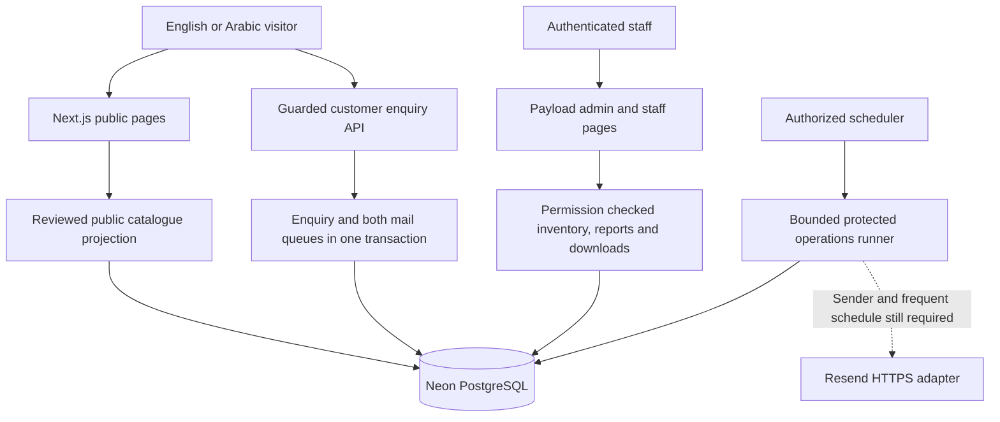

# Backend, security and operations handbook

This chapter describes EL AMAL as implemented at application commit `7f7326704305012e9637702b3112b5c85f554833`, using the 29 September 2026 operational evidence recorded in `PROGRESS.md`. Documentation checkpoint `f751ef5` follows that application release. It explains both the working application and the conditions still preventing a complete operational launch. Documentation preparation did not change application code, databases, accounts, deployments or credentials, and did not send email.

## What the backend does

The backend is the part of the website that runs on the server. It reads the published catalogue, controls staff access, records enquiries, maintains stock history and prepares email. The browser presents those results, but cannot decide its own permissions, confirm its own email address, rewrite an enquiry or invent stock.

EL AMAL is one Next.js application with Payload CMS embedded in it. It is not a separate React frontend calling an independently deployed CMS. The public website, `/admin`, staff pages and HTTP API deploy together to the existing Vercel project. Payload provides the administration interface, authenticated staff accounts, collection permissions, database adapter and migration framework. Neon PostgreSQL holds the durable application records. The same source repository contains the interface, server services, migrations and verification scripts.

The application is an instrument catalogue and enquiry system. An enquiry is a request for technical or commercial review. It is not a paid order, quotation, invoice or automatic stock commitment. Email confirmation proves access to the enquiry's mailbox at confirmation time; it does not verify the customer's business identity or approve their requested configuration.

### Current service inventory

| Service or component | Purpose | Current state and boundary |
|---|---|---|
| Vercel | Hosts the Next.js application and daily cron | Existing project on the confirmed Hobby account; stable review site and administration are live. |
| Neon PostgreSQL | Stores catalogue, staff, enquiries, queues, inventory and private photos | Separate development and hosted databases; Neon is the installed Marketplace integration. Built-in Neon Auth is not the application's staff authentication. |
| Payload CMS | Staff login, collection administration, permissions and migrations | Embedded in the application; version 3.90.2. |
| Next.js / React / Node | Server-rendered website, routes and runtime | Source pins Next.js 16.3.5, React 19.2.8 and Node 22.x. |
| Resend adapter | Would deliver customer confirmations, staff notifications and password recovery | HTTPS implementation exists. No verified sender/domain and provider credentials are operationally configured; real customer and recovery delivery remain disabled. |
| Native Vercel cron | Bounded stock expiry and enabled retention | Registered daily at 02:00 UTC. It cannot provide the frequent email-worker health required for public intake. |
| Inngest | Proposed frequent scheduling option | Terms acceptance is outstanding; no resource was provisioned. An available free option is not an installed integration or an authorized scheduler. |
| Checkly / external monitoring | Proposed uptime and operational alerting | Explicitly deferred by Nour. No monitoring installation or external alert destination is claimed. |
| GitHub Actions | Checks source changes and disposable database behavior | Quality workflow runs on pushes and pull requests. It does not itself block Vercel's separate automatic deployment integration. |
| Local encrypted backup tooling | Captures and verifies a recoverable database snapshot | A local backup and isolated restore are verified. Automatic offsite backup scheduling and retention are not configured. |

The receiving iCloud inbox is already confirmed. A receiving inbox is not a sending domain, proof of sender ownership, a provider API credential or a scheduler. Do not ask for the recipient again or treat the recipient setting as email activation.

### How requests move through the system



The diagram shows implemented connections, including the currently gated mail path. It does not imply that an anonymous visitor can submit a live enquiry today.

### Why this structure was chosen

Using one application keeps the public design, CMS records and staff workflows together without another deployment, API gateway or authentication service. PostgreSQL transactions make an enquiry and its queue entries succeed together, and allow stock checks to remain correct when several staff members act at once. Persistent database locks and leases coordinate different server instances; an in-memory JavaScript flag would protect only one instance and would disappear on restart.

The tradeoff is shared infrastructure. A database outage affects catalogue reads and staff operations. The configured database connection pool is deliberately small: at most three connections per Payload instance, with a 15-second connection timeout. Serverless replicas can still create more than three total connections. This is not evidence of unlimited capacity or a load-test result. External calls are kept outside long-held database transactions to avoid occupying scarce connections while waiting for an email provider.

The public catalogue uses an explicit projection: a new object containing public fields, rather than a raw CMS record. The trusted server read can inspect private publication evidence, but that evidence is not included in the website's public data. Products and categories paginate independently and concurrently; each collection's pages remain sequential. A failed read fails the request instead of silently returning a partial catalogue. Request-scoped caching deduplicates reads within a request while allowing later requests to see publishing and unpublishing changes.

CMS catalogue mode never falls back to convincing-looking demo products when the database is empty or unavailable. That protects the business from showing synthetic stock as genuine stock during an outage. Demo and real baskets also use separate storage keys.

## Data ownership and access

Payload has 13 configured application collections. Physical PostgreSQL tables also include child arrays, versions, relationships, authentication and CMS support tables; the number of collections is not the number of tables in a backup.

| Collection slug | What it represents | Who may read it through normal collection access | How it changes |
|---|---|---|---|
| `staff` | Login accounts and assigned role | Owner can read all; an authenticated non-owner can read their own record | Owner creates and updates; deletion denied. Password policy applies when a password is supplied. |
| `categories` | Bilingual catalogue groupings | All four staff roles | Owner and catalogue editor create/update; deletion denied. Public pages receive a separate projection. |
| `products` | Bilingual model records and reviewed technical details | Staff; anonymous collection access is restricted to published records | Owner and catalogue editor create/update, but only owner may publish; deletion denied. Draft versions enabled. |
| `skus` | Exact stock configurations | All four staff roles | Owner creates/updates; identity cannot be relabelled after creation; deletion denied. |
| `enquiries` | Immutable customer request snapshot plus staff workflow status | Owner and sales | Trusted submission service creates. Owner/sales can change business status and internal notes; submitted identity/content and confirmation fields are immutable through normal updates. |
| `notifications` | Staff notification queue | Owner and sales | Trusted server code only; direct create/update/delete denied. |
| `enquiry-verifications` | Confirmation digest, expiry and consumption evidence | No ordinary CMS role or anonymous reader | Trusted verification services only. |
| `request-limits` | Pseudonymous request/email allowance counters | No ordinary CMS role or anonymous reader | Trusted rate-limit services only. |
| `verification-emails` | Encrypted customer confirmation outbox | Owner/sales can read status metadata; encrypted envelope, delivery key and lease token explicitly denied | Trusted outbox and workers only. |
| `delivery-operations` | Scheduler lease, outcome, health and backlog counts | Owner only; lease token explicitly denied | Trusted scheduler only. |
| `inventory-reservations` | Immutable exact-SKU holds | Owner, sales and warehouse | Private inventory service; direct changes denied. |
| `inventory-movements` | Append-only stock event history | Owner, sales and warehouse | Private inventory service; direct changes denied. |
| `enquiry-attachments` | Private photo metadata and encrypted bytes | Owner/sales metadata only; `sealedData` and `contentHash` explicitly denied | Verified-customer upload service creates; retention service removes expired rows. |

Public pages do not expose the internal SKU ledger. A catalogue label inherited from a supplied source page describes dated model or family availability, not an exact warehouse quantity. Production has no entered exact SKU definitions at the latest checkpoint. No zero-balance or opening-stock assumption should be converted into a customer promise.

### Staff roles in practice

| Task | Owner | Catalogue editor | Sales | Warehouse |
|---|---|---|---|---|
| Sign in to Payload administration | Yes | Yes | Yes | Yes |
| Read staff accounts | All | Own only | Own only | Own only |
| Create staff or change role | Yes | No | No | No |
| Edit category/product drafts | Yes | Yes | No | No |
| Publish reviewed products | Yes | No | No | No |
| Read SKU definitions | Yes | Yes | Yes | Yes |
| Create/change SKU definition | Yes | No | No | No |
| Use private inventory console and ledger | Yes | No | Yes | Yes |
| Receipt / adjustment / dispatch / block / unblock / physical count confirmation | Yes | No | No | Yes |
| Place or release a hold | Yes | No | Yes | No |
| Reconcile inventory | Yes | No | Yes | Yes |
| Read enquiries, update enquiry status/internal notes | Yes | No | Yes | No |
| Read demand reports and export CSV | Yes | No | Yes | No |
| Read private photo metadata/download | Yes | No | Yes | No |
| Read scheduler health | Yes | No | No | No |

Inventory actions are checked in both the HTTP handler and the service. Buttons being hidden is not the permission boundary. The service validates the staff collection, role and numeric actor ID. A catalogue editor may see SKU definitions in the CMS while still being denied the inventory console and ledger.

Product publication requires English and Arabic names/descriptions, a source reference, reviewer, valid review date and confirmed rights. The publication hook rejects non-owner publication. A published product being edited by a catalogue editor must remain within the draft workflow; a normal update that attempts to leave the record published meets the same owner-only hook.

### Staff authentication and recovery

New or changed passwords must contain 15–128 Unicode characters and be nonblank. A small explicit common-password list and repeated-single-character passwords are rejected. This is not a comprehensive breached-password database or proof that any chosen passphrase is strong. The previously chosen short owner password was not silently replaced; it still needs an authorized change to a strong unique password.

Payload is configured for five failed login attempts, a ten-minute lock and a two-hour token lifetime. Cookies use SameSite Lax and the Secure flag in production. Payload provides password hashing and session machinery; the application does not store recoverable staff passwords in ordinary collection fields. Public first-user registration is blocked both in the catch-all route and the collection endpoint. Initial owner creation is a trusted local bootstrap, not a visitor-accessible signup.

Recovery email is disabled until its explicit gate and sender configuration are complete. The custom recovery wrapper requires exact canonical HTTPS origin, JSON POST and a body no larger than 8 KiB. It applies four requests per minute to each visitor/operation scope and another one-per-minute bucket for a normalized staff email; Payload additionally sets a ten-minute minimum reset-request interval. The forgot-password response is neutral so it does not confirm whether an account exists. Reset tokens expire after 30 minutes, and a transaction-scoped advisory lock serializes competing uses of the same token through password update and session creation.

The staff email adapter sends directly through the HTTPS provider with a 15-second timeout and a body-derived idempotency key. It is not the durable customer outbox. Its existence does not make password recovery operational. There is no implemented application MFA enrollment flow and no completed penetration-test certification. MFA in hosting/provider accounts is a separate control and cannot be inferred from staff login settings.

## HTTP route reference

These are the concrete application route contracts at the current source revision. Authentication failure, disabled configuration and invalid input can intentionally return generic responses. API and staff paths receive private/no-store and noindex headers. A 200 page containing a sign-in explanation is not evidence that protected data was returned.

### Application-owned API routes

| Method and path | Intended caller and input | Result and important conditions | Implementation |
|---|---|---|---|
| `GET /api/customer-enquiries` | Browser checking configured intake availability | `{canSubmit}`. This is configuration/origin presence only; POST additionally checks real durable worker health. | `src/lib/customer-http.ts`, `customer-readiness.ts` |
| `POST /api/customer-enquiries` | Anonymous customer, once enabled; exact canonical origin; JSON enquiry | 202 with random reference, signed resend receipt, awaiting-verification status, `emailSent:false`, `stockReserved:false`. 400 input, 403 origin, 409 changed request-key content, 415 type, 429 rate, 503 unavailable/health/capacity/error. | `customer-http.ts`, `customer-service.ts`, `submit-enquiry.ts` |
| `POST /api/customer-enquiries/resend` | Customer holding signed receipt; exact origin; JSON receipt, maximum 4 KiB | Neutral 202 accepted for invalid/expired/ineligible receipts and email-limit/capacity outcomes; visitor limit can return 429. Never accepts a replacement email address. | `customer-http.ts`, `customer-service.ts` |
| `GET /api/enquiry-submissions` | Staff test UI | `{canSaveTest}` only when CMS is configured, catalogue source is demo and caller is owner/sales. | `enquiry-http.ts` |
| `POST /api/enquiry-submissions` | Owner/sales testing demo enquiry; same origin, JSON | 201 new or 200 repeated test save; no mail or stock reservation. Unavailable in real CMS-catalogue mode. | `enquiry-http.ts` |
| `POST /api/enquiry-verification` | Holder of email token; same origin; JSON token, maximum 4 KiB | Single-use atomic confirmation. Returns reference, customer/test mode and `stockReserved:false`; customer mode may include upload grant when enabled. 400 invalid/expired/used link; 429 rate; 503 unavailable. | `verification-http.ts`, `enquiry-verification.ts` |
| `POST /api/enquiry-verification/test-link` | Authenticated owner/sales; demo enquiry reference | Returns a test token only for an eligible unverified demo enquiry. Never issues a public customer token. | `verification-http.ts`, `verification-runtime.ts` |
| `POST /api/customer-photos` | Verified customer holding bearer upload grant; exact origin; raw JPEG/PNG body | Signed capability plus database confirmation checks. Uses `X-Upload-Id` and encoded `X-Photo-Name`; not multipart. 403 unauthorized, 415 type, 429 rate, 413 oversized stream, 400 invalid/content/quota failure, 503 disabled. | `attachment-http.ts`, `attachment-service.ts` |
| `GET /api/staff/enquiry-attachments/:id` | Authenticated owner/sales; positive numeric ID | Private attachment download. Generic 404 for invalid ID, denied caller, expired/unreadable file or unavailable CMS. | Staff attachment `route.ts`, `attachment-service.ts` |
| `GET /api/staff/inventory` | Owner/sales/warehouse | Private inventory view; 403 unauthorized, 503 unavailable. | `inventory-http.ts`, `inventory-service.ts` |
| `POST /api/staff/inventory` | Authorized role for the command; same-origin JSON, maximum 8 KiB | Validates command/role and executes transactionally. 201 new action, 200 exact repeated action, appropriate input/conflict denial. | `inventory-http.ts`, `inventory.ts`, `inventory-service.ts` |
| `GET /api/staff/demand-report` | Owner/sales; validated date/filter/query options | JSON report or downloadable CSV. Private/no-store/no-referrer. Contact details and arbitrary customer text excluded. | `demand-http.ts`, `demand-report.ts`, `demand-service.ts` |
| `POST /api/internal/notifications` | Authorized machine bearer using `NOTIFICATION_WORKER_SECRET` | At most one eligible staff notification. 401 before database access if unauthorized; 503 disabled/error. | `notification-http.ts`, `notification-worker.ts` |
| `POST /api/internal/verification-emails` | Same machine secret; verification delivery enabled | At most one customer confirmation job; 401 before database access or 503 disabled/error. | `notification-http.ts`, `verification-email-worker.ts` |
| `GET` or `POST /api/internal/delivery-operations` | Authorized scheduler bearer using separate `CRON_SECRET` | Bounded batch and maintenance. 200 complete/maintenance/overlap; 503 degraded/disabled/stale/error; 401 bad authorization. This performs work and is not a public health probe. | `delivery-operations.ts`, `delivery-runner.ts` |
| `HEAD /api/internal/delivery-operations` | Any caller | Explicit 405. Prevents Next.js automatically running GET work for HEAD. | Operations `route.ts` |
| `GET /social-image` | Public social-image fetch | Generated social artwork; outside the private `/api` namespace. | `src/app/social-image/route.tsx` |

Each API route file is under `src/app/(frontend)/api/` at its corresponding path. Unsupported methods are not an alternative way to invoke these services. The one exception to POST-only mutation is the explicitly bearer-protected operations GET required by native cron.

### Payload REST surface

`src/app/(payload)/api/[...slug]/route.ts` dispatches GET, POST, PATCH, PUT, DELETE and OPTIONS to Payload after the CMS configuration gate. Dispatching a verb does not mean every collection permits that operation. Collection/field access rules above still apply. GraphQL is explicitly disabled.

For each listed collection slug, Payload's installed REST endpoint definitions include:

| Path pattern | Methods and meaning |
|---|---|
| `/api/:collection` | GET find; POST create; PATCH bulk update; DELETE bulk delete, subject to collection permissions. |
| `/api/:collection/:id` | GET record; PATCH update; DELETE delete, subject to permissions. |
| `/api/:collection/count` | GET count subject to read access. |
| `/api/:collection/access/:id?` | POST document-access calculation. |
| `/api/:collection/:id/duplicate` | POST duplicate endpoint, subject to collection create/access rules. |
| `/api/:collection/versions` and `/versions/:id` | GET version APIs, meaningful for version-enabled products; POST `/versions/:id` restores a version under framework permissions. |
| `/api/access` | GET framework access information. |

The authenticated `staff` collection also registers `GET /api/staff/init`, `GET /api/staff/me`, and POST `/api/staff/login`, `/logout`, `/refresh-token`, `/forgot-password`, `/reset-password`, `/first-register`, `/unlock`, and `/verify/:id`. These are framework routes with framework preconditions, not a promise that every optional feature is configured. Staff email verification and API-key authentication are not enabled in the collection configuration. First-register is explicitly denied; forgot/reset are intercepted by the custom guarded recovery wrapper. The principal staff entry point is `/admin/login`, not these raw API endpoints.

The installed endpoint definitions can be inspected in `node_modules/payload/dist/auth/endpoints/index.js` and `node_modules/payload/dist/collections/endpoints/index.js`. They are dependency source, not files maintained by this project. Do not add undocumented authentication behavior based on a different Payload version.

## Customer enquiry lifecycle

### What a customer would do after activation

1. Browse the real English or Arabic catalogue and add products/quantities to the quote basket, or enter a direct model, quantity and required range.
2. Enter name, company, email and optional technical notes. Review the request before submitting.
3. Receive a random enquiry reference once the server atomically saves the request and its required queue records. The immediate response explicitly says email has not yet been sent and stock has not been reserved.
4. Receive a confirmation email, open the link and actively press Confirm. Merely opening the link does not consume it.
5. After genuine confirmation, optionally upload eligible technical photos on that page. Staff become eligible to receive the reference-only notification.
6. Sales review the private enquiry and contact the customer through an approved business process. A staff member decides any configuration, quote and exact-SKU stock action.

That customer journey is implemented but public intake is still gated off. The website can still be browsed and requests reviewed without claiming a working submission channel.

### Submitted data and validation

An enquiry contains a random version-4 UUID request key, English/Arabic locale, contact object and either catalogue basket lines or a direct-model request. The contact fields are name up to 120 characters, company up to 160, email up to 254 and notes up to 2,000. Name/company/email are required; email is normalized to lowercase for customer intake and checked server-side.

Catalogue input allows at most 100 unique product IDs, each up to 100 characters, with whole-number quantities from 1 to 9,999. The server resolves those IDs against its current public catalogue and snapshots model plus English/Arabic names. It does not trust caller-provided product descriptions or statuses. Direct RFQ input requires a model up to 120 characters, nonempty range up to 160 and the same quantity bounds; it cannot also include catalogue lines. A direct request is labelled customer-specified and needs technical review, not treated as an existing SKU.

New submissions are streamed with a 32 KiB body limit, checked independently of a claimed content length. They require JSON and an Origin header matching the configured canonical HTTPS origin and actual request origin. This makes customer intake intentionally unavailable from arbitrary mirrored or protected-preview origins unless configured deliberately for that environment.

### Duplicate protection and durability

The browser creates a request key for a reviewed submission. The server hashes the normalized request content and stores both that fingerprint and the unique key. Retrying the identical key/content returns the original reference. Reusing the key with different content returns a conflict so a changed request cannot silently replace the first request.

The enquiry snapshot, one staff-notification record and the customer verification digest/encrypted outbox are created in the same database transaction. A queue failure rolls back the enquiry instead of leaving a customer believing a deliverable request exists. Database uniqueness also handles simultaneous identical submissions. A successful saved retry is resolved before re-checking changed catalogue data, queue capacity or worker freshness, so an outage does not hide an already accepted request.

This protects against accidental double submission, but does not give every business event universal exactly-once delivery. A third-party provider can accept a message while a network timeout prevents the application recording that fact. Stable provider idempotency keys and bounded retry windows address that separate uncertainty.

### Confirmation and resend are different capabilities

The customer verification token is a cryptographically random 32-byte value represented as 64 hex characters. The database verification record stores only its SHA-256 digest. It expires after one hour and is consumed atomically with confirmation. Demo confirmation produces `test-verified`; only genuine CMS confirmation produces `verified` and can qualify for customer photos or staff notification delivery.

The emailed link carries its token in the URL fragment. Fragments are not sent in ordinary HTTP requests. The page reads it into memory, requires the user to press Confirm and removes the fragment before the confirmation API request. This reduces accidental consumption by link-preview fetchers; it does not turn an email token into a public reusable link.

The immediate submission receipt is a separate HMAC-signed, resend-only capability lasting 24 hours. It cannot confirm an address, read the enquiry or select another recipient. The current UI stores it only in memory; refresh or tab closure loses resend controls. Resending replaces the old digest/message, so the earlier confirmation link stops working. Requests within the one-minute cooldown or after three confirmation generations in a 24-hour window are not issued another link. A message already in flight cannot be recalled; an older email may arrive with a link that is now invalid.

### Abuse limits and queue admission

- Customer submission and resend use six requests per minute per pseudonymous visitor/scope.
- A normalized email has six new submission/resend allowances per fixed 24-hour window; this counts eligible attempts, not guaranteed emails sent. Repeating the same attempt key does not consume another allowance.
- Request/email keys use purpose-separated HMACs; raw IP addresses and email addresses are not stored in the rate-limit table.
- The forwarded IP is trusted only when the application is running directly behind the configured Vercel proxy. Other hosts or invalid headers use a shared fallback bucket.
- Queue admission takes a transaction-scoped advisory lock and refuses new CMS work when either active confirmation jobs or active CMS staff jobs has 100 rows. This bounds active backlog, not lifetime record count or all platform costs.
- New requests require the durable delivery row to show outcome `complete` and a nonfuture success timestamp no more than 15 minutes old. A missing/stale/degraded heartbeat refuses new persistence before the email allowance is consumed.

These limits make ordinary abuse more expensive and bound some resource use. They do not demonstrate resistance to all distributed abuse, DDoS, malicious staff activity or future vulnerabilities. There is no claim of a CAPTCHA, independent WAF configuration or penetration test in this application release.

## Email queues, scheduling and operational health

### Two queues with different jobs

The customer outbox contains a snapshot of sender, recipient, bilingual message and confirmation link. AES-256-GCM encrypts that envelope with a purpose-specific HKDF-derived key from `PAYLOAD_SECRET`. A fresh nonce is used, and authenticated associated data binds ciphertext to its delivery generation. Sent or terminal records erase the replayable envelope while preserving delivery metadata.

The staff queue sends only the enquiry reference and an instruction to sign in. Customer notes, contact details and attachments are not copied into the notification body. Staff delivery waits until the related CMS enquiry has genuine verified status and a confirmation timestamp. Waiting for confirmation does not consume attempts; demo records are permanently disabled. Customer enquiry data still exists in the authorized private inbox independently of an email's transport outcome.

Workers claim records atomically using database row locks with `SKIP LOCKED`, increment attempts, and assign a random five-minute lease. Other workers can continue with different rows. Expired claims can be recovered, and late results must match the current lease before changing the row. Provider calls use HTTPS, reject redirects, abort after 15 seconds, supply a stable idempotency key and accept only a bounded valid provider receipt. Provider error bodies are not retained in user-facing errors or queue diagnostics.

Retries use exponential delays beginning at 60 seconds, with a five-attempt ceiling. Staff notifications are not retried beyond 23 hours from creation, preserving the conservative window chosen for provider deduplication. Customer confirmation claims require more than 30 seconds of token life remaining. A provider acceptance receipt is not proof of inbox delivery or customer confirmation.

### The batch runner

The protected operations route has a separate two-minute scheduler lease so overlapping calls return `overlap`. One invocation starts at most eight message attempts, alternates queues and stops starting more work after a 40-second budget that begins before CMS initialization. The route's duration limit is 60 seconds. Leases and idempotency handle repeats and interrupted invocations; successful HTTP scheduling alone is not enough.

Maintenance can operate with sending disabled. It expires at most 25 holds with a five-second start budget, cleans bounded secret/rate-limit data when retention is enabled, and removes at most 50 expired photos. A maintenance-only outcome has zero email attempts and never advances the successful-mail timestamp. Expired holds already stop reducing availability even when physical cleanup waits for the daily invocation.

The owner-only delivery operations collection shows last start/completion/success, last outcome, attempt/failure counts, queue sizes and oldest pending work. This is durable internal health, not an external monitoring service. A healthy empty-mail-queue pass can establish worker activity; a daily maintenance-only pass cannot satisfy the mail gate.

### Why the existing daily cron cannot activate customer intake

The current Vercel schedule is 02:00 UTC once per day. Its purpose is bounded housekeeping on the confirmed Hobby project. New customer enquiries require successful mail-worker evidence within 15 minutes and confirmation links expire in one hour. A daily schedule cannot maintain either practical delivery cadence or continuous fresh health. A separately authorized frequent scheduler, normally every five minutes, remains required; upgrading a plan or accepting integration terms was not done implicitly.

Do not use the local laptop as permanent production scheduling. Do not count GitHub scheduled workflows as a guaranteed timely email service. Inngest terms have not been accepted, and external Checkly monitoring was explicitly deferred. Those facts must stay visible instead of being converted into a completed checklist item.

### Activation sequence once prerequisites are supplied

1. Confirm the owned sending domain/address, actual provider account and canonical HTTPS origin. Store credentials privately. The receiving inbox is already known.
2. Confirm migration state and runtime access in the intended environment. Inspect readiness booleans and the private queue without exposing customer data.
3. Configure and authorize the frequent scheduler and protected bearer secret. Enable worker transport and verify two healthy scheduled outcomes with fresh timestamps; daily maintenance is insufficient.
4. Prepare an authorized controlled customer test, including permission to send real email. Intake must be enabled in the controlled environment/window to exercise its actual API; preserve the launch gates until this test is ready.
5. Verify actual receipt of the customer email, successful one-time confirmation, staff notification receipt in the confirmed inbox, and expected private records. Test resend/old-link invalidation and failure/retry behavior with appropriate test accounts.
6. Set the manual workers-ready assertion only after the real scheduler/delivery evidence exists. Open public intake after controlled acceptance and continue watching the durable health row.
7. Enable and verify staff recovery separately. Its direct adapter is not proved by a customer queue test.

`npm run readiness` makes no network calls and prints configuration booleans only. It cannot prove domain ownership, provider account access, real receipt, scheduler activity, stock correctness or client launch approval.

### Operator response to delivery trouble

Investigate any operations 503, successful-mail timestamp older than 15 minutes, increasing backlog, customer queue older than ten minutes or staff work approaching 23 hours. First distinguish disabled configuration from maintenance-only health, provider failure and an interrupted invocation. Compare timestamps and lease expiry; an old displayed result can survive a timed-out worker.

During a prolonged outage, pause new public intake while allowing authorized workers to recover pending work. Preserve records. Check provider receipts before deciding whether a timed-out message was accepted. Do not reset attempts, rewrite creation dates or reuse an old job beyond its deduplication window. Do not change sender, recipient or template while retryable staff jobs are pending without reconciling the queue. Turning off public intake alone does not drain or erase existing queues.

## Private technical photos

Photos are an implemented, deliberately narrow attachment workflow. They are not general document upload. A genuinely verified CMS customer can upload at most three JPEG/PNG still images, each up to 2 MiB (2,097,152 bytes). PDF, XLSX, SVG, video and arbitrary documents are not enabled; neither a 10 MB limit nor malware-scanned document quarantine is implemented.

The confirmation response can issue a signed enquiry-specific upload grant lasting 24 hours. The browser holds it in memory and sends it as a bearer header. It is not a public download URL, and the application has no later customer attachment portal. Refreshing the confirmation page loses the grant; the consumed original email token cannot simply be reused to obtain it again.

The upload route streams and bounds actual bytes, verifies declared MIME against signature, and decodes the image with an 8,000,000-pixel limit. It applies orientation, resizes inside 2400 by 2400 without enlargement and writes a fresh JPEG or PNG that must still fit the byte cap. Rebuilding the pixels discards embedded metadata and appended content. It does not scan arbitrary documents or remove private information visibly photographed in the image.

Reconstructed bytes are encrypted with AES-256-GCM and a fresh nonce, using a purpose-separated key derived from `PAYLOAD_SECRET`. Authentication binds a photo to its enquiry reference and upload UUID. A transaction and advisory lock serialize per-enquiry counting and the shared quota: 64 MiB of reconstructed bytes across the table. Base64 encryption envelopes and database/index overhead mean physical database size can exceed that logical cap. The quota includes expired rows until cleanup deletes them.

A repeated UUID with the same enquiry, reconstructed content hash, sanitized filename and MIME returns the previous save. Changing the file while reusing the UUID is rejected. The browser preserves the UUID during a retry of the same selected file. A failed response should therefore be retried with the same file and identity, not by generating many new attempts.

Only owner/sales may download. The download requires staff authentication and current genuine enquiry confirmation; it returns a generated filename, attachment disposition, no-sniff, private/no-store and restrictive `default-src 'none'; sandbox` policy. Invalid, unauthorized, expired and unreadable cases share a generic not-found response. Encrypted contents never enter `public/` and are not emailed as attachments.

Photos become unavailable exactly 30 days after creation. Physical deletion requires enabled retention and a successful operations invocation. Backups can retain older encrypted copies; the live 30-day policy is not automatic erasure from every backup. When the quota fills, new admission stops instead of deleting active photos or silently expanding storage.

The current encrypted format has no key ID or dual-key reader. Changing `PAYLOAD_SECRET` invalidates outstanding grants and makes old photo/outbox ciphertext unreadable with the new secret. A planned rotation needs paused dependent workflows, an encrypted backup, preserved old secret in private custody, and either a reviewed re-encryption migration or explicit expiry/retention plan. No automated re-encryption tool is included. Losing the old secret cannot be repaired by restoring only the database.

## Security controls and their limits

### Implemented controls

| Risk | Relevant implemented control | Practical limit |
|---|---|---|
| Unauthorized staff/data access | Payload role/field access plus service authorization; first-register denied; private routes | Staff roles remain trusted within their scope; compromised credentials can use their permissions. |
| Cross-origin mutation | Exact/same-origin checks on custom mutation handlers, JSON requirements, production secure cookies | Do not describe this as a custom universal CSRF token system; Payload's ordinary routes use framework behavior. |
| Input abuse | Bounded streaming bodies, UUID/token patterns, quantities, names and command parsing | Not every framework route has the same custom body/rate guard. |
| Duplicate or concurrent writes | Unique request keys, fingerprints, transactions, row/advisory locks and leases | Third-party outcomes remain potentially ambiguous; provider reconciliation matters. |
| Email/token disclosure | Digest-only confirmation records, encrypted outbox, private responses, reference-only staff mail | Authorized enquiry contact fields are not application-encrypted; application compromise with secrets defeats envelope protection. |
| Upload abuse | Strict JPEG/PNG limits, full decode/re-encode, signed grants, verified enquiry, quota and private download | Not antivirus scanning, content moderation or support for arbitrary documents. |
| Query injection | Parameterized runtime queries and validated identifiers; collection permissions | A source review and tests are not a comprehensive penetration test. |
| Dependency advisories | Lockfile, pinned package versions, narrow compatibility overrides and all-severity CI audit | Zero known findings at a checkpoint is not absence of undiscovered vulnerabilities. |
| Accidental indexing/caching of private data | Private/no-store, no-referrer and noindex on administration/staff/API; robot exclusions | Robots/noindex do not authenticate or prevent a determined visitor requesting a URL. |

Global headers disable MIME sniffing and framing, constrain objects/base URI/forms, restrict camera/microphone/geolocation and add HSTS for one year. The global CSP is `object-src 'none'; base-uri 'self'; frame-ancestors 'none'; form-action 'self'`. It has no restrictive `script-src` or per-response nonce policy and should be described as baseline hardening, not comprehensive XSS prevention. Public referrers use strict-origin-when-cross-origin; private routes are overridden to no-referrer. HSTS is not configured with includeSubDomains/preload in this source. The powered-by header is disabled.

### Known source limitations to address after documentation

1. **Notification worker metadata is only hidden in the admin UI.** `src/cms/notifications.ts` marks `deliveryKey` and `leaseToken` with `admin.hidden` but does not deny their field-level read access. Owner/sales can therefore potentially receive those values through their authorized collection reads. Anonymous readers are denied the entire collection. These values are an idempotency identity and an internal lease identity; neither authenticates a public worker endpoint. The worker routes separately require `NOTIFICATION_WORKER_SECRET` or `CRON_SECRET`, and direct queue writes are denied. No anonymous exposure or direct worker takeover is established. The minimal future change is field read denial plus owner/sales denied-field assertions and a trusted-worker regression.
2. **Enquiry admin helper text is stale.** The collection description still says stock reservation is not active, although private staff stock operations exist. Its immutable `deliveryStatus` field is still a legacy `not-configured` value; actual email state lives in the queue collections. Operators should consult those queues, not use that field as delivery telemetry.
3. **No application MFA or penetration-test acceptance is implemented.** Strong-password policy, login lockout and recovery controls are real safeguards but do not establish either claim. Existing owner credentials still need strengthening.
4. **No independently provisioned external alerting.** Owner-visible health exists; Checkly remains deferred. A failed daily job can require manual discovery until an approved external alerting arrangement exists.
5. **No automatic offsite recovery schedule.** The successful local archive/rehearsal establishes one recoverable snapshot, not a continuous recovery service.
6. **The broader upload requirement remains open.** Larger PDF/Excel private quarantine, scanning and storage need their own design, implementation and verification.
7. **Staff unlock inherits a broader framework default.** The staff collection does not define `access.unlock`. Installed Payload 3.90.2 fills this with `defaultUnlockAccess`, which allows an authenticated member of the configured admin collection. Because all four staff roles belong to that collection, source inspection indicates that a signed-in non-owner can use the framework unlock operation for another staff email. Anonymous access remains denied; unlock clears login-attempt/lock state and does not reveal or change a password or grant a role. This is broader than an owner-only account-administration policy. The minimal future correction is explicit owner-only unlock access, verified with owner/non-owner/anonymous requests against disposable accounts and with normal login lockout preserved. This finding is from source inspection, not a production mutation or a newly executed exploit test.

No application fix was made while producing this chapter. These are concrete follow-up findings, not a claim that undocumented hardening already happened.

## Configuration reference

Values, passwords, tokens, private hostnames, provider credentials and connection strings must stay outside this handbook. The table lists variable names and purposes only. `.env.example` is a starting reference, not proof of hosted configuration. Vercel may intentionally return sensitive values blank during an environment pull; a blank downloaded value alone does not prove the deployed setting is missing.

| Variable name | Purpose and dependency |
|---|---|
| `DATABASE_URL` | Application database connection; development and hosted targets must remain distinct. |
| `DATABASE_URL_UNPOOLED` | Direct database connection for workflows that cannot use a transaction pooler. |
| `PAYLOAD_SECRET` | Payload authentication plus signed/encrypted application capabilities; minimum length gate and coordinated rotation required. |
| `CMS_ENABLED` | Enables configured CMS runtime; also requires database and secret. |
| `CATALOGUE_SOURCE` | Selects reviewed CMS catalogue versus explicit demo mode. |
| `SITE_URL` | Canonical site origin; customer/recovery mail requires exact HTTPS origin without path, credentials or trailing slash. |
| `PUBLIC_ENQUIRIES_ENABLED` | Public customer submission gate, currently disabled. |
| `ENQUIRY_WORKERS_READY` | Operator assertion after actual scheduler/delivery verification; does not replace durable health. |
| `ENQUIRY_NOTIFICATION_TO` | Confirmed staff receiving destination; not a sender credential. |
| `NOTIFICATION_DELIVERY_ENABLED` | Enables mail transport readiness for staff/customer workers. |
| `VERIFICATION_DELIVERY_ENABLED` | Additional customer confirmation delivery gate. |
| `MAIL_PROVIDER` | Selects the implemented provider adapter. |
| `MAIL_FROM` | Verified-domain plain sender address; requires actual provider/domain verification. |
| `RESEND_API_KEY` | Provider authorization credential; keep private. |
| `NOTIFICATION_WORKER_SECRET` | Separate machine bearer for the one-item worker endpoints; not a staff password. |
| `DELIVERY_OPERATIONS_ENABLED` | Enables the scheduled batch/maintenance endpoint. |
| `DELIVERY_RETENTION_ENABLED` | Separately enables expired secret/rate/photo cleanup. |
| `CRON_SECRET` | Independent protected scheduler bearer. |
| `STAFF_RECOVERY_ENABLED` | Staff password-email recovery gate, currently disabled. |
| `ENQUIRY_PHOTOS_ENABLED` | Enables photo grant/upload capability; genuine confirmation remains required. |
| `INVENTORY_FRESHNESS_HOURS` | Optional whole-hour freshness policy; absent setting leaves review manual. |
| `SITE_INDEXING_ENABLED` | Production real-catalogue indexing gate; not a ranking guarantee. |
| `GOOGLE_SITE_VERIFICATION` | Optional Search Console ownership token. |
| `BUSINESS_PHONE`, `BUSINESS_WHATSAPP` | Approved public contact information. |
| `WIKA_RELATIONSHIP_EN`, `WIKA_RELATIONSHIP_AR`, `WIKA_EVIDENCE_URL` | Approved relationship wording and documentary evidence. |
| `BACKUP_DATABASE_URL` | Optional explicit direct source for encrypted backup. |
| `PG_BIN_DIR` | PostgreSQL command-line tool location. |
| `BACKUP_KEY_FILE`, `BACKUP_ENCRYPTION_KEY` | Private separate backup-key source; file-based local custody or protected automation secret. |
| `RESTORE_DATABASE_URL`, `RESTORE_ALLOWED_HOST` | Explicit separate development destination authorization for isolated restore rehearsal. |
| `CMS_DATABASE_CHECK` | Development-only regression guard; not a bypass permitting production test writes. |

Platform/runtime inputs such as `VERCEL`, `VERCEL_ENV`, `NODE_ENV`, `CI` and `NEXT_TELEMETRY_DISABLED` also affect proxy trust, indexing, cookies or checks. They are not user credentials. Maintain separate environment scopes and verify runtime behavior after changes; do not bulk-copy development configuration into production.

## Database migrations, backups and recovery

### Schema changes

Payload's Postgres adapter has automatic schema push disabled. Changes are recorded as versioned migrations under `src/migrations`, registered in `src/migrations/index.ts`. The ten current migrations cover the initial catalogue, security upgrade, enquiry inbox, staff queue, client requirements, confirmation, encrypted confirmation outbox, detailed catalogue, launch operations and inventory completion.

The latest is `20260929_141342_inventory_completion`; the preceding operations migration is `20260929_002849_launch_operations`. Both were applied to development and hosted databases according to the current progress evidence. A code deployment and a database migration are separate events. A Ready deployment is not proof that its required schema exists. Down migrations may drop data and are not the normal response to an application rollback.

The safe sequence is review the migration, rehearse on development/disposable data, take and verify an appropriate backup, apply the reviewed forward migration to the intended target, then verify compatible application behavior. Additive migrations reduce rollback friction but do not make every older version compatible automatically. Never test integration scripts against hosted production to avoid setting up a development environment.

### What the verified backup proves

The encrypted local archive is `artifacts/backups/el-amal-2026-09-29-verified.enc`, accompanied by `.manifest.enc`. The restore report records **2026-09-29T14:29:27.653Z**, **24 public tables**, **572 rows**, matching sorted row fingerprints and matching constraint count; the random temporary development database was removed. The backup predates the latest inventory-completion migration. It must be restored with the matching source/schema context and then advanced with reviewed forward migrations where required.

The backup script shares a repeatable-read exported snapshot between its manifest and PostgreSQL custom-format dump, so the two describe one database point in time. AES-256-GCM protects archive and manifest with independent nonces, and the manifest binds the archive SHA-256. Rehearsal authenticates the full archive before `pg_restore`, restores into a newly named database on the explicitly allowed different unpooled development host, and compares rows plus constraints. Plaintext is temporarily created under a random operating-system temporary directory and cleanup attempts all owned resources even after failure.

The backup key is held separately outside the OneDrive project. Neither its value nor other application secrets belong in the archive documentation, chat or Git. Keep both encrypted files and the appropriate original `PAYLOAD_SECRET` in separate approved custody: encrypted photo/outbox contents require that Payload secret as well as the database backup key.

The archive covers the public application schema. It does not back up Neon account settings, cluster roles, DNS, provider accounts, local secrets or every hosting configuration. Bundled product media is recovered from the matching Git source revision. GitHub preserves committed source, not live database data. OneDrive placement of an encrypted local artifact is not a configured, verified offsite backup policy with independent retention and alerts.

### Documented backup commands

These commands are an operator reference, not commands executed during handbook preparation. Their named ignored environment files must already contain the correct private configuration. Use PostgreSQL tools matching or newer than the hosted server major version; the recorded hosted database uses PostgreSQL 18.

```powershell
node --env-file=.env.hosted.local --env-file=.env.backup.local scripts/database-backup.mjs create artifacts/backups/el-amal-YYYY-MM-DD.enc
node --env-file=.env.backup.local scripts/database-backup.mjs rehearse artifacts/backups/el-amal-YYYY-MM-DD.enc
```

Choose a new filename; the script refuses overwrite. Preserve both encrypted outputs and the unique restore report. A successful archive command without a successful rehearsal is not equivalent to the verified snapshot above. Scheduling, offsite destination, retention period, acceptable data-loss window and recovery-time target still need explicit operational setup and acceptance.

### Actual incident recovery

1. Preserve the affected database and its logs for diagnosis. Identify the incident time, latest recoverable archive and matching application revision.
2. Retrieve encrypted archive and manifest plus the separately held backup key and required original application secret through the approved private process.
3. Restore to a separate replacement database under an operator's supervision; never point rehearsal at production or erase the affected database in place.
4. Verify table contents, constraints, staff access, published catalogue, private records and encrypted downloads. Apply reviewed forward migrations after establishing the correct restored baseline.
5. Point a protected candidate deployment at the replacement and perform runtime checks before switching production.
6. Reconcile any business/email events after the backup timestamp with provider or staff records. A database restore can roll back recorded delivery outcomes while an email has already been sent.
7. Switch only after recovery acceptance, observe the restored service, document the real data-loss/time outcome, and preserve incident evidence.

No complete automated production failover or point-in-time restore guarantee has been established. The local rehearsal is strong evidence for that archive, not an unmeasured promise about recovery time.

## Development, CI and deployment operations

### Working locally

Use the existing project and Node version from `package.json`. `npm ci` installs the lockfile, `npm run dev` starts the loopback development server on port 3004, `npm run build` makes a production build and `npm start` serves it on the same loopback port. Clean builds can download configured fonts. Local development must use the development database; production credentials are not a convenient shortcut.

The installed Next.js version requires its bundled documentation for coding changes. `AGENTS.md` points to `node_modules/next/dist/docs/`; use that source rather than relying on assumptions from earlier Next.js releases. The current application deliberately uses Webpack for dev/build. Payload's admin import map uses a resolved filesystem path because a previously bundled URL form built successfully but failed at runtime.

Windows host memory has interrupted earlier parallel checks and local builds. Run resource-heavy build/database tasks serially, stop unneeded owned processes, and record which environment actually completed a check. A terminated local build is not a successful build; the verified Linux CI/Vercel builds provide the release build evidence. Do not disable assertions simply to fit the host.

### Verification commands and boundaries

| Command or script | What it verifies | Operational caution |
|---|---|---|
| `npm test` | Unit/permission/validation/crypto/helper regressions | 142 checks succeeded at the current application checkpoint; new runs may change the count. |
| `npm run typecheck` | Integrated TypeScript consistency | Type success does not prove browser or database behavior. |
| `npm audit --audit-level=low` | Known dependency advisories at all severities | Recorded result is zero; must be rechecked for future releases. |
| `npm run readiness` | Presence/shape of configuration gates | No network, no secrets and no real readiness/receipt proof. |
| `npm run build` | Production compile/build | Needs runtime smoke checks afterward. |
| `scripts/check-cms-database.ts` | CMS permissions, draft/publication and projection behavior | Development guard required; use private development settings. |
| `scripts/check-enquiries.ts` | Request persistence/deduplication/queue transaction behavior | Development database and disposable fixture cleanup. |
| `scripts/check-verification.ts` | Confirmation behavior | Synthetic fixture data, no real customer message. |
| `scripts/check-notifications.ts` | Staff queue claims/retries/leases/eligibility | Fake transport, no provider contact. |
| `scripts/check-verification-emails.ts` | Encrypted outbox, resend, token rotation and worker behavior | Fake transport; not actual inbox evidence. |
| `scripts/check-customer-intake.ts` | Quotas, health gating, retries/conflicts and request persistence | Isolated development schema; does not overwrite real health to make a test pass. |
| `scripts/check-request-limit-cleanup.ts` | Cleanup versus concurrent quota-renewal regression | Development-only concurrency test. |
| `scripts/check-delivery-operations.ts` | Batch leases, queue capacity, retention and genuine verification gate | Disposable schema; fake mail transport. |
| `scripts/check-staff-and-photos.ts` | Photo crypto/quota/access/retention and real Payload reset/session behavior | Checks intended development/hosted separation, uses owned isolated schema and fake mail. |
| `scripts/check-inventory.ts` | Real PostgreSQL inventory access and concurrent operation invariants | Development/disposable data only. |
| `scripts/check-demand-report.ts` | Report filtering, aggregation, access and privacy-safe export | Development/disposable data only. |
| `scripts/check-built-server.mjs` | Starts the built app and checks public/private CMS routes | Explicitly restricted to the disposable CI database. |
| `scripts/audit-live-seo.mjs` | Public route/sitemap/asset technical crawl | Public read-only crawl; follow its configured target and limits. |
| `scripts/database-backup.mjs` | Encrypted backup or isolated restore rehearsal | Separate private configuration and intended direct hosts; not an in-place restore tool. |

### What CI currently checks

The pinned GitHub workflow runs on push and pull request, cancels superseded runs for the same ref, and grants read-only repository contents permission. Its Linux runner uses Node 22 and a disposable PostgreSQL 17 service with synthetic CI credentials. No hosted database secrets are required.

It performs a clean install; unit/permission checks; TypeScript; all-severity dependency audit; fresh migrations into disposable Postgres; stock/report database regressions; a production build with real CMS integration enabled against that disposable database; and built-server route checks. The smoke script checks English/Arabic catalogue, staff sign-in surfaces, admin login, and denial of anonymous SKU/photo/inventory/report APIs.

The current workflow does not run every standalone integration script on every push, does not send real email, does not perform a complete device/accessibility audit and does not prove hosted database migration status. Earlier isolated integration evidence covers additional services but should not be relabelled as automatic coverage in the workflow.

Recorded final application evidence is GitHub run `36584827754` on `7f73267`, with 142 unit checks, TypeScript, zero audit findings, fresh migrations, stock/report regressions, build and built-server checks. Production deployment is `dpl_4iYTN8joqJgEfHa7L2GZzR4pn2bA`; the stable site remains `https://el-amal-sigma.vercel.app`. These identifiers establish the documented checkpoint, not the result of a fresh deployment during this handbook task.

### Release and rollback discipline

Vercel has a separate automatic Git integration. A push to its connected branch can change the review/production site even if the GitHub quality workflow is still running or later fails. The existing workflow is not a protected deployment gate. Before pushing a behavior change, understand that effect and arrange the intended preview/promotion process.

For an authorized release: review the diff and secret exclusions; run focused verification; verify migration compatibility and backup needs; prepare the candidate in the correct existing project; check its actual runtime; then promote/switch as intended and record the exact commit/deployment. Check public English/Arabic pages, staff login, anonymous private boundaries, configured flags and relevant feature flows. Source commit, migration state and deployed application identity should all be recorded together.

The earlier `9a09e82` release exposed a runtime import-map URL problem after a successful build. It was immediately rolled back, repaired with an explicit path and checked as a protected candidate before promotion. This is why build success and a Vercel Ready label are insufficient. It also demonstrates an application rollback, not a database restore.

During rollback, preserve the database and review whether the older code can use the current schema and secrets. Do not automatically run down migrations. A source rollback cannot undo emails already sent, restore deleted data or reconstruct an encryption key. Verify the chosen older deployment's configuration before switching it live.

## Practical troubleshooting

| Symptom | First checks | Correct response |
|---|---|---|
| Public catalogue unavailable or empty | Intended catalogue source, CMS gate, database connectivity, published/reviewed records | Repair the real dependency or record state. Do not silently enable demo fallback. |
| Admin login fails | Correct environment account, five-attempt lock, active deployment, cookie/HTTPS behavior | Use the right private credential source and respect lock timing; do not repeatedly guess or bootstrap another owner. Recovery email is currently disabled. |
| Public submission unavailable | Configuration gates, exact origin, sender/provider and fresh durable mail health | Keep intake closed until real prerequisites work. GET capability alone is not full health. |
| Retry gives a request conflict | Same request UUID with changed contact/items | Return to review and create a deliberate new request identity; do not mutate saved history. |
| Submission saved but no staff email | Customer confirmed status, queue state, retry age and provider/scheduler readiness | Distinguish saved, queued, provider-accepted and received. Do not manually mark customer verified to clear the queue. |
| Confirmation link invalid | Expired hour, replaced generation, already used or malformed link | Use an eligible resend receipt or staff review; no public arbitrary-email lookup endpoint exists. |
| Resend control vanished | Page reload or tab closed | Receipt is intentionally memory-only. It is not recoverable from the public enquiry reference alone. |
| Upload area vanished after confirmation | Reload lost in-memory grant | There is no later attachment portal or token replay path. Treat replacement access as future workflow scope, not a current button. |
| Photo rejected | JPEG/PNG signature/decoder, byte/pixel limits, count, grant expiry, logical quota | Use an eligible image and unchanged retry identity. Do not rename a PDF as an image or raise limits ad hoc. |
| Photo download returns 404 | Owner/sales session, 30-day expiry, original encryption key | Generic denial is intentional; investigate privately. Do not expose ciphertext/public URLs for troubleshooting. |
| Operations returns maintenance but intake stays off | No active mail transport or insufficient schedule | Expected separation: daily housekeeping never fabricates successful mail health. |
| Operations repeatedly overlaps | Active two-minute lease or slow/overlapping scheduler | Check timestamps and duration. Preserve leases; avoid resetting them during an in-flight send. |
| Staff job failed or older than 23 hours | Attempts, provider receipt and confirmation timing | Reconcile before an explicitly new delivery action; never extend its original retry window by editing dates. |
| Inventory refuses a hold | Exact SKU, active definition, verified enquiry/line, available/unblocked stock and optional freshness | Resolve the business facts and correct service action. Catalogue labels cannot supply the missing quantity. |
| Demand CSV is empty | Date range, verification/source/status filters and actual saved enquiries | Empty real demand is valid. Do not populate fictitious customer records. |
| Backup cannot start | Matching Postgres tools, direct connection, private key configuration, new output filename | Fix configuration privately. Never print a connection URL or key to diagnose it. |
| Restore rejects archive or target | Matching manifest/key, archive authentication, different allowed development host | Stop and investigate; do not bypass authentication or destination restrictions. |
| Deployment is Ready but routes fail | Built/runtime logs, migration state, import-map path, env scope | Verify runtime before promotion and use compatible rollback if needed. |

## Evidence and source index

This chapter reconciles current code with current progress. Older runbooks preserve development history and sometimes say later-completed work is pending. The latest milestone in `PROGRESS.md` and the source revision above take precedence for present status. In particular, `docs/operations-release-2026-09-29.md` retains earlier test counts/audit findings and earlier backup status; `docs/continue-project.md` still ends with a stale instruction not to claim a restore rehearsal. The actual restore report and current recovery runbook establish the later completed rehearsal.

| Subject | Primary repository evidence |
|---|---|
| Current release, integration/deployment state and limitations | `PROGRESS.md`, `README.md`, `docs/phase-status.md`, `docs/final-client-inputs.md` |
| Runtime versions, scripts and overrides | `package.json`, `package-lock.json` |
| Payload collections, database adapter and disabled GraphQL | `src/payload.config.ts`, `src/cms/collections.ts` |
| Role and publication predicates | `src/lib/access.ts`, `src/lib/inventory.ts`, `src/lib/demand-report.ts` |
| Public data boundary and pagination | `src/lib/load-catalogue.ts`, `src/lib/public-catalogue.ts`, `src/lib/read-catalogue-records.ts` |
| App API exports | `src/app/(frontend)/api/**/route.ts`, `src/app/(payload)/api/[...slug]/route.ts` |
| Staff passwords/recovery/reset concurrency | `src/lib/staff-security.ts`, `staff-recovery.ts`, `staff-email.ts`, `staff-reset-lock.ts`; `scripts/check-staff-and-photos.ts` |
| Inherited staff-unlock behavior | `src/cms/collections.ts`; installed `node_modules/payload/dist/collections/config/defaults.js`, `auth/defaultUnlockAccess.js`, `auth/operations/unlock.js` |
| Enquiry contract/snapshot/transaction | `src/lib/enquiry-preview.ts`, `basket.ts`, `enquiries.ts`, `submit-enquiry.ts`; `src/cms/enquiries.ts` |
| Public intake gates, quotas and receipts | `src/lib/customer-readiness.ts`, `customer-http.ts`, `customer-service.ts`, `customer-receipt.ts`, `customer-quota.ts`, `request-limits.ts`, `queue-capacity.ts` |
| Confirmation and customer outbox | `src/lib/enquiry-verification.ts`, `verification-http.ts`, `verification-runtime.ts`, `verification-message.ts`, `verification-outbox.ts`, `verification-email-worker.ts`; `src/cms/verification.ts`, `verification-emails.ts` |
| Email transport/staff worker | `src/lib/mail-transport.ts`, `notification-http.ts`, `notification-worker.ts`; `src/cms/notifications.ts` |
| Scheduler, health and retention | `src/lib/delivery-operations.ts`, `delivery-runner.ts`, `delivery-store.ts`; `src/cms/delivery-operations.ts`; `vercel.json` |
| Photos and download | `src/lib/enquiry-attachments.ts`, `attachment-http.ts`, `attachment-service.ts`; `src/cms/attachments.ts`; `src/components/verify-enquiry.tsx`, `enquiry-photo-upload.tsx` |
| Headers and indexing boundaries | `next.config.mjs`, `src/lib/site-policy.mjs` |
| Migrations | `src/migrations/index.ts`, all registered migration files |
| Backup/rehearsal implementation | `scripts/database-backup.mjs`, `scripts/lib/backup-archive.mjs`, `docs/database-recovery.md` |
| Actual backup evidence, local ignored files | `artifacts/backups/el-amal-2026-09-29-verified.enc`, corresponding `.manifest.enc` and `.restore-4a77739a69f9443bbfa882dbfbda724b.json` |
| CI and runtime smoke | `.github/workflows/quality.yml`, `scripts/check-built-server.mjs` |
| Secret/artifact exclusions | `.gitignore`, `.vercelignore`, `.env.example` (names and safe reference structure; no secret values reproduced here) |
| Focused operating runbooks | `docs/customer-intake.md`, `notification-queue.md`, `verification-email-outbox.md`, `private-enquiry-photos.md`, `delivery-operations.md`, `inventory-operations.md`, `demand-reporting.md` |

Technical mechanisms have been described from source; live status is attributed to recorded evidence. No new penetration test, mail receipt test, offsite recovery test or production mutation occurred as part of writing this chapter.
